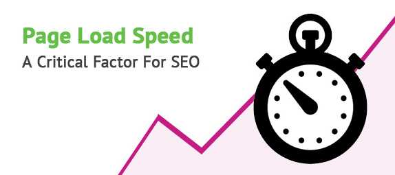
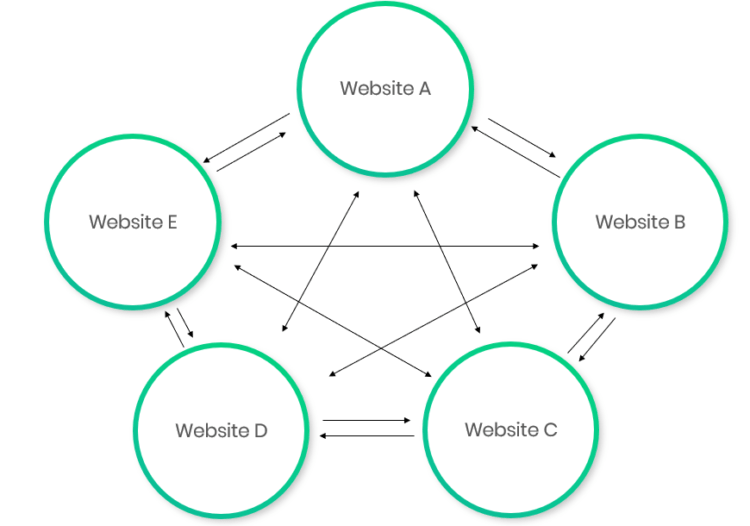

相信很多站长在开始建站的时候都有一个疑虑，那就是一个服务器上面放多个网站会不会影响到**SEO优化效果**？SEO禅帮企业做SEO优化的时候，基本都是推荐一个IP，一个服务器放一个网站，这样在优化网站排名的时候比较好操作，因为有时候影响排名的因素太多，如果一个服务器上放多个网站，要去排查是不是其他网站影响的就会很麻烦，那具体对SEO优化有多少影响呢？这还需要分情况。

## 使用VPS虚拟机会影响SEO优化吗？

正常情况下使用VPS虚拟机是不会影响SEO优化，除非VPS比较慢，这对网站SEO影响是比较大的，现在SEO圈子里面公认的第一排名要素，就是网站打开速度。

网站排名第一要素：加载速度

SEO禅对自己的几个关键词排名作了分析，为什么SEO禅这个新站，能排在那些老站前面，很关键的一个原因应该就是网站打开速度，SEO禅的网页很简洁，基本上在1S左右就可以交互，网络上大多数人说VPS对SEO有影响，那是因为大部分的VPS主机比较便宜，配置相对较低，再加上站长没有很好的优化，所以会觉得VPS主机对SEO优化会有影响，其实主要是大部分VPS配置低影响的。

## 同一个IP下多个网站会影响SEO优化吗？

同一个IP下有多个网站对SEO优化肯定是会有影响的，因为多个域名都指向同一个IP地址，如果其中一个网站被处罚了，很有可能连累到相同服务器IP下的网站，对于正规企业，SEO禅是不建议把多个网站放在同一个服务器下的，有的SEO优化人员觉得没有太大影响，在SEO禅看来，小心驶得万年船为好。

## 站群对SEO优化的影响

一般会把多个网站放在同一个服务器下，很多时候是再做站群，站群对排名优化是有一定效果，但是必须躲过搜索引擎算法，比如说百度的飓风算法，飓风算法就是专门打击站群和采集站的，站群如果放在同一个服务器IP下，基本都会被搜索引擎处罚，站群的最主要目的就是传递权重，这么多个网站，无论怎么导向，最终肯定会把权重导向其中一些站点，或者外部的一些站点。

站群对SEO影响

对于做[谷歌SEO优化](https://www.seozen.top/Google SEO优化-tutorial-starter-guide-2021.html)来说，站群基本上已经没有作用了，SEO禅最近观察的一个做站群的SEOer网站，他的排名就是忽上忽下，有时候就彻底消失了，想要把SEO优化做好，最重要的永远是这三点：内容，内链，外链；内链和外链永远是建立在[高质量原创内容](https://www.seozen.top/writing-seo-article.html)的基础上。
