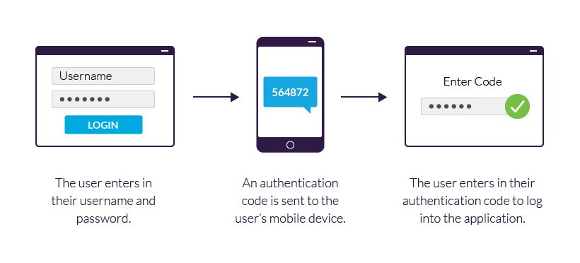

在网站服务器安全优化方面，有一个方法是最简单，又最高效的，也是最容易被人忽视的，那就是**用户认证安全**，还记得我在初中的时候，最常做的事就是跑到网吧，开个自动扫3389的脚本，用弱密码去爆破，我们那时候使用的**爆破字典**都是超级简单的，不要小看这种『小伎俩』，真的能扫到很多服务器，当然基本上会留下一个提示文本，告诉管理员，服务器密码设置太简单，被爆破之类的提示，当然也有使坏的时候，看服务器上有挂着一些XXX网站，就会挂一些木马脚本上去，那时候就经常这么『抓肉鸡』，然后看那些人看XXX内容，就给他弹出一些『善意』的提示弹窗，说远了，接着说今天的主题：用户认证安全。

## 什么是认证安全？

首先我来说下**什么是认证**，他和授权又有什么区别？认证用一句话来解释，就是**证明你是你**的这个过程，而授权是你能被**允许做什么事情**，通常我们在网络上，有两种资料类型，一种是谁都可以访问的**公共资料**，另外一种就是**私有资料**，通常情况，私有资料会通过认证系统来区分所属关系，张三肯定不能访问李四的私有资料，我们都知道，物以稀为贵，一旦东西变的私有，如果这些资料被不法份子窃取，就有可能对拥有者造成损失。

『钓鱼』邮件

在2000年左右，最流行的就是钓鱼邮件和钓鱼网站，这些邮件会伪装成官方邮件，让你修改用户认证信息，如果上当点击了邮件中伪造的网页链接，那你的原始密码就会被黑客窃取，随后用你的原始密码登录你的账号。

## 用户认证机制

随着时代的发展，有越来越多的认证机制，来保护用户的信息安全，总的来说可以分为以下三种认证机制：

- **知道类**（You Know） - 比如说最普通的密码，或者安全问题等，需要你记住的。
- **拥有类**（You Have）- 比如说手机验证码授权，网银UKey等，都是属于你拥有的。
- **生物指纹类**（You Are） - 比如说人脸识别，指纹识别等，具有独一无二的个人生物特征。

人脸识别机制

以上三种认证机制往往都是搭配使用，这主要看安全等级，等级越高，使用的认证机制也会越多，在美国大片里，有时候经常还看到虹膜识别认证，这也是**生物指纹认证机制**中的一种，随着科学技术越来越先进，认证的技术也越来越发达，以前我们乘坐火车需要买票，然后检票员验证纸质车票，现在有的地方使用身份证，有的地方已经使用人脸识别，有的地方使用人脸识别和身份证共同认证，但是不管怎么变，都在上面提到得三种认证机制中。

## 认证安全的重要性

认证安全的重要性是不言而喻的，很多站长会把服务器管理密码，设置成自己的**名字拼音或者加生日**，这种设置密码的习惯是最容易被人利用的，如果一个黑客想要攻破你的网站，肯定会收集各种可能的资料，有时候还会用上[社会工程学](https://www.baidu.com/link?url=-1sEbd5QEpTEHy7FyBu_XLIPY5Y4iiuyB0nD6pb0z5UQT3b_Df9kr51utx7V5Azs8hFlETjLXlrClMKOVp-FJ4uqLC7rd81Z-rY8xlZ5yB_ADRedcRgqlYB4kpbm9UYAzu9v6n6YJTvFDh8lh0v9wK&wd=&eqid=e1f5a37100062f11000000066124fb2f)，通过各种伪装来获取你的个人资料，比如说伪装成猎头，获取你的身份证号码，手机号码等，在通过加工处理生成爆破字典，很容易就攻破你的服务器，这里提示各位站长，务必使用16位以上的强密码，最好是随机生成的那种，找个相对安全的地方存放就好，只要设置了强密码，基本上可以防止90%的隐患，服务器是没有那么容易就被攻破的，只要文件系统的权限设置合理，就算得到网站的WebShell，也不是那么容易得到管理员权限的。

## 如何做到用户认证安全

双因素认证

提高用户认证安全的方法有很多，但是原理基本是相同的，都是通过多种认证机制组合，来保证认证安全，通常现在使用最多的是密码认证+短信的**[双因素认证模式](https://baike.baidu.com/item/双因素认证/1612350?fr=aladdin)**，我们在输入用户密码之后，还会需要输入手机验证码，这样在很大程度能保证认证的安全性，黑客盗用了你密码和同时盗取你手机的可能性几乎为零，除非你是超级重量级的人物，那肯定也不会用这种认证方式。

我们在日常生活中经常会使用网银的UKey，它的认证方式和密码+短信的认证方式有所不同，使用Ukey的认证安全等级要高的多，所以在企业使用网银转账，基本都是使用UKey，因为短信容易被拦截，SIM卡也有可能被复制，但是UKey是因为给的，被复制的可能性非常低，为什么呢？下面就要介绍到[TOTP](https://en.wikipedia.org/wiki/Time-based_One-time_Password_Algorithm)认证方案，TOTP是Time-based One-time Password的缩写，中文叫『基于时间的一次性密码』，它的原理是使用**同一个密钥**在UKey和服务器端，根据相同的时间戳和密钥生成**哈希（Hash）码**。

以前使用Ukey就很好奇，为什么这个小东西应该没有联网，那服务器怎么知道它现在生成的是什么东西，现在你只要了解了TOTP认证方案，你就知道他们实现的原理了，具体实现我就不多说了，有想要了解的朋友自己谷歌百度吧，今天的分享就到这，有什么不懂的可以留言，但是一定要记住今天的关键点：**使用强密码**！
