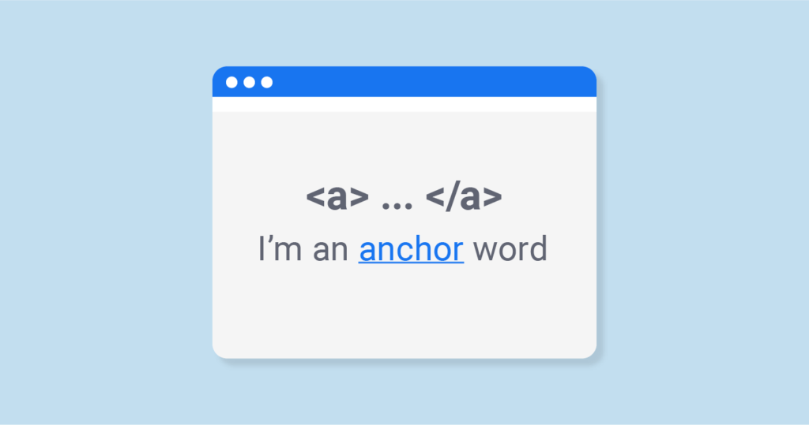
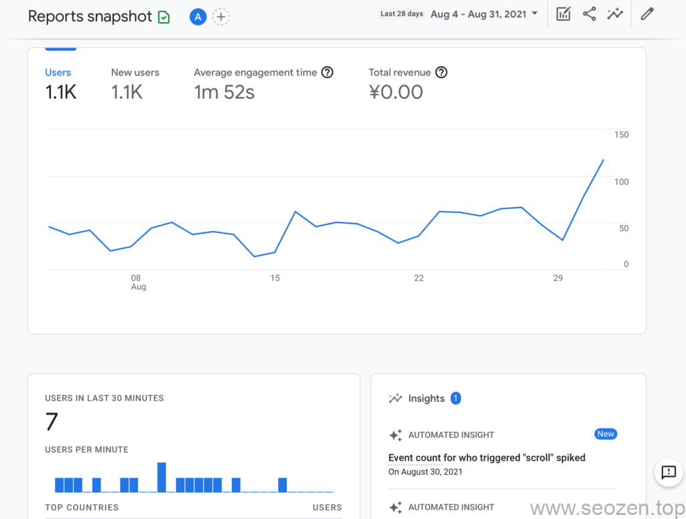
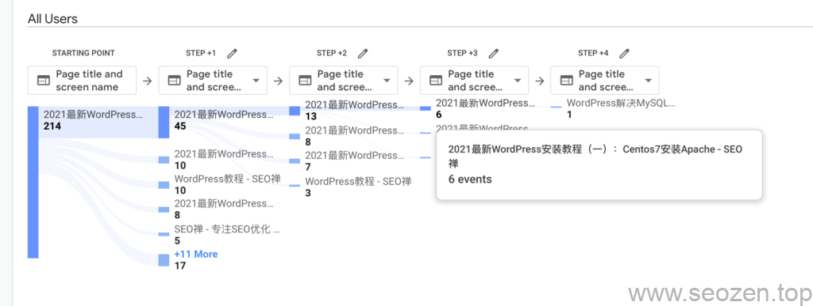

关于**提升网站排名**的文章SEO禅已经写了几篇，那些文章介绍的方法都是比较理论的，就像[网站排名优化方案](https://www.seozen.top/seo-website-ranking-checklist.html)这篇文章中，把排名优化分为内部优化和外部优化，这篇文章SEO禅打算单独说一说，**网站关键词排名优化**的方法，但是内容会比较具体，就拿SEO禅举例，现在每日的访客数从一个月前的30-50左右，上升到80-100左右，长尾关键词的复利效应已经慢慢发挥作用了，文章已经有朋友留言评论了，但是以前留言评论的朋友很抱歉，没办法邮件通知回复，这两天把评论邮件通知功能给加上去了。

## 内容为王

内容为王是SEO领域中无可争辩的话题，如果内容质量不行，再多的**SEO技巧**和优化手段都是画蛇添足，这篇文章分享的**提升网站关键词排名技巧**都是建立在有实质性的内容之上，如果各位的内容不过关，可以先看看SEO禅下面两篇文章，提升下内容质量：

- [SEO新手入门系列2021（六）：站内SEO内容篇](https://www.seozen.top/seo-tutorial-moz-serial-2021-on-page-content.html)
- [SEO优化：输出优质原创文章](https://www.seozen.top/writing-seo-article.html)

SEO内容为王

写出对用户和搜索引擎友好的文章，是SEO优化排名中最基础的一步，可以说内容是一个网站的『地基』，SEO优化技巧手段是在这基础上的点缀，就拿SEO禅举例，每个月流量的增长现在都在50%以上，这个趋势暂时没有变慢的迹象：

SEO禅谷歌关键词排名

各位朋友先自检下网站内容，觉得没有问题，再来学习提升网站关键词排名的实际方法和技巧。

## 优化关键词上下文环境

新手SEO朋友一开始不知道怎么把单个关键词排名优化提升上去，要提升特定关键词排名，不单单是发对应关键词的文章这么简单，我们需要配合外链和内链，不会内链和外链优化的朋友可以先看看下面两篇文章：

- [什么是SEO内链及怎么做内链？](https://www.seozen.top/internal-link-build-seo.html)
- [如何做网站推广-外链为皇](https://www.seozen.top/website-external-links.html)

锚文本SEO关键词优化

在做外链和内链优化的时候，最关键的就是锚文本的设定，锚文本是可以告诉用户和搜索引擎链接的网址的中心内容，这就是我们的关键词，需要**提升特定关键词排名**，就是通过**设定关键词锚文本**来实现的，但是这个锚文本不能随便设置，很容易被搜索引擎惩罚，需要注意下面三点：

- **锚文本关键词上下文环境**（重点）
- 锚文本关键词和被链接页面的相关性。
- 锚文本关键词的一致性

其中最关键的一点就是锚文本上下文环境，什么是锚文本上下文环境呢？比如说一篇卖化妆品的文章，介绍的是化妆品相关的内容，就不能使用『LV时尚女包』这个关键词链接到一个卖包的网站，因为上下文中谈论的基本是化妆品的内容，这就是**锚文本上下文环境要匹配**，SEO禅观察谷歌对这一块还是比较敏感的，伪原创的内容和采集的内容为什么排名不好，很大一部分原因就是内容上下文环境不匹配，中文类SEO博客很多，做[SEO优化](https://www.seozen.top/SEO教程-first-step.html)这个关键词的站肯定也不少，为什么SEO禅这种新站，域名又不是很好，能够在一个月的时间把这个关键词做到首页，这都是SEO优化的细节，可以看看[SEO禅站点谷歌SEO优化排名情况分析](https://www.seozen.top/seozen-google-ranking-july.html)这篇文章最底部有SEO优化这个词的**排名优化记录**，里面记录的所有长尾词，排名都很稳定，不会像使用黑帽或者灰帽SEO手段的网站，上上下下排名不稳定。

## 提升网站停留时间

在[Google Analytics](https://analytics.google.com)界面，最显眼的一个参数就是**Avreage Engagement Time，**SEO禅是把这个参数当作用户平均停留时间来对待，我们可以使用这个参数来判断网站内容是否优质，用户体验如何？提升用户停留时间是辅助提升网站关键词排名优化的手段之一。

GA用户平均停留时间

可以看到SEO禅的平均时间在1分50秒左右，正常人的每分钟阅读字数在200-400字左右，也就是说一篇文章在500字以上，这个平均停留时间应该要有1分钟左右，说明用户把这篇文章看完了，如果平均停留时间和文章字数长度不匹配（文章很长，但是停留时间很短），那可能说明网站文章的内容不太行，需要花时间在提升文章质量上。

SEO禅的文章大部分在500-1500左右的字数，有些文章字数也比较少，除了字数达标以为，还有一个**提升用户平均停留时间小技巧**就是**字体的大小和行距**，设置**合理的字体大小和行距**，不仅可以提升用户体验，也可以间接增加用户停留时间，这是SEO禅在SEO优化过程中测试得出的结论，大家可以自己试试，不过要控制在合理范围，不然就会影响用户体验，还会被搜索引擎处罚。

## 增加用户访问深度

增加用户访问深度和增加用户停留时间，对于提升关键词排名一样都有很重要的辅助作用，就拿SEO禅写过的WordPress安装教程系列文章来举例，前一段时间有个用户留言：

wordpress安装用户评论

从用户的评论我们可以知道，这个用户已经看完WordPress安装系列的四篇文章，这样用户的访问深度就加深了，而且用户的访问停留时间并不会减少，SEO禅和其他SEOer的思路在这方面有点不同，很多站长把一篇文章写的非常长，SEO禅觉得这样对知识的吸收和理解并不是很好，因为一个人的专注力一般最长在45分钟左右，有时候还更短，技术类的文章那都是很烧脑的，SEO禅使用的策略是把单篇文章的权重分散到多篇**关联文章**上去：

WordPress安装GA用户访问路径

从上图可以看到用户的访问路径都是相关文章，那怎么增加用户访问深度呢？一个简单的方法就是在文章结尾加上相关**文章的锚文本**，或者使用固定模块，比如SEO禅和大多数网站一样，在文章底部都有一个相关阅读模块。

提升网站关键词排名的方法还有不少，这篇文章SEO禅先分享到这，其他方法以后再分享，或者可以看看下面的相关阅读中有没有其他文章方法。
