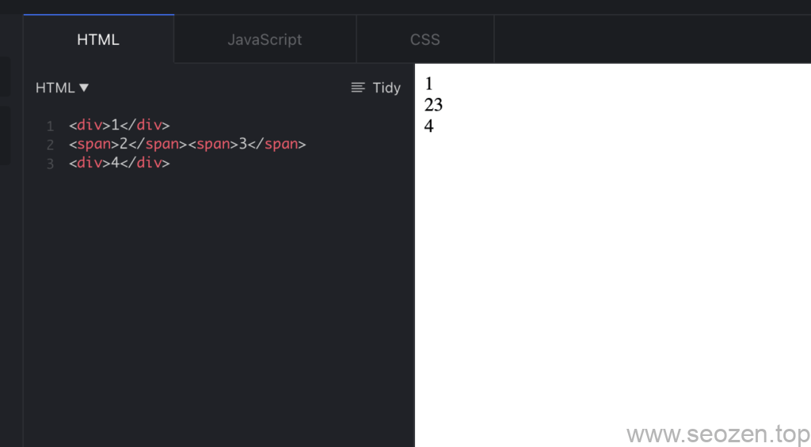
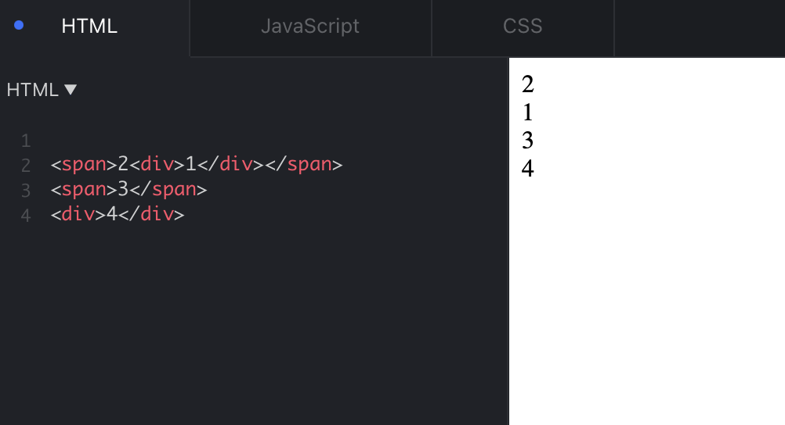

SEO禅的老本行是前端开发，SEO优化一直都是副业和爱好，以前也经常有在其他平台记录一些技术类的文章，现在基本就只有在SEO禅这个站点写个人文章了，因为在其他平台写的东西，随时都可能消失，就像上次博客园事件，谁都没想到一个技术类的博客分享平台，既然会一夜之间被关停整顿，自此之后，SEO禅坚信，还是个人网站靠谱，虽然个人网站比较容易受到攻击，但至少内容还是比较安全的，前几天SEO禅的一个客户被DDOS攻击了，对于这种攻击，小企业和个人确实没有好办法，除非有备用服务器线路切换，不然都需要等攻击结束，不过这种拒绝服务攻击的代价也不小，不可能持续很长时间。

这篇文章主要分享在平时编写页面过程中，常用的一些CSS水平和垂直居中的方法，最后会附上Codepen的参考地址，如果文章看的不是很明白的，可以看看源码。

在学习如何居中Html元素标签之前，我们要先来熟悉下HTML中的行内元素，块级元素这两个概念。

## 行内元素与块级元素

在HTML中标签可以分为两大类，行内元素和块级元素，比如说我们的div，p，article等都是块级元素，如a，strong，span标签就属于行内元素。

块级元素的一个特点是，会占据一整行的空间，下一个元素只能在新的行，行内元素后面可以跟行内元素，不会强制显示在下一行。



行内元素和块级元素区别

行内元素是不能包裹块级元素的，这在使用语法上是错得，在渲染的时候也会被当作是块级元素渲染，但是不同的浏览器可能会有不同的奇怪表现：



行内元素嵌套块级元素

但是HTML5开始有个例外，那就是我们常用的[a标签](https://www.seozen.top/anchor-tag-title-seo.html)，如下的使用方式：

```
<a href="https://www.seozen.top">
   <h1>SEO禅</h1>
   <p>专注SEO优化 分享SEO技术</p>
</a>
```

当然行内元素也可以表现块级元素的属性，块级元素反之也是一样，这个主要由css中的`display`属性控制，这里不进行深入，下面正式来讲讲元素居中。

## CSS水平居中

因为有块级元素，行内元素的区别，水平居中和垂直居中，SEO禅也分开来说，当然还有最后的水平垂直居中。

### 行内元素水平居中

行内元素的水平居中应该算最简单的，只要设置父级块级元素的text-align属性为center就可以：

```
// html
<header>
  这是头部文字居中
</header>

<nav role='navigation'>
  <a href="">SEO优化</a>
  <a href="">SEO新手教程</a>
  <a href="">SEO基础</a>
  <a href="">SEO教程</a>
</nav>
// css
header, nav {
  text-align: center;
  background: white;
  margin: 20px 0;
  padding: 10px;
}
```

### 块级元素水平居中

块级元素的水平居中常用的方法是将margin的左右设置成`auto`属性，如：

```
// html
<main>
<div class="center-block">
<div>
</main>
// css
.center-block {
  margin: 0 auto;
  width: 200px;
}
```

这里要注意的是，一定要设置`width`，不然无法居中。

如果有时候要居中的块级元素不止一个，那一般情况可以转成行内元素，设置display为`inline-block`就可以了，然后根据行内元素的居中思路处理，这里还可以使用flexbox，这SEO禅会单独写一篇文章介绍非常强大的flex和grid布局模式。

## CSS垂直居中

### 行内元素垂直居中

行内元素垂直居中有时候挺蛋疼，最简单的办法就是使用padding或者margin设置相同的上下边距，如果在没办法使用这种方法的情况下，可以使用行高的方式，如：

```
// 第一种方式垂直居中行内元素
margin-top: 20px;
margin-bottom: 20px;
// 或
padding-top:20px;
padding-bottom:20px;
// 第二种方式
height:200px;
line-height:200px;
```

多行文本的情况下，上面的方法也是可以用的，如果不能使用，我们可以把父元素display改成`table`，然后子元素的display为`table-cell`，再设置子元素的`vertical-align`属性为`middle`就可以，如：

```
.parent-table {
  display: table;
  height: 250px;
  width: 240px;
}
.child-table-cell {
  display: table-cell;
  height: 250px;
  width: 240px;
  vertical-align: middle;
}
```

这里父级需要设置高度才会起作用。

### 块级元素垂直居中

块级元素的垂直居中要复杂一些，通常使用position属性，这里要区分两种情况，根据是否已知居中的这个块的高度。

首先是已经知道垂直居中元素的高度的情况下，我们可以使用如下代码：

```
.parent {
  position: relative;
}
.child {
  position: absolute;
  top: 50%;
  height: 100px;
  margin-top: -50px; 
}
```

这里的margin-top需要根据实际的padding，border等属性进行调整，如果_`box-sizing: border-box;`_不是设置成这个属性的话。

如果不知道元素的高，我们需要使用transform属性来帮忙：

```
.child {
  position: absolute;
  top: 50%;
  transform: translateY(-50%);
}
```

## 水平垂直居中

水平垂直居中的布局，在实际应用中还是非常广泛的，比如说我们的dialog，progress，gallary等，都是需要水平垂直居中的布局，大多数情况下，上面的垂直居中和水平居中的组合都是能够生效的，有些因为浏览器实现差异会导致无效，下面分享两个对各浏览器都支持不错得水平垂直居中方案：

```
// 已知高度和宽度
.parent {
  position: relative;
  height: 200px;
}

.child {
  width: 200px;
  height: 100px;
  margin: -50px 0 0 -100px;
  position: absolute;
  top: 50%;
  left: 50%;
}
// 未知高度和宽度
.parent {
  position: relative;
}
.child {
  position: absolute;
  top: 50%;
  left: 50%;
  transform: translate(-50%, -50%);
}
```

是不是感觉很麻烦？以前SEO禅就是这么布局的，现在基本使用的是flex和grid布局方式，对老的浏览器也不怎么去兼容了，下篇文章来分享下flex和grid，这篇文章就先到这。
