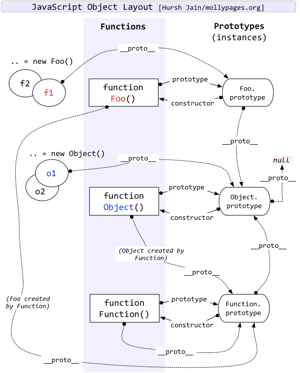
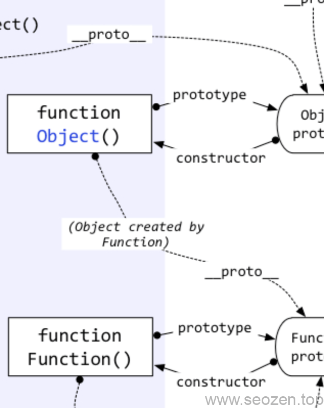

相信学习过前端的同学，一定有一段时间会对**原型**，**原型对象**，**原型链**这些名词熟悉又陌生，其中最难理解的应该就是\_\_proto\_\_和prototype，它们的区别经常会被搞混，我也一样，有段时间也是傻傻分不清，经过社会的毒打之后，才慢慢开窍，网上有很多文章都在谈，但是并没有看到说的比较明白的，这里我把自己的理解分享给各位。

## 什么是对象？

首先我们要先搞清楚什么是对象？在JavaScritp中有7种基础数据string, number, [bigint](https://developer.mozilla.org/en-US/docs/Glossary/BigInt), boolean, undefined, symbol, 和null类型，其中[symbol](https://developer.mozilla.org/en-US/docs/Glossary/Symbol)是ES6新加入的，bigint还在提案阶段，除了这些数据类型外，其他所有你能看到的，用到得东东都是**Object类型，也就是对象**，所有对象都有**\_\_proto\_\_访问器属性**（getter 和 setter），但是它不是ECMAScript标准所规定的属性，只是历史的产物，在实际开发中，使用`Object.getPrototypeOf`方法来获取\_\_proto\_\_指向的对象。

## \_\_proto\_\_访问器属性

前面说过只要是对象，就有\_\_proto\_\_属性，那这个属性所代表的内容是什么呢？我们来看看下面这张图：



JavaScript原型链关系图

从上面图我们可以看到所有的\_\_proto\_\_箭头，都指向最右边的一列，这就是**原型对象**，这些原型对象也是对象，所以他们也有各自的\_\_proto\_\_属性，可以看到最终这些原型对象的\_\_proto\_\_都指向了**Object.protoype原型对象**，而Object.prototype的原型对象是基础数据类型`null`，所谓万物皆空，九九归一，在JavaScript上体现的很具体。

## Constructor属性

这里我们可以注意到，每个原型对象还有一个属性是其他对象没有的，那就是**constructor构造函数**：



**原型对象的constructor属性**指向的是我们自己定义的构造函数，或者是内置的构造函数，JavaScript中有许多内置的构造函数，比如上图的Function()，Object()，上面也已经说过，除了基础数据类型，万物皆对象，所以构造函数也是对象，对象上就可以挂载方法，也就是我们常用的静态方法，比如我们经常使用的：Object.defineProperty，Object.entries，Array.isArray等。

## \[\[Prototype\]\]符号

在chrome develope tool里面我们打开console面板，随便打印一个对象，你都能看到这个对象有**\[\[Prototype\]\]符号**，而且还能展开，其实这个符号就是\_\_proto\_\_：

```
function Foo(){}
let foo = new Foo()
foo.__proto__  === foo[[Prototype]] // true
```

上面代码只是举例，实际\[\[Prototype\]\]是无法访问的。

## 什么是原型？原型对象？原型链？

看到这里，大部分朋友可能还是不懂什么是原型，原型对象，原型链，看下面这段代码：

```
function SEOZEN(){
  this.seozen = '我'
}
SEOZEN.prototype.seoniubility = ' SEO优化'
let seoObject = new SEOZEN()
console.info(seoObject.seozen + seoObject.seoniubility ) // 我 SEO优化
```

这里我们申明了一个SEOZEN函数，之后在这个函数的原型对象上挂载了一个seoniubility的属性，再使用这个函数作为构造函数，实例化了一个seoObject对象，注意这里还是没有提高原型，其实原型只是JS的一种语言机制，如果要把它固化成某个东西的话，那可以认为是原型对象。

我们来总结下，什么是原型，什么是原型对象，什么是原型链：

- 原型 - JS的语言机制，也可以理解为是对象的\_proto\_属性或者是函数的prototype属性所指向的对象
- 原型对象 - 构造函数的prototype属性所指的对象
- 原型链 - 对象的\_\_proto\_\_访问器属性，或者\[\[Prototype\]\]内部属性指向的逐级向上最终为null的链式路径，有点绕口，大概的意思就是object.\_\_proto\_\_(父级).\_\_proto\_\_(祖父级).null(最后的\_\_proto\_\_)

以上是我对JavaScript原型(对象原型)，原型对象，原型链的理解，如果有什么说错的地方，各位可以留言评论指出。
