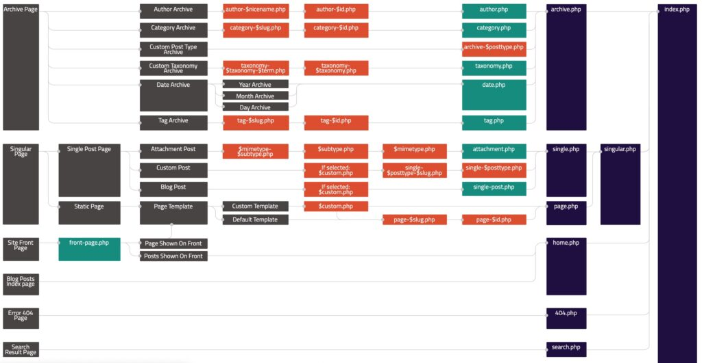

在《[2021从零开始开发WordPress主题教程（一）：主题开发基础知识](https://www.helloyu.top/wordpress-theme-development-basic.html)》中，我有提到WordPress的页面层次关系，今天就简单的来说说index.php，home.php，front-page.php的区别，再来看看这个层次结构树。

WordPress主题开发层次结构

从上面图片我们可以看到，页面是\`front-page.php->home.php->index.php\`这样的顺序，也就是说，如果主题中有front-page.php这个文件，就会优先使用这个文件作为首页模板，如果没有使用home.php，最后才是index.php文件，那他们的区别是什么呢？

## home.php

首先说下home.php这个文件的作用，这是wordpress默认的显示模板，可以看到系统自带的主题在启用后，都有一个默认样式，会有一个`hello world`的默认文章，使用的就是Home.php页面模板，相当于post的默认列表模板，展示的是最新的几篇文章索引，注意这里是索引，不是单篇文章内容。

## front-page.php

看名字就知道这是首页模板，网上很多人说这是静态首页模板，其实不准确，这东西并不是静态的，也是可以像home.php一样动态循环文章列表的，front-page.php模板相当于我们的landing page，如果主题中有这个文件，用户访问网站主页，wordpress会优先使用这个模板来显示，它和home.php最大的不同是，home.php更加通用，一般在网上的主题内很少有front-page.php文件，使用这个模板一般都是个人项目，有这个文件之后，无论你在`settings->reading->front page`设置的是什么，都使用的是front-page.php模板。

## index.php、home.php、front-page.php

最后来说下他们的关系，梳理下为什么会有这三个文件，上面已经说了front-page和home各自的功能，这里再整理一遍。

home.php是系统默认显示文章列表的模板。

front-page.php是用户自定义的首页模板，如果有这个文件会优先使用。

index.php是整个主题最后的『底线』，如果找不到其他的模板，最后都会使用index.php去渲染。

当然还有一个page.php，wordpres里有几个基础的Post type，一个是Post，一个是Page，page.php就是用来显示Page类型的，这里稍微提一提，随着你对wordpress开发的深入，你自然会明白他们的区别。
