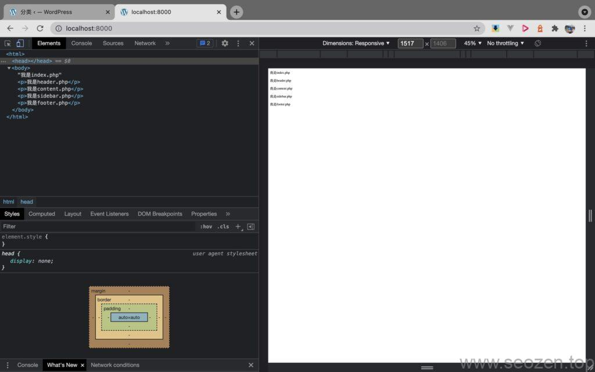
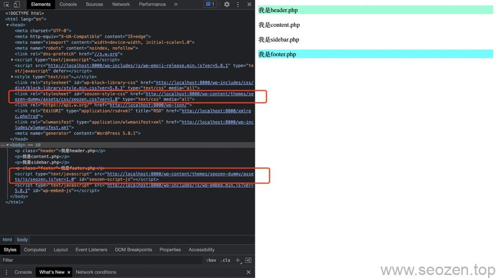

在上一篇文章中，我们已经使用get\_header，get\_footer等函数把一个页面分割成多个文件，这篇文章要来说说如何载入CSS/JS前端文件，我们可以打开[Chrome Developer Tool](https://www.seozen.top/developer-tools-network-seo.html)查看项目源码，可以看到如下的代码：



SEOZEN Dummy HTML代码

可以看到`head`标签里面什么都没有，就连我们的`style.css`文件都没有被载入，这里就要介绍到我们的**fucntions.php文件**

## functions.php主题功能入口

functions.php文件在主题启用后，会被WordPress载入作为主题的功能入口，在这我们能挂载自己的功能，也可以调用WordPress提供的功能，主题的fcuntions.php和插件的functions.php功能基本类似，区别在于插件开发需要在头部申明插件名称，主题开发没有这个要求，但是一般我们也会写入类似的一些标记：

```
// functions.php
<?php
/**
 * Functions and definitions
 *
 * @link https://developer.wordpress.org/themes/basics/theme-functions/
 *
 * @package SEOZEN
 * @subpackage SEOZEN_Dummy
 * @since SEOZEN Dummy 1.0
 */
```

一般在**functions.php文件**，我们会做下面几件事：

- 添加主题支持功能
- 注册css文件
- 注册js文件
- 注册动态菜单
- 注册动态侧边栏
- 引入自定义功能文件
- 注册编辑器样式
- 引入主题多语言支持

## 载入CSS/JS文件

functions.php要完成的功能很多，放在一篇文章是说不完的，以后SEO禅会单独写文章专门介绍，这里我们先进行加载CSS/JS文件，在上一节课的源代码基础上我们作一些修改，创建一个css文件和js文件：

```
// functions.php
function seozen_scripts() {

	// seozen styles.
	wp_enqueue_style( 'seozen-style', get_template_directory_uri() . '/assets/css/seozen.css', array(), wp_get_theme()->get( 'Version' ));

	// seozen script.
	wp_enqueue_script(
		'seozen-script',
		get_template_directory_uri() . '/assets/js/seozen.js',
		array(),
		wp_get_theme()->get( 'Version' ),
		true
	);
}
add_action( 'wp_enqueue_scripts', 'seozen_scripts' );

// seozen.css
查看Github源代码
// seozen.js
查看Github源码
// header.php
增加wp_head函数
// footer.php
增加wp_footer函数
```

这里对header.php和footer.php作了点修改，增加了两个wordpress的template tag函数：`wp_head`和`wp_footer`，这两个函数是动态加载头部和尾部模板，也就是说我们在functions.php注册的css和js脚本文件，最终会被这两个函数载入到页面中去，完成修改后应该会看到下面的样子：



WordPress主题开发载入CSS/JS文件

可以看到`head`和`</body>`标签内已经有我们在functions.php中注册的CSS/JS文件，当然还有很多WordPress自带加载的文件，这些都是可以通过在functions.php中进行自定义删除，这里暂时不说，到这里我们已经可以自己加载自定义的CSS/JS文件，后续我们还可以通过WordPress提供的Condition Tag去根据不同的界面实现动态加载资源文件，这样对于提升加载速度也有一定的帮助。

这篇教程就到这，下篇教程SEO禅会教各位如何使用Loop主循环读取Post文章，有什么不懂得可以留言，回头见！

本篇教程Github地址：[WordPress主题开发-加载CSS/JS文件](https://github.com/HelloYu/seozen-dummy/tree/02-加载CSS/JS资源文件)
