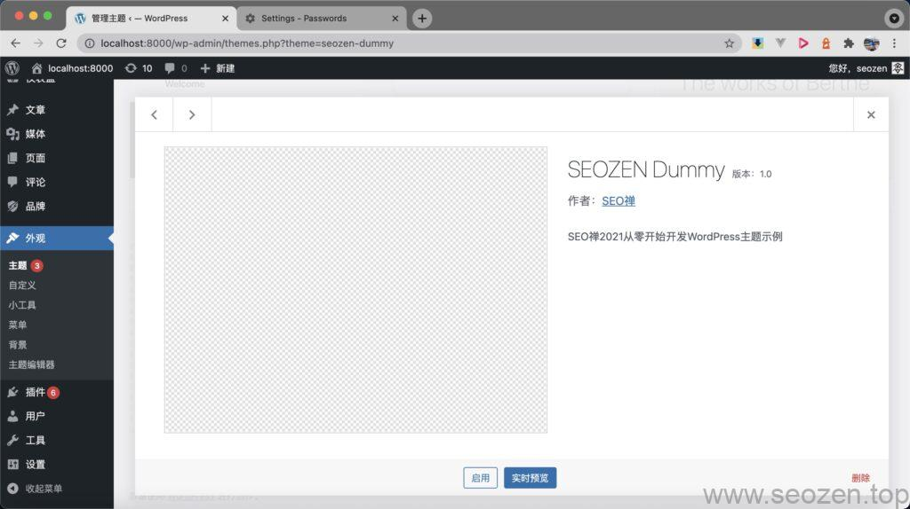
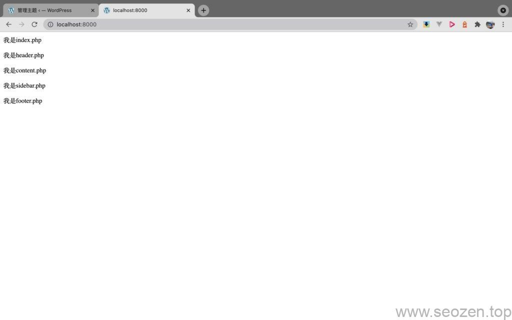

终于终于要开始正式开发WordPress主题，前面SEO废话了两篇文章，要是没有看过的朋友可以先回去看看，文章都很短，花不了几分钟，不看也可以，问题不大。

- [WordPress主题开发知识：了解目录结构](https://www.helloyu.top/wordpress-theme-develop-hierarchy.html)
- [WordPress主题开发知识：模块化开发](https://www.helloyu.top/wordpress-theme-development-modularization.html)

接下去的文章我会用一个简单的示例，一步一步的教大家**如何开发WordPress主题**，当然开始使用的都是最原始的方式，因为这个系列是初级入门教程，写的太复杂怕很多朋友看不懂，等到进阶教程，就会用上设计模式和比较多面向对象的方式去写，接下去的每篇都会提供一个Github源码地址，是以分支的形式，有需要的朋友可以自己下载运行查看参考，如果觉得哪里代码有问题，请留言评论，谢谢！

[WordPress的安装过程](https://www.helloyu.top/wordpress-apache-setup-2021.html)这里就不讲了，在我的博客搜下有完整的安装教程，或者可以体验下[使用Docker来部署WordPress开发环境](https://www.helloyu.top/docker-wordpress-develop.html)，一定会让你爽到飞起，下面正式开始这篇文章的内容。

## 注册WordPress主题

在第一篇了解**WordPress目录结构**中，我已经提到过，WordPress的主题最少需要`index.php`文件和`style.css`文件，首先我们就需要在目录下创建这两个文件：

```
// index.php
<?php
/**
 * The main template file
 *
 * This is the most generic template file in a WordPress theme
 * and one of the two required files for a theme (the other being style.css).
 * It is used to display a page when nothing more specific matches a query.
 * E.g., it puts together the home page when no home.php file exists.
 *
 * @link https://developer.wordpress.org/themes/basics/template-hierarchy/
 *
 * @package SEOZEN 
 * @subpackage SEOZEN_Dummy
 * @since SEOZEN Dummy 1.0
 */

echo "我是index.php";

// style.css
/*
Theme Name: SEOZEN Dummy
Text Domain: seozen_dummy
Version: 1.0
Requires at least: 5.3
Tested up to: 5.7
Requires PHP: 5.6
Description: 我2021从零开始开发WordPress主题示例
Author: 我
Author URI: https://www.helloyu.top/
Theme URI: https://github.com/HelloYu/seozen-dummy
License: GNU General Public License v2 or later
License URI: http://www.gnu.org/licenses/gpl-2.0.html

All files, unless otherwise stated, are released under the GNU General Public
License version 2.0 (http://www.gnu.org/licenses/gpl-2.0.html)

This theme, like WordPress, is licensed under the GPL.
Use it to make something cool, have fun, and share what you've learned
with others.
*/
```

注册WordPress主题主要是`style.css`这个文件，其中`Theme Name: SEOZEN Dummy`标识了主题名称，有这一行信息，WordPress就可以在后台识别到主题：



WordPress主题开发第一步注册主题

开启主题之后，刷新首页，应该会看到『我是Index.php』的输出，这样第一步注册WordPress主题就算完成，下面我们试着使用WordPress的Template Tag来获取header，footer，sidebar。

## 获取WordPress模板

在进行WordPress主题开发过程中，最经常使用的就是下面四个获取模板的Template Tag函数：

- get\_header
- get\_template\_part
- get\_sidebar
- get\_footer

把这四个函数使用在`index.php`文件中：

```
// index.php
echo "我是index.php";

get_header();
get_template_part('content');
get_sidebar();
get_footer();
```

之后再创建四个php文件，并向里面写入HTML的P标签，可以得到下面的结果：



加载WordPress模块化模板

到这里第一篇**手摸手WordPress主题开发教程**就算结束了，内容不多，可以看到我们都还没有使用`functions.php`文件，下一篇会讲到如何载入js，css文件，还有最重要的Post Loop（显示文章），一篇内容不长，一般就安排两个知识点，我觉得这样的形式更有利于大家学习和消化吸收，消化完这篇文章的朋友可以看下一节：《[从零开始开发WordPress主题教程（二）：载入CSS/JS文件-functions.php](https://www.helloyu.top/wordpress-theme-development-load-css-js-functions.html)》，教程的Github地址：

```
https://github.com/HelloYu/seozen-dummy
```

希望我的文章能对你有帮助，如果有什么不懂得，可以留言评论。
