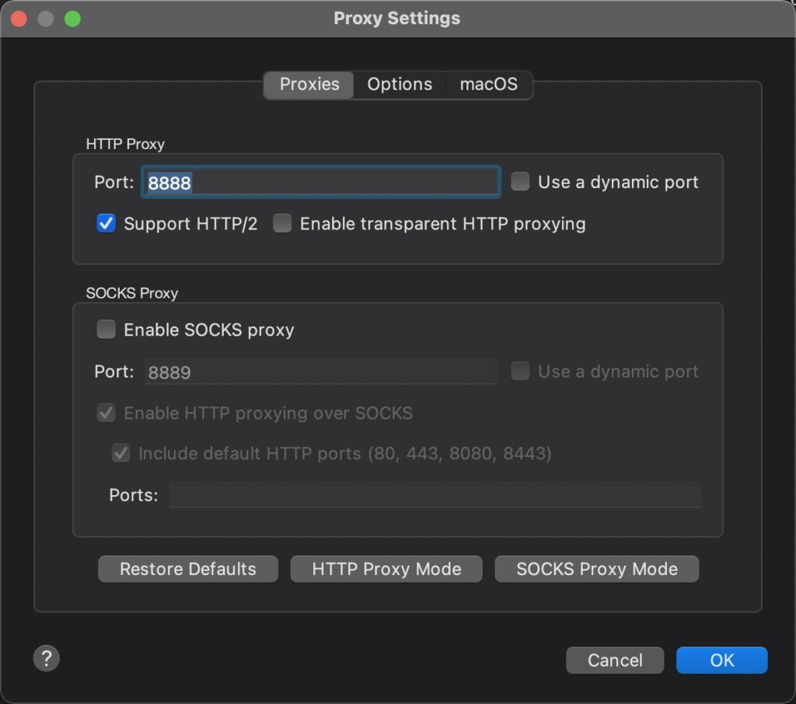
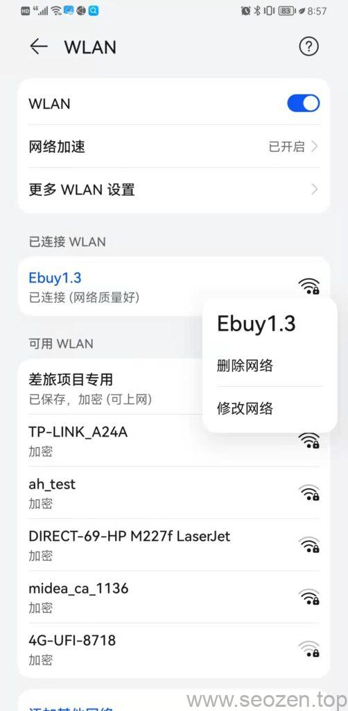
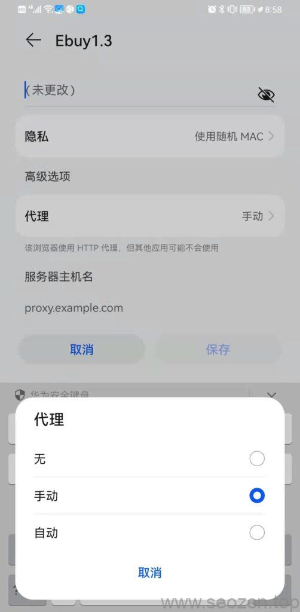
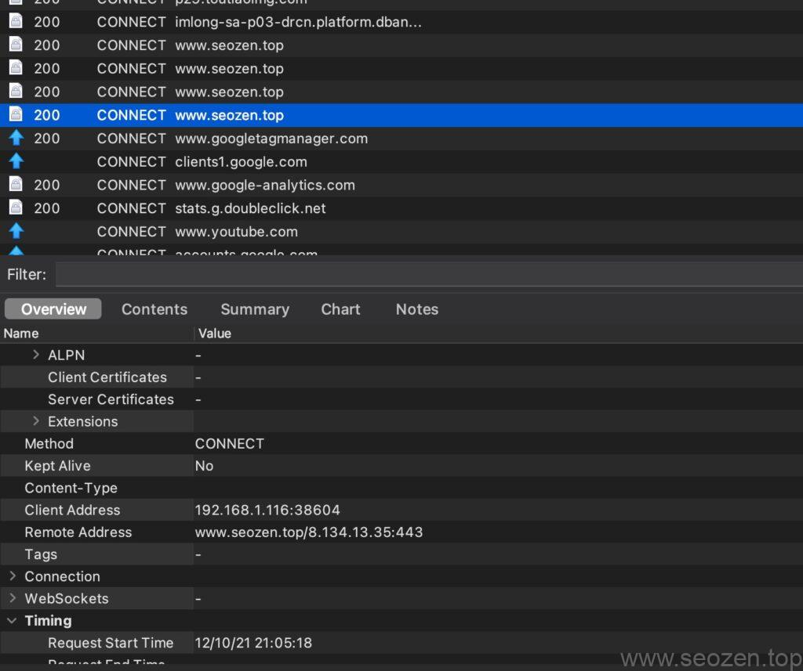

我好久没更新文章了，主要是忙（偷懒），最近在做Webview H5的项目，在线上调试有时候很麻烦，有时候还需要用到抓包，因为最近换了新的Macbook Pro M1的机子，无法同时共享热点又连接WIFI，所以想要抓包手机比较麻烦，需要接一个Type-C转接口，连上网线，这种蛋疼的多捣腾几次就觉得烦人，后面看到测试的同事使用Fiddler代理的方式，我装的是Wireshark，其实加个代理应该就可以了，后面去网上找了下，果真有个好用的代理Charles，只要启动，在手机上配个服务器代理就可以正常抓包了，不需要通过共享热点，这种方式要方便很多，现在记录下，给自己，也给需要的朋友。

[Charles](https://www.charlesproxy.com/)其实也是抓包工具，不过没有Wireshark强大，但是自带了代理服务，所以我们可以搭配着使用。

## 开启Charles代理

打开charles，点开右上角的settings->proxy settings:

默认是已经开启代理，主要打开是看看端口号：

charles代理设置界面

**注意：**手机和电脑需要在同一网段才行，同一个WIFI。

## 手机端代理服务设置

因为我用的鸿蒙系统，可能设置和你们的不一样，但是原理是一样的，选择连接上的wifi，修改配置：

可以看到有代理选项，点击选择手动后会出现服务器主机名，服务器端口等字段，端口填写的是charles的端口，服务器主机地址写电脑的ip就可以，确认之后，charles就会弹出提示，确认允许，就已经可以检测到手机的网络数据了。

OK就是这么简单，第一次配置麻烦点，但是后面会保存配置信息，连接就快的多：

charles抓包
