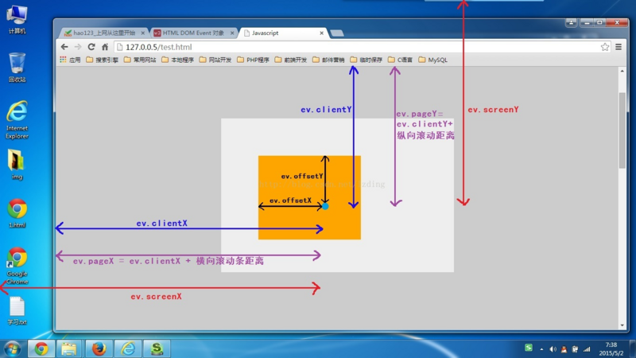

有做过拖拽项目的前端小伙伴一定有遇到过这几个鼠标事件属性：clientX、clientY、pageX、pageY、screenX、screenY、offsetX、offsetY，WTF！一开始我看到这么多XY也是一头雾水头大的很，读了MDN的文档还是不是很清楚，后面看了几篇文章，又找到一些图片，终于再也不会把他们混在一起了，在这里记录分享给大家：

- clientX/Y：当前鼠标点击位置相对于浏览器窗口左上角的X/Y值，不会随着文档滚动而变化
- pageX/Y：当前鼠标点击位置相对于文档左上角的X/Y值，如果DOM文档，也就是页面滚动，这个值会变化
- screenX/Y：当前鼠标点击位置相对于屏幕浏览器左上角的X/Y值，不会随着浏览器窗口变化或文档滚动而变化
- offsetX/Y：当前鼠标点击位置相对于当前被点击DOM对象节点左上角X/Y值，这里注意是padding内边距的左上角

clientX/Y、pageX/Y、screenX/Y、offsetX/Y的区别

所谓一图胜千言，网上找了个图来示意下，不晓得图片作者是谁，在这里表示感谢下。

如果有什么不懂，或者不明白的可以留言，很多人把这个概念写的长篇大论，我觉得没必要，这篇分享就到这里，回头见。
