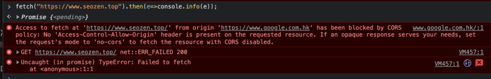

做过前端开发的小伙伴肯定会遇到下面这样报红的`error`经历：



CORS资源请求错误

如果没有遇到，那你就还需要多努力努力了，这个错误就是今天SEO禅要说的**CORS（Cross-origin resource sharing）跨域资源共享**，这是在前端开发中再常见不过的问题，比如我们本地开发，使用的域名地址是`localhost`，或者IP如`192.x.x.x`之类的，如果请求后端API服务器和前端服务器不是同一个，就会有CORS错误，为什么会产生这种错误呢？

## CORS问题的起因

其实CORS并不算是一种问题，它是一种浏览器保护机制，在很久很久以前，各大浏览器厂商都在抢着实现JS的功能，很少去考虑安全性问题，直到JS这个孩子闹出了很多问题，各浏览器厂商爸爸终于做下来协商如何管一管这调皮的孩子，最后他们一致决定，把这孩子关起来，不让它出去玩，也不让它带其他捣蛋鬼回来。

说白了，这是浏览器对外部资源的一种限制手段，是为了保证用户的安全，最初各大浏览器厂商规定网站只能请求自身同源同域名的资源，但是这种方式不利于网站的发展，因为很多资源是分布在其他服务器上的，所以后来浏览器通过CORS机制，限制性的访问外部资源服务器。

## CORS请求方式

下面来说说CORS实现的原理，首先我们明确一点，会触发CORS保护机制，一定是在请求外部资源的情况下，在这种情况下，又分为两种请求，一种是**简单请求**，一种是**预检请求**。

### CORS简单请求

简单请求需要满足两大条件，包括一下：

- 使用下列方法之一：
    - `GET`
    - `HEAD`
    - `POST`
- Http头部只有下列集合：
    - `Accept`
    - `Accept-Language`
    - `Content-Language`
    - `Content-Type`

Content-type的值仅限于：

- `text/plain`
- `multipart/form-data`
- `application/x-www-form-urlencoded`

当然还有一些不常用的情况，可以参考MDN关于[**CORS简单请求的说明**](https://developer.mozilla.org/zh-CN/docs/Web/HTTP/CORS#%E7%AE%80%E5%8D%95%E8%AF%B7%E6%B1%82)。

比如说有如下请求头：

```
GET /cors HTTP/1.1
Origin: https://example.com
Host: www.seozen.top
Accept-Language: en-us,en;q=0.5
Accept-Encoding: gzip,deflate
Connection: keep-alive
User-Agent: Mozilla/5.0
```

如果是简单请求，浏览器就会在请求头中加入`origin`字段，host服务器对比这个字段在不在自己的请求允许名单中，如果不在，就会返回正常的http响应，浏览器发现这个CORS请求没有包括`Access-Control-Allow-Origin`字段，就知道这次跨域请求有问题，就会显示文章开头那张图片所示的报错信息。

如果简单请求成功，服务器的返回头一般会有下面的字段：

```
Access-Control-Allow-Origin: *
```

这个字段的意思是运行任何来源访问本服务器资源，当然正常情况我们需要对这个来源作出限制，只有可信赖的来源才能请求服务器资源，这里不去深究，具体如何操作看MDN文档手册。

### CORS预检请求

如果发起的跨域请求不满足简单请求，就会被浏览器认为是预检请求，预检请求浏览器首先会发送`options`预检请求头，类似下面格式：

```
OPTIONS /doc HTTP/1.1
Host: bar.other
User-Agent: Mozilla/5.0 (Macintosh; Intel Mac OS X 10.14; rv:71.0) Gecko/20100101 Firefox/71.0
Accept: text/html,application/xhtml+xml,application/xml;q=0.9,*/*;q=0.8
Accept-Language: en-us,en;q=0.5
Accept-Encoding: gzip,deflate
Connection: keep-alive
Origin: https://foo.example
Access-Control-Request-Method: POST
Access-Control-Request-Headers: X-PINGOTHER, Content-Type
```

我们可以看到这个预检请求比上面说到的简单请求多了两个字段：

```
Access-Control-Request-Method: POST
Access-Control-Request-Headers: X-PINGOTHER, Content-Type
```

这两个字段主要是询问资源服务器是否支持相应的请求方法，和请求头参数，如果服务器支持预检的请求，一般会返回下面两个字段：

```
Access-Control-Allow-Methods: POST, GET, OPTIONS
Access-Control-Allow-Headers: X-PINGOTHER, Content-Type
```

一个是允许的请求方法，一个是允许的头部字段，如果预检请求没有通过，和简单请求一样，都是返回正常的Http响应，但是头部字段中不会有这些CORS字段信息，浏览器就知道预检请求没有通过，一旦预检请求通过之后，后面的请求就和简单请求一样了。

### CORS携带验证信息

在跨域请求中，我们有时候会携带上验证信息，如果说`cookies`，这时候CORS机制就有特殊的要求：

如果是简单请求，首先在发起Ajax请求是，需要设置`withCredentials`为`true`，之后服务器端返回信息，必须携带`Access-Control-Allow-Credentials: true`头部字段，如果没有这个字段，浏览器不会把响应内容展示给请求者。

如果是预检请求，在预检请求Options的时候不需要带上cookies等凭证，但是预检的响应头中，服务器必须设置`Access-Control-Allow-Credentials: true`字段，之后的请求和简单请求一致。

在服务器响应凭证请求时，有下面几个约束：

- 服务器不能将 `Access-Control-Allow-Origin` 的值设为通配符“`*`”，而应将其设置为特定的域，如：`Access-Control-Allow-Origin: https://example.com`。
- 服务器不能将 `Access-Control-Allow-Headers` 的值设为通配符“`*`”，而应将其设置为首部名称的列表，如：`Access-Control-Allow-Headers: X-PINGOTHER, Content-Type`
- 服务器不能将 `Access-Control-Allow-Methods` 的值设为通配符“`*`”，而应将其设置为特定请求方法名称的列表，如：`Access-Control-Allow-Methods: POST, GET`

也就是说要指定明确的允许请求列表，和请求方法。

关于CORS的问题暂时SEO禅就说这么多，以前我们解决跨域资源请求时候还会用到JSONP，现在基本很少使用，使用CORS机制的比较多一些，有什么问题可以留言评论，要是有什么说的不对的地方欢迎点出。
