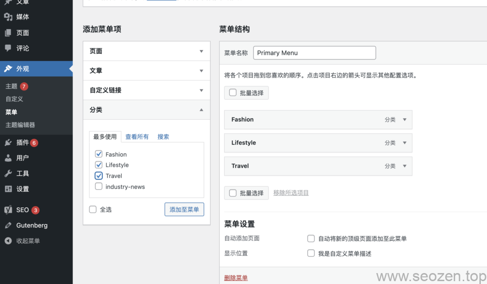
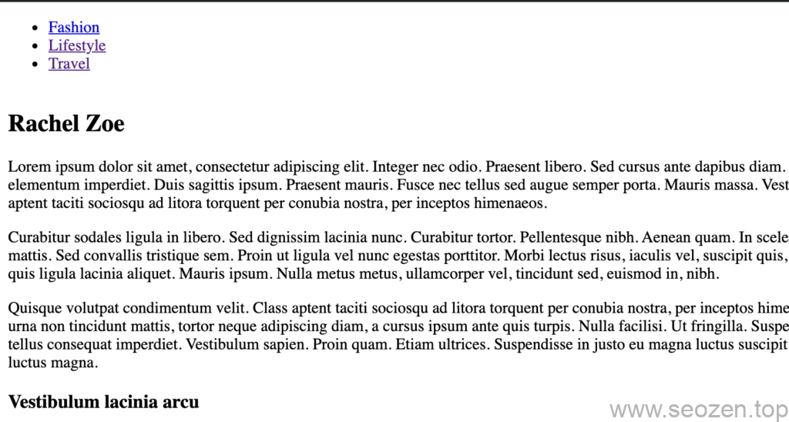

这是从零开始开发wordpress主题系列教程的第七篇，但是标题是五，因为SEO禅把最开始的两篇剔除出去作为基础知识，这样github源码库的分支名称就能和文章名称对应上，这样比较容易理解，也比较容易找到相关的文章记录，如果是一路看下来的朋友，应该知道，我们已经通过**默认WordPress主循环**获取到文章数据，和**[WordPress自定义循环](https://www.seozen.top/wordpress-theme-development-wp_query.html)**获取分类的文章数据，并展示他们，如果还搞不清楚的，就返回到前面的几篇看看，今天SEO禅要分享的是WordPress主题开发中的一个重要概念，WordPress主题特色功能，比如说我们可以在后台自定义菜单，通常我们开发，菜单是通过后台获取的，或者直接写死在代码中，WordPress也同样提供了通过后台获取的方式，当然还有很多其他功能，但是今天我们只介绍菜单的自定义，更多的特性可以参考WordPress官方的下面两个链接：

```
https://codex.wordpress.org/Theme_Features
https://developer.wordpress.org/themes/functionality/navigation-menus/
```

## 自定义导航菜单

想要使用WordPress的自定义菜单功能，必须在主题加载的时候注册这个功能，不然你在后台**外观**\->**菜单**是没有这个选项的，首先我们先修改SEOZEN Dummy源码中的`functions.php`文件，加入如下代码：

```
function register_seozen_dunmmy_menu() {
	// header-menu是这个菜单放在什么位置的标识
	// 描述字段会显示在后台自定义菜单面板下方，需要选中保存才会生效
	register_nav_menu('header-menu', '我是自定义菜单位置描述');
	// register_nav_menus注册多个自定义菜单
}
add_action('init', 'register_seozen_dunmmy_menu');
```

保存代码，再刷新后台界面，看看是不是就可以找到菜单选项了，我们点击菜单选项，打开菜单自定义面板：



WordPress自定义菜单面板

SEO禅把几个文章分类作为菜单，这个自定义菜单的好处在于可以随意更换位置，也可以自定义链接，更换名称等，这样不需要去动代码，注意要勾选**显示位置**，不然这个菜单不会显示，下面我们在`header.php`文件加入下面代码：

```
 wp_nav_menu(
        array(
            "theme_location" => "header-menu"
        )
    );
```

[wp\_nav\_menu](https://developer.wordpress.org/reference/functions/wp_nav_menu/)是用来在前端显示菜单的内置函数，它的参数还有很多，比如说我们这里用的是刚才注册的菜单位置标识，我们也可以直接使用在后台注册面板的菜单名称，这时候就把`theme_location`更换成`menu`，把`header-menu`改成`Primary Menu`一样是生效的，刷新界面，应该可以看到如下样式：



wp\_nav\_menu获取自定义菜单

有些情况，我们一个界面不会只有一个菜单，有时候底部还有菜单，而且用的菜单内容可能还不一样，这时候我们可以使用[regsiter\_nav\_menus](https://developer.wordpress.org/reference/functions/register_nav_menus/)函数，一次性注册多个菜单位置，之后在后台面板新建一个菜单，再安装上面的方法获取菜单就可以，这里SEO禅不单独演示，自己去试试就知道了，自定义菜单就暂时说到这里，下一篇文章SEO禅会说一说使用WordPress主题特性的另一个功能sidebar widgets，自定义底部`footer.php`页面，上一篇侧边栏使用的是硬编码获取分类信息，其实正常来说应该使用widget去做一个获取分类信息的widget插件，之后挂载到自定义的sidebar中去，下一篇就来说说自定义的sidebar，然后使用一些WordPress默认的widget组件，编写widget组件将会放到进阶教程中去说。

本节教程Github源码地址：[05-自定义头部导航-register\_nav\_menu](https://github.com/HelloYu/seozen-dummy/tree/05-%E8%87%AA%E5%AE%9A%E4%B9%89%E5%A4%B4%E9%83%A8%E5%AF%BC%E8%88%AA-register_nav_menu)
