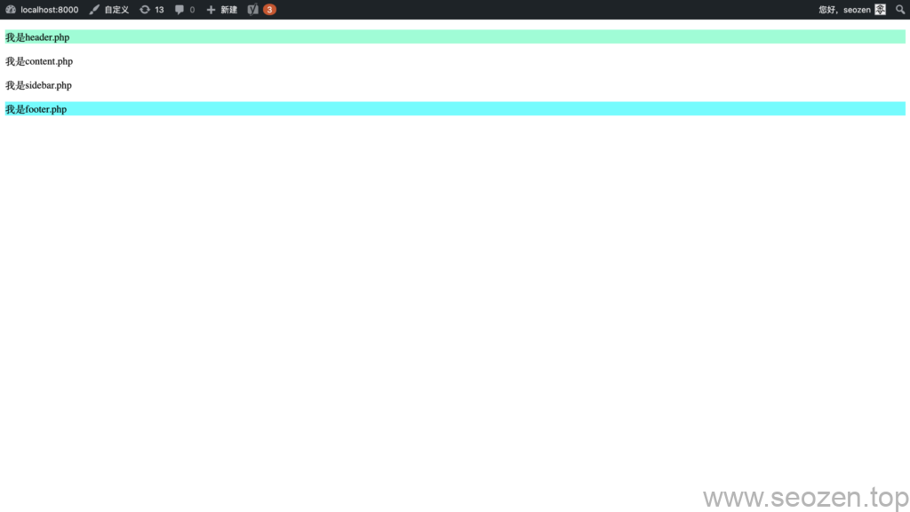
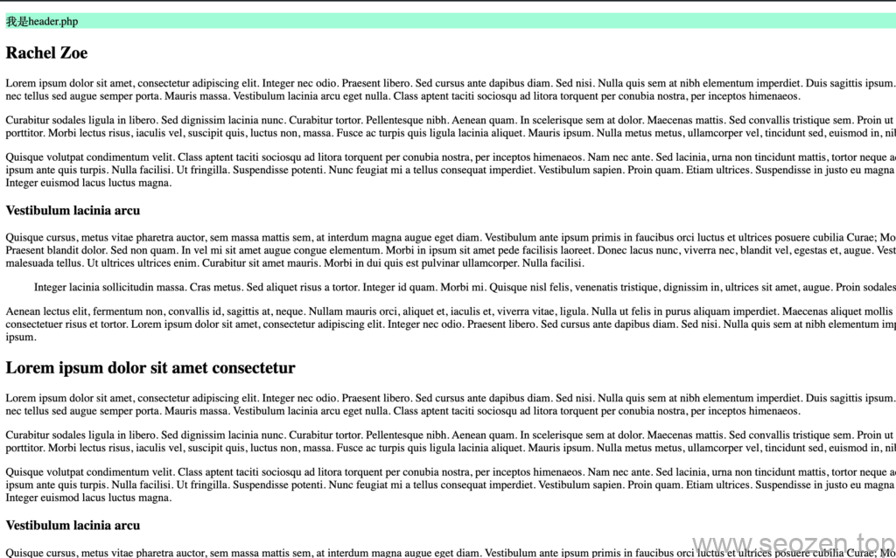

这是《从零开始开发WordPress教程系列》的第三篇，离上一篇[WordPress加载CSS/JS文件](https://www.seozen.top/wordpress-theme-development-load-css-js-functions.html)已经过去有一点时间，但是放心，SEO禅一定不会放鸽子，如果没有看过前面教程的朋友，可以回去看看前面的文章，如果是顺着前面文章看下来的朋友，应该能照着前面介绍的步骤，有下面的界面样子了：



wordpress主题开发教程-加载CSS/JS

今天SEO禅教大家，如何显示文章内容，把`content.php`中的内容充实起来。

## The Loop文章Post

WordPress有个很神奇的机制，那就是默认主循环，也就是今天我们要介绍的Loop，为什么说是默认主循环呢？难道还有其他循环吗？答案是当然有，比如说我们文章的侧边栏，我们就可以设置一个显示推荐文章，或者是热门文章的循环，具体做法可以看SEO禅的[WordPress自定义循环](https://www.seozen.top/wordpress-customize-main-query.html)这篇文章，但是这篇文章我们还是专注在[WordPress主题入门开发](https://www.seozen.top/wordpress-theme-development)这条主线上，从简单到复杂，一步一步学习入门。

当用户进到一个页面之后，WordPress会根据用户请求参数情况，将相关的文章从数据库中找出来，并通过循环机制显示出来，比如用户访问的是搜索页面，那就会根据搜索参数，显示相关搜索内容，这个loop内就是所有相关的文章，在[WordPress模块化开发](https://www.seozen.top/wordpress-theme-development-modularization.html)这篇文章中，SEO禅介绍了**Template tag**，我们可以使用这些**WordPress内置函数**来显示，首先来看看最简单的Loop代码：

```
<?php 
if ( have_posts() ) : 
    while ( have_posts() ) : the_post(); 
        // Display post content
    endwhile; 
endif; 
?>
```

其中`have_posts()` 是否有文章需要显示，如果有，执行下面的`while`循环，`the_post()`函数是抽取装载Loop中的当前文章，将我们的Template Tag中的数据更新为当前文章，比如说我们的`the_title`，或者是`the_content`函数，我们就可以直接使用这些函数来获取当前文章的数据。

## 显示WordPress文章内容

上面我们已经看到了最简单的**WordPress Loop循环**，但是还没有具体显示数据，下面SEO禅教各位如何显示文章数据，WordPress默认显示的是**Post格式的文章数据**，现在我们将**seozen-dummy主题**中的content.php文件内容替换如下：

```
// 原始内容
<p>我是content.php</p>
// 替换内容
<?php 
if ( have_posts() ) : 
    while ( have_posts() ) : the_post(); 
?>
    <h2><?php  the_title(); ?></h2>
    <div>
        <?php  the_content(); ?> 
    </div>
<?php
    endwhile; 
endif; 
```

刷新浏览器，就会看到下图的样子，SEO禅在开发之前已经有导入一些测试数据，你们自己可以在WordPress后台发布一些文章：



wordpress主题开发-loop主循环

`the_content`函数返回的数据是HTML格式的，其实为了安全，我们还需要做一些数据过滤的工作，[防止XSS脚本攻击](https://www.seozen.top/web-seo-security-xss-2021.html)，这里先不谈，后面的教程SEO禅会说到，这里我们已经实现了通过WordPress主循环显示文章数据，我们这里只使用了两个函数，一个获取文章标题，一个获取文章内容，还有更多其他的内置函数可以使用，这个自己看官方文档，当然我们还可以使用内置的**Conditional Tag**，也就是条件函数，来判断不同的页面显示不同的内容之类，比如说我们常用的判断是否是首页，我们可以使用如下代码：

```
<?php 
if ( have_posts() ) : 
    while ( have_posts() ) : the_post(); 
   if(is_front_page()):
?>
    <h2><?php  the_title(); ?></h2>
<?php else: ?>
    <h1><?php  the_title(); ?></h1>
<?php endif; ?>  
    <div>
        <?php  the_content(); ?> 
    </div>
<?php
    endwhile; 
endif; 
```

我们通过`is_front_page`条件函数判断当前页面是否是首页，如果不是就使用`H1`标签来显示文章标题，这是SEO优化方面的一个点，像这种优化，在网站建设的时候就要考虑进去，这篇文章就先讲到这，下篇文章我们来完善侧边栏，通过自定义查询，将相同分类的数据查询处理放在侧边栏显示，要是有什么疑问，可以留言评论。

文章Github代码库地址：[Loop主循环显示Post文章](https://github.com/HelloYu/seozen-dummy/tree/03-Loop%E4%B8%BB%E5%BE%AA%E7%8E%AF%E6%98%BE%E7%A4%BAPost%E6%96%87%E7%AB%A0)
