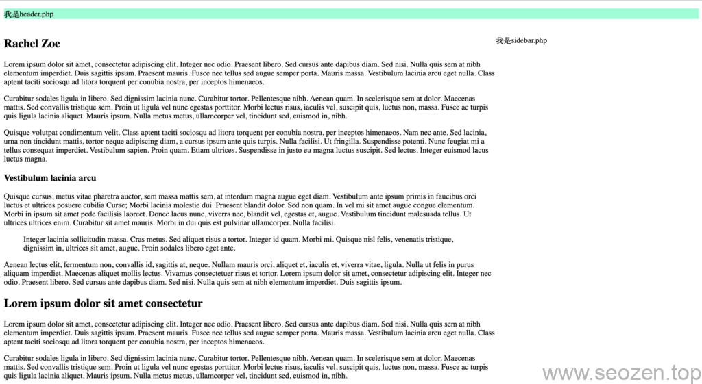
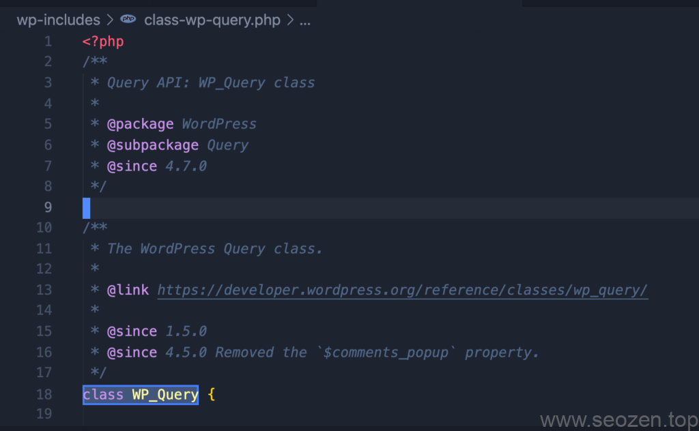
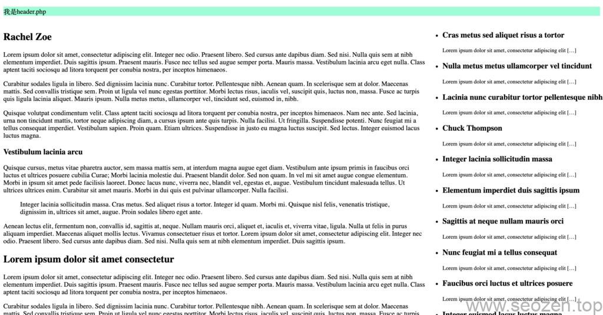

上一篇我已经讲了在WordPress中使用[Loop主循环显示Post文章](https://www.helloyu.top/wordpress-theme-development-loop.html)，这篇文章要介绍下WordPress开发中的重点内容，那就是**WP\_Query类**，如果搞明白这个类，就可以算入门WordPress开发了，无论是开发主题还是插件，今天我们通过使用WP\_Query类自定义查询特定的文章内容。

接着上一篇的源码，我们改造下布局，如果没有源码的可以拉到文章最底部Github源码仓库下载，因为这是入门教程，所以都是使用最原始的方法，没有使用任何的第三方库和打包工具等，等这个系列写完，我会再写一个进阶系列，其中会包括使用Webpack配置开发环境，使用TailwindCSS等第三方库的内容，也会在原有基础上深入使用WordPress的各种Hook机制。



WP\_Query自定义查询布局

## WordPress的心脏WP\_Query

在实际操练之前，我们先来简单了解下WP\_Query，这个类主要负责WordPress中的查询操作，源代码在`wp-includes/class-wp-query.php`文件内，一共有4000多行代码。



WP\_Query源码位置

其中光`get_posts`一个方法，就有1500多行代码，其他我们常用的比如`the_post`只有十几行代码：

```
public function the_post() {
		global $post;
		$this->in_the_loop = true;

		if ( -1 == $this->current_post ) { // Loop has just started.
			/**
			 * Fires once the loop is started.
			 *
			 * @since 2.0.0
			 *
			 * @param WP_Query $query The WP_Query instance (passed by reference).
			 */
			do_action_ref_array( 'loop_start', array( &$this ) );
		}

		$post = $this->next_post();
		$this->setup_postdata( $post );
	}
```

就像前一篇文章我介绍到的，主循环中，我们使用the\_post来切换Post文章和装载Template Tag函数的数据，从源码就能很清楚的看到`$post = $this->next_post();`切换下一篇文章，`$this->setup_postdata( $post );`把当前文章的数据更新装载到各变量中，这里不深究源码知识，学习编程最快的方法就是看官方文档，还有就是看项目源码，有时候文档没有说清楚的地方，看了源码就一目了然，但是WordPress的源码并不值得花太多时间学习，知道原理就好了。

作为入门WordPress开发，我们只要知道如何使用WP\_Query就行，下面我们开始学习如何使用WP\_Query进行自定义查询。

## 自定义查询Post

一般我们网站的侧边栏都会显示当前页相关的内容，这对[SEO优化](https://www.helloyu.top/)来说是很有帮助的，能增加整个网站相关页的权重分配比较平均，我就演示下如何使用WP\_Query查询相关内容，正常来说，我们的网站通常会按两种方式去分类信息，一种是大的分类的形式，一种是标签的形式，这里我们查询相同分类中的文章，我们可以到WordPress开发文档中查看[WP\_Query的分类参数说明](https://developer.wordpress.org/reference/classes/wp_query/#category-parameters)，其中有下面几个参数：

```
cat (int) – use category id.
category_name (string) – use category slug.
category__and (array) – use category id.
category__in (array) – use category id.
category__not_in (array) – use category id.
```

通常我们会使用`slug`的形式去查询相同分类的文章，对应这里的`category_name`，其他属性各位有需要就自己查下文档，不然一篇文章就会写的太长，没啥意义，现在我们改造下`sidebar.php`文件:

```
<?php
$args = array(
    "category_name" => "travel" // travel是我文章分类的slug
);

$custom_posts = new WP_Query($args)
?>
<section>
    <ul>
        <?php if ($custom_posts->have_posts()) :
            while ($custom_posts->have_posts()) : $custom_posts->the_post()
        ?>
                <li>
                    <h3><?php the_title(); ?></h3>
                    <small>
                        <?php the_excerpt(); ?>
                    </small>
                </li>
        <?php
            endwhile;
            wp_reset_postdata(); // 切忌使用完自定义查询以后要调用这个函数
        endif;
        ?>
    </ul>
</section>
```

这里我查询"travel"分类的文章，并显示在侧边栏，效果如下：



WP\_Query条件查询

OK，这篇文章讲到这里差不多结束，具体的使用还是需要查看WP\_Query的API文档，里面有很多参数，如果有什么不懂的也可以留言，下一篇，我要介绍WordPress的主题自定义，并通过改造`header.php`来演示如何自定义导航栏。

本篇教程Github源码仓库地址: [WordPress自定义查询WP\_Query](https://github.com/HelloYu/seozen-dummy/tree/04-%E8%87%AA%E5%AE%9A%E4%B9%89%E6%9F%A5%E8%AF%A2WP_Query)
