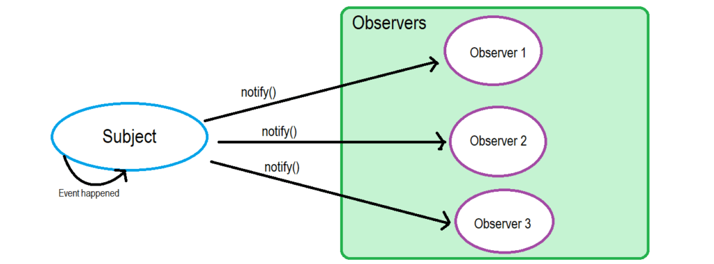
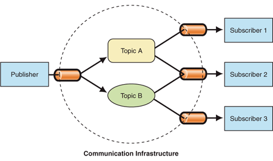

不知道各位在学习设计模式的时候有没有遇到这个问题：**观察者（observer）模式**和**发布订阅（publish-subscribe）模式**有什么区别？

经常在网上看到有人把他们混为一谈，其实他们是不一样的，被误导可能是因为《Head Fisrt Design Patterns》这本书里面有提到：Publishers + subscribers = observer pattern。这段话的意思是观察者+订阅者=观察者模式，但是并不是说观察者模式=发布订阅模式，下面我来具体说说他们的区别。

## 观察者模式（Observer Pattern）

我在学习设计模式的时候，第一个学会的就是观察者模式，因为它就像名字听上去一样显而易见，举个例子：

最近我在12306上面准备买回家过年的火车票，因为春运一票难求，也不可能天天盯着手机抢票，发现12306上既然有个候补的功能，可以订阅自己要买的车次，也就是预购票，如果有这个车次的票，12306就会通知我购买，这个功能就类似观察者模式，12306维护了一个这个车次的候补订阅者名单，如果有车票就按先后顺序通知或者直接购买，如下图：

观察者模式

注：其中这里的subject就是我要买的火车班次。

## 发布订阅模式（Publisher Subscriber Pattern）

这里继续拿12306的例子，虽然不是很贴切，但是大概意思是一样的，火车的班次有很多，而且一个人要回家可能要转车，所以他可能就要买两班车的车票，这时候12306后台就相当于一个班次收集发布的终端，只要某个班次有票，就会通知候补订阅者，但是如果是这种架构，所有的工作就由12306处理，那压力就非常大，耦合也很严重，后台需要维护各种班次和订阅者的信息，这时候我们就可以使用发布订阅模式，如下图：

发布订阅模式

这时候，12306后台就如上图的publisher，它不需要知道订票者（subscriber）的信息，中间这层我们可以称它为消息分发器（Message Broker），由它来维护订票者信息，这样12306就和订票者的关系解耦了，12306只要发布班次信息给消息分发器，由消息分发器去通知相应的订票者。

## 观察者和发布订阅的区别

观察者模式和发布订阅模式有以下两个主要区别：

- 观察者模式中的可观察对象（observable）或者是subject是和观察者耦合的，subject需要维护一份观察者清单列表，然而在发布订阅模式中，观察者（observer）和被观察对象（subject）是不知道对方的存在的，由消息分发器（Message Broker）来维护他们的关系。
- 观察者模式（Observer Pattern）通常是同步执行的，也就是说有事件发生的时候，会立马通知订阅者（Observer），然而发布订阅模式中，通常是异步执行，事件发生之后会推进消息队列（Message Queue）中，由消息分发器去执行分发工作。

这篇文章就分享到这里，有什么问题留言评论。

参考文章：https://betterprogramming.pub/observer-vs-pub-sub-pattern-50d3b27f838c
