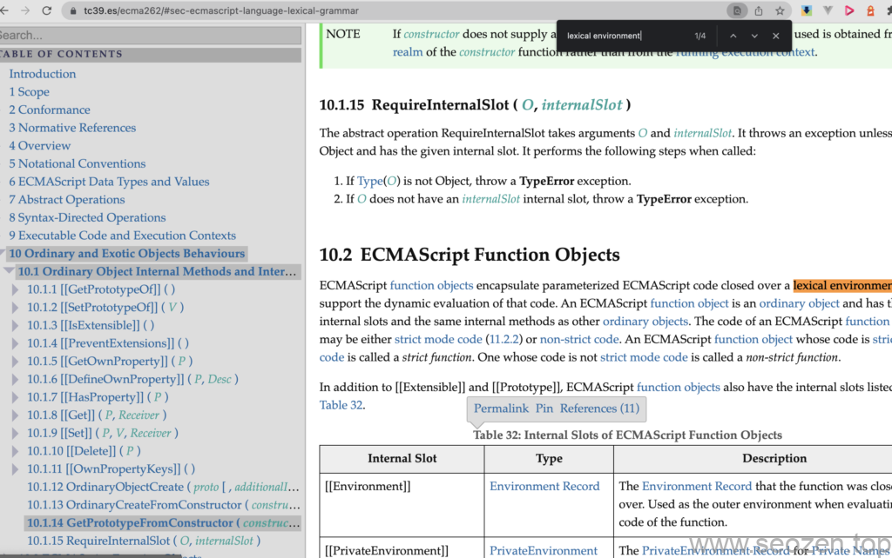

最近SEO禅在巩固复习前端知识，看了看对闭包的解释，网上的说法有很多种，这篇文章主要分享自己对闭包的理解，如果有什么说错的地方，欢迎指正留言评论。

## 什么是闭包？

在谷歌和百度搜索了下什么是闭包，你能得到至少3种以上的说法，比如说：

- 闭包是一个函数，这个函数能访问外部函数的变量
- 闭包是由函数嵌套而成的作用域链
- 闭包是指可以访问其所在作用域的函数
- 闭包是指有权访问另一个函数作用域中的变量的函数
- 闭包就是能够读取其他函数内部变量的函数
- ......

而网上大部分能看到的解释是闭包是一个函数，其实SEO禅认为，闭包是一个函数这种说法并不准确，SEO禅觉得最准确和最有深度的解释是MDN上的解释：

> 一个函数和对其周围状态（**lexical environment，词法环境**）的引用捆绑在一起（或者说函数被引用包围），这样的组合就是**闭包**（**closure**）
> 
> [MDN-闭包](https://developer.mozilla.org/zh-CN/docs/Web/JavaScript/Closures)

上面这段解释中，最后说的是一个组合，而不是函数，那我们来看看这段话具体什么意思，首先一个函数好理解，那什么是周围环境的引用呢？也就是什么是**词法环境**呢？下面SEO禅就来解释下什么是词法环境。

## 词法环境

想要搞清楚什么是词法环境？SEO禅查了挺多资料，也是各种解释都有，就连ecma的官方文档也只提到4次这个词？（难道是SEO禅的方向错了？）



ecma262-词法环境

但是MDN上既然能这么写，一定有它的理由，下面是SEO禅觉得最合理的分析：

**词法环境（Lexical Environment）**是在JS引擎进行词法分析（就是在js引擎执行代码之前的预编译）阶段创建的，可以把它当作一个对象，类似下面的伪代码格式：

```
lexicalEnvironment = {
  environmentRecord: {
    <identifier> : <value>,
    <identifier> : <value>
  }
  outerEnv: < Reference to the parent lexical environment>
}
```

词法环境包括两部分：

- **[环境记录](https://tc39.es/ecma262/#sec-executable-code-and-execution-contexts)**：存储变量声明和函数声明
- 外部环境记录的引用：对父级词法环境的引用

当然根据ecma262标准文档中，环境记录还分好多种，这里就暂时不深究，这里我们只要知道环境记录就是在词法分析阶段，JS引擎为了保存变量或者函数引用而创建的对象，而对于外部环境引用，它其实也是一个环境记录对象，有没有点突然想明白作用域链？只要不断顺着这个外部环境记录的引用往上，就能遍历所有的闭包可访问的变量？下面借用代码来实际看看：

```
let seozen = 'SEO优化';
function mySEO() {
  let seo = '百度优化';  
  console.info(seozen) // SEO优化
}
mySEO();
```

上面这段代码声明在全局环境中，所以我们词法分析后得到的词法环境对象如下：

```
globalLexicalEnvironment = {
  environmentRecord: {
      seozen: 'SEO优化',
      mySEO : < 对mySEO函数的引用 >
  }
  outerEnv: null
}
```

因为是在全局环境下定义，所以这里的outerEnv就是空，当然还有mySEO自己的词法环境对象：

```
functionLexicalEnvironment = {
  environmentRecord: {
      seo: '百度优化',
  }
  outerEnv: globalLexicalEnvironment
}
```

可以看到mySEO函数的词法环境对象的outerEnv指向了全局的词法环境，这样mySEO内部就能访问到外部的变量。

以上代码只是示例代码，词法环境的创建是在JS执行过程：语法分析，预编译，执行三个阶段中的预编译阶段，这个阶段变量并没有进行赋值，只有在执行阶段才进行变量的赋值操作，但是函数引用在词法分析阶段是已经实现的。

这篇文章是关于闭包在底层方面的理解，闭包在JS中扮演非常重要的角色，SEO禅会在其他文章继续介绍闭包的应用，如果觉得有哪里说的不对的，欢迎评论指出，ecma262标准文档太难啃了！
