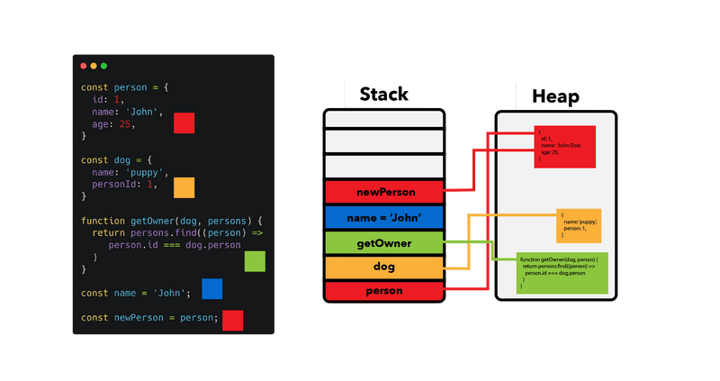

各位同学又见面了，我是SEO禅，今天带来的**JavaScript基础知识**是**深拷贝**和**浅拷贝**，浅拷贝比较简单，但是我们学习嘛，就要由浅入深（听起来有点怪怪的），不能还没学会走路就想跑，在SEO禅做前端的时候，别人喜欢叫前端『切图仔』，现在大前端的概念深入人心，我们前端可以不再是『切图仔』，要是看后端不爽，他的工作我们也顺手做了，但是呢，能这样做，还需要建立在扎实的基础，和不断学习探索的精神上，SEO禅分享的JavaScript基础知识，都是曾经困扰我的一些点，现在对这些知识有了新的，全面的理解，分享出来给大家，也有可能理解有错，如果你觉得不对，就留言评论，欢迎指出SEO禅的不足之处。

## 什么是深浅拷贝

首先SEO禅来解释下什么是深浅拷贝和浅拷贝：**深拷贝是对一个对象的完全拷贝**，包括其中的引用对象，相当于new一个新的对象，**浅拷贝是对一个对象基础类型的拷贝**，如果为对象中有其他引用类型的对象，只会拷贝引用地址。

我估计大部分人看了上面这段话肯定也不知道啥意思，下面SEO禅先说说为什么会有深浅拷贝的原因。

## 深浅拷贝的区别

我们知道在计算机体系中，CPU有一级二级三级缓存，之后就是内存，硬盘，他们的速度是逐级递减的，但是容量是逐级递增，也就是说，他们的读取速度是：CPU缓存 > 内存 > 硬盘，他们的容量大小是：硬盘 > 内存 > CPU缓存，等等？什么情况？SEO禅你是不是在水文章啊，深浅拷贝和CPU，内存，硬盘啥关系？且听我慢慢道来，没有水文章（嘿嘿嘿），这是计算机物理架构体系，那我们软件架构体系是怎么样的呢？其实他们也是差不多的，可以看看下面这张图：



JavaScript变量体系

我们在代码中申明的变量，除了基础数据类型（string，number， boolean 等），其他的引用类型都是在Stack中存放的引用对象地址，我们的`name=John`是字符串类型，直接就可以存放在**程序栈(Stack)**中，而其他的数据类型因为比较复杂，占用的内存比较多，就存放在**程序堆(Heap)**中，这样应该就会明白点深浅拷贝的区别了吧？

对于浅拷贝，如果是基础数据类型，就新拷贝一份数据放在栈中，如果是复杂数据类型，就会和原来拷贝对象指向同一个堆地址，所以我们在修改基础数据类型的时候不会影响到拷贝对象，而修改复杂数据类型的时候，拷贝对象的数据就会被同步更新。

如果是深拷贝，对于基础数据类型处理的方式和浅拷贝基本一样，对于复杂引用数据类型，这时候就需要重新复制一份堆中的数据，之后在栈中生成相同的属性名，然后指向堆中新的数据地址，这样才算完成了深拷贝。下面SEO禅开始用一些JavaScript实例来分享，如果这个概念懂了，代码实现都是小事情。

## JavaScript深浅拷贝由浅入深

上面SEO禅已经说了深浅拷贝的概念，下面我们来看看实际工作中遇到的深浅拷贝，之后再讨论几中深拷贝方法，首先我们来看看浅拷贝。

### JavaScript浅拷贝

在我们编写前端代码的时候，每天我们都会用到浅拷贝，比如说：

```
let seo = 'https://www.seozen.top/'
let seozen = seo

seo = 'seo禅'
console.log(seo)  //seo禅
console.log(seozen) // https://www.seozen.top/
```

因为这里我们的变量都是基础数据类型，所以浅拷贝都是新的实例，如果是下面的代码：

```
let seo = {
   name: 'seo禅',
   site: 'https://www.seozen.top/'
}

let seozen = seo

seo.name = 'seo禅超级帅'
console.log(seo.name)  //seo禅超级帅
console.log(seozen.name) //seo禅超级帅
```

这时候浅拷贝的对象就相当于只拷贝了一个栈上的变量，这个变量保存的是堆数据的地址。

那我们要怎么进行这种只有一层级对象的浅拷贝呢？

#### `...`(Spread Operator) 扩展操作符

ES6中引进了一个新的符号`...`(Spread Operator) 扩展操作符，如果是单个对象或者数组没有内嵌，使用这个语法很方便：

```
let seozen = {...seo}
seo.name = 'seo禅超级帅'
console.log(seo.name)  //seo禅超级帅
console.log(seozen.name) //seo禅
```

#### Object.assign函数

再拿上面例子，我们还可以使用`Object.assign`方法：

```
let seozen = Object.assign({},seo)
```

结果和使用`...`操作符是一样的。对于数组来说，我们还可以使用slice和from等方法，这里就不多介绍。

### JavaScript深拷贝

对于深拷贝，会麻烦些，有很多第三方库，比如说Lodash的cloneDeep，SEO禅这里不介绍第三方库的深拷贝。

#### JSON.parse/stringify

要说到最最简单的深拷贝原生方法，那就是**JSON.parse/stringify**，只要一行代码就完事，当然限制也是最多的，这个方法不支持复杂的数据类型，也就是JSON对象中，不能有Date，undefined，Infinity，NaN，Map，Set等这些数据类型，如果有这些类型，大多数会成为null输出：

```
let seozen = JSON.parse(JSON.stringify(seo))
```

这是一个序列化和反序列化的过程，如果是纯JSON对象，可以用这种方式。

#### 递归深拷贝

想要真正的实现深拷贝，包括其中的函数和复杂的数据类型，必须通过递归的方式，如下代码：

```
const deepCopyFunction = (inputObject) => {
  
  let outputObject = Array.isArray(inputObject) ? [] : {}; 
 
  let key;
  let value;

  if (typeof inputObject !== "object" || inputObject === null) {
    return inputObject; //如果输入的数据不是对象就直接返回
  }

  for (key in inputObject) {
    value = inputObject[key];
    outputObject[key] = deepCopyFunction(value); 
   // 递归拷贝对象，包括数组
  }
  return outputObject;
}
```

我们通过`typeof`来判断数据的类型，只要不是`object`只表示不需要继续递归拷贝，可以把值直接返回，如果是数组，`typeof`的结果也是`object`，所以数组内的数据还需要继续递归，很多面试官喜欢让面试者手写深拷贝代码，其实只要记住使用typeof判断递归的返回条件就行。

今天的分享就到这里吧，深浅拷贝也算是一道在面试前端开发岗位中比较常见的一道题，各位如果理解了那就会很快的写出来，希望这篇文章对各位有帮助，下次再见。
