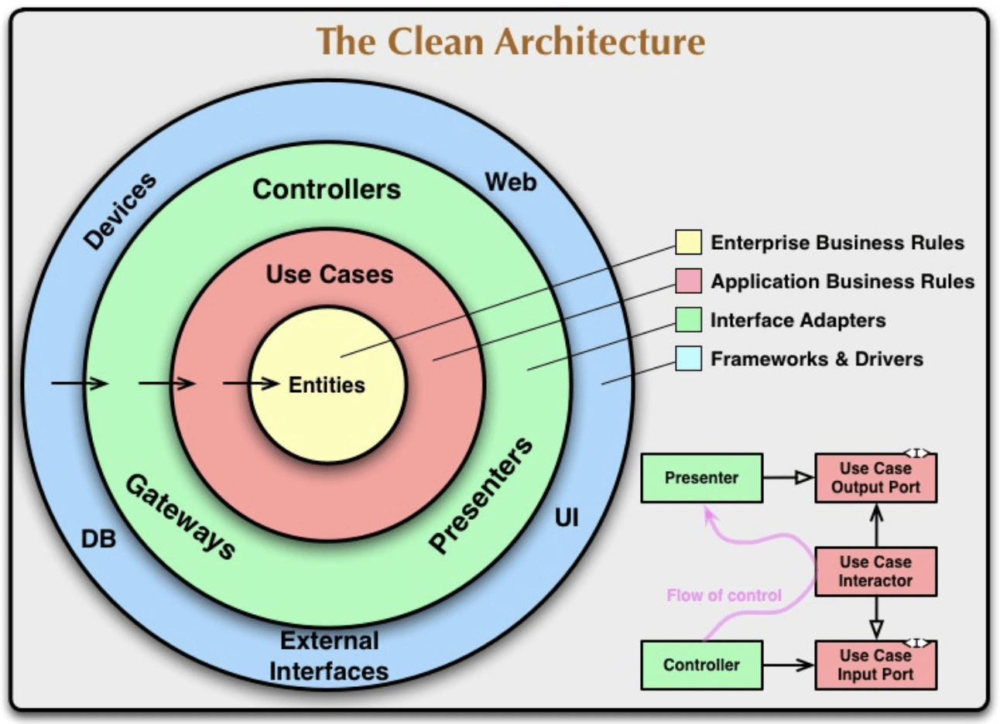

## Clean Architecture介绍



Clean Architecture（简称CA）是一种软件架构设计思想，旨在解决软件系统的可维护性、可测试性、可扩展性等问题。CA的核心思想是：将应用程序分为不同的层，每个层都有自己的职责和依赖规则，层与层之间通过接口进行通信，依赖关系保持单向。这样做的好处是，系统的不同部分之间松耦合，易于维护和扩展，也方便进行单元测试和集成测试。

CA的基本结构通常由以下几个部分组成：

1. 实体（Entity）：代表系统的核心概念和业务规则，包括属性和行为，是应用程序中最重要的部分，应该是独立于任何其他部分的。

3. 用例（Use Case）：描述了系统的功能和行为，是与用户交互的部分，负责调用实体和协调其他部分的工作流程。

5. 接口适配器（Interface Adapter）：负责将用例和实体连接到外部系统和用户接口，包括控制器、门户网站、命令行接口等。

7. 框架和驱动程序（Framework & Drivers）：负责连接整个系统的外部环境，包括数据库、web框架、消息队列等。

CA的一个重要特点是，每个部分都只依赖于比自己低一层的部分，避免了高层部分直接依赖于低层部分的情况。这种结构使得系统的各个部分都能独立演化，不会产生副作用，也能避免由于依赖关系的变化而导致的系统崩溃。

CA的思想并不是最近才出现的，它最早是由Robert C. Martin在他的文章《[The Clean Architecture](https://blog.cleancoder.com/uncle-bob/2012/08/13/the-clean-architecture.html)》中提出的。它已经被广泛应用于许多大型项目和企业，如Android应用程序、Java EE应用程序、Node.js应用程序等。在现代Web应用程序开发中，使用CA进行开发已经成为了一种趋势。

## Entity业务实体层

上面介绍中可以知道，大概分为4层，但是我们使用NestJS一般作为后端API使用，在实际开发过程中，SEO禅喜欢把项目分为三层，现在先介绍Entity业务实体层。

在 Clean Architecture 中，Entity 实体层是系统的核心，它包含了业务逻辑和状态，是系统的基础构建块。Entity 实体层通常是与业务逻辑密切相关的部分，负责处理业务领域内的问题。Entity 实体层不依赖于外部系统，也不涉及到和数据库交互的操作，其目的是将业务逻辑和状态信息独立于技术实现，从而更加关注业务需求，提高代码的可维护性和可测试性。

在实现 Entity 实体层时，通常会使用面向对象的思想，将业务领域内的概念抽象成实体对象，并封装相关的属性和方法。Entity 实体对象通常是具有唯一标识符的对象，比如说一个用户对象、一个订单对象、一个商品对象等等。这些实体对象可以彼此之间关联，形成复杂的业务对象结构。

Entity 实体层应该只包含与业务逻辑相关的代码，不应该包含任何技术实现相关的代码，比如说与数据库、缓存、消息队列等的交互。这样可以使得业务逻辑和技术实现独立，有利于测试、修改和维护。同时，Entity 实体层的代码应该具有高内聚、低耦合的特点，方便代码重用和扩展。

在 NestJS 中，可以通过定义类来实现 Entity 实体层，通常在类中定义实体对象的属性和方法。下面是一个简单的示例：
```ts
export class UserEntity {
  constructor(
    public readonly id: number,
    public readonly name: string,
    public readonly email: string,
    public readonly password: string,
  ) {}
  
  public async verifyPassword(password: string): Promise<boolean> {
    // 验证密码的逻辑
  }
  
  public async updateName(name: string): Promise<void> {
    // 更新用户名的逻辑
  }
}
```
在上面的示例中，我们定义了一个 UserEntity 类，它包含了用户的基本属性和一些相关的方法。这里的属性和方法都是与业务逻辑相关的，不涉及到具体的技术实现。同时，我们也没有和任何数据库或者其他技术实现相关的代码。这样，我们就可以在这个 Entity 实体层上，编写和测试业务逻辑，而不用考虑具体的技术实现。

## Use Case业务逻辑层

在 Clean Architecture 中，Use Case 层被定义为业务逻辑和用例流程的实现。它是应用程序的核心，负责实现具体的业务规则和操作。Use Case 层通常是与其他层分离的，并通过接口与框架和驱动程序交互。

在 NestJS 中，我们可以将 Use Case 层实现为 service 或者 provider。它们负责对 domain 层的 entities 进行操作，并在需要时调用其它 service 或 provider 实现特定的 Use Case。

下面是一个示例 Use Case 实现：
```ts
import { Injectable } from '@nestjs/common';
import { InjectRepository } from '@nestjs/typeorm';
import { Repository } from 'typeorm';
import { Post } from '../entities/post.entity';

@Injectable()
export class GetPostByIdUseCase {
  constructor(
    @InjectRepository(Post)
    private readonly postRepository: Repository<Post>,
  ) {}

  async execute(postId: string): Promise<Post> {
    const post = await this.postRepository.findOne(postId);
    if (!post) {
      throw new Error('Post not found');
    }
    return post;
  }
}
```
在上面的示例中，我们定义了一个名为 `GetPostByIdUseCase` 的 Use Case。它接收一个 `postId` 参数，并返回对应的 `Post` 实体。我们使用了 TypeORM 库来访问数据库，并在 constructor 中使用 `@InjectRepository()` 装饰器来注入 `Post` 实体的 Repository 对象。

在 `execute()` 方法中，我们使用 `findOne()` 方法从数据库中获取对应的 `Post` 实体，并根据情况抛出异常。这个 Use Case 实现只是一个简单的示例，我们可以根据实际需求添加更多的业务逻辑和操作。

需要注意的是，这个 Use Case 实现是与框架和驱动程序无关的，它只依赖于 domain 层的 entities 和 Repository 对象，可以方便地进行单元测试和模拟。

## Infrastructure具体实现层

在 Clean Architecture 中，infrastructure 层负责实现具体的技术细节，例如数据库访问、API 调用、第三方库的使用等。

在 NestJS 中，infrastructure 层通常由以下部分组成：

- 数据库：Mongoose、TypeORM 等

- 缓存：Redis、Memcached 等

- 消息队列：RabbitMQ、Kafka 等

- API 接口：Express、Fastify 等

这些技术细节的实现，应该尽可能地与系统其他部分分离，保持单一职责，以便随时更换或升级底层技术实现。

以下是一个使用 Mongoose 实现数据持久化的示例：
```ts
import { Injectable } from '@nestjs/common';
import { InjectModel } from '@nestjs/mongoose';
import { Model } from 'mongoose';
import { User } from './user.entity';

@Injectable()
export class UserRepository {
  constructor(
    @InjectModel(User.name) private readonly userModel: Model<User>,
  ) {}

  async create(user: User): Promise<User> {
    const createdUser = new this.userModel(user);
    return createdUser.save();
  }

  async findOneByEmail(email: string): Promise<User | null> {
    return this.userModel.findOne({ email }).exec();
  }
}
```

在该示例中，我们使用 Mongoose 提供的 `Model` 对象来访问 MongoDB 数据库。`UserRepository` 作为数据访问的一个门面（Facade），提供了对外的操作接口，而具体的数据库访问细节则被封装在了该类内部。

这样的设计可以让我们在需要更换数据库实现时，只需要更改 `UserRepository` 类的内部实现即可，而不会影响到其他层次的代码。

## 结束语

这篇文章大部分内容由ChatGPT生成，SEO禅感觉并不是很严谨，会再写一篇文章，用实例代码讲解Clean Architecture在NestJS中的实现。
