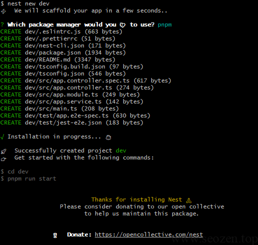
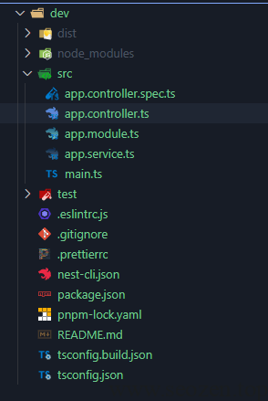
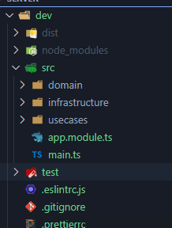
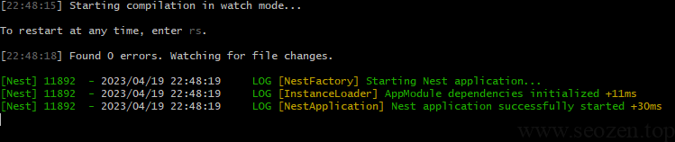
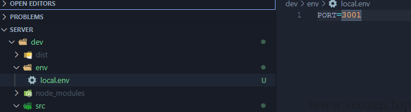
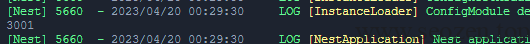
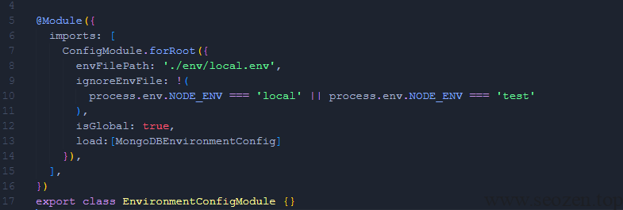
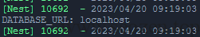

在前一篇文章《[\[ChatGPT\]Clean Architecture架构在NestJS中的实现](https://www.seozen.top/clean-architecture-in-nestjs-by-chatgpt.html)》，SEO禅用ChatGPT生成了一些关于**clean architecture**的介绍，但是感觉不够通顺，也不够严谨，在这篇文章SEO禅会进行示例介绍，从零开始搭建一个Clean Architecture(简称CA)的NestJS项目，CA中关键的四个点：Entities(不是指代数据库的entity)、Use Cases 业务用例、Interface Adapaters 接口适配器（Controller/Presenter等）、Frameworks & Drivers 框架和驱动，现在不理解没关系，接着往下看，SEO禅用实例来讲解。

## 初始化项目

首先我们来创建一个NestJS项目，运行`nest new project-name`生成项目目录结构：



安装依赖完成之后，会有如下目录结构：



我们把`app.controller/.spec.ts`和`app.service.ts`这三个文件删除掉，然后创建三个新的目录：



这里介绍下这三个目录的不同：

**domain** - 对应CA中的entities层，不会依赖外层代码，比如说我们的interface，model，等比较抽象，变动最不频繁的一部分代码。

**infrastructure** - 基础框架层，对应了我们最外层的Frameworks & Drivers 和 Interface Adapter两层的内容，这里的代码是最经常改动的，比如说我们的service具体实现，数据库实体模型Entity等内容，依赖domain层和usecases层。

**usecases** - 业务用例层，这一层对应的就是CA中的usecases层了，这里只会出现domain层的代码，而不会出现infrastructure层的代码。

## 加载项目配置

我们已经创建好基础的项目目录了，如果是传统的后台开发，我们肯定要先配置好Tomcat，Nginx，Mysql这些开发环境，但是这次使用的是NestJS作为后台开发框架，我们运行`pnpm run start:dev`命令就能进行开发：



但是我们还需要连接数据库，这里SEO禅选择MongoDB作为数据库，在连接数据库前，首先我们来获取下数据库的配置信息，使用`@nestjs/config`包来载入我们的配置信息：
```
pnpm i @nestjs/config
```
安装完成以后，运行如下命令，创建`environment-config`模块：
```
nest g mo infrastructure/config/environment-config
```
environment-config.module.ts中的代码：
```
@Module({
  imports: \[
    ConfigModule.forRoot({
      envFilePath: './env/local.env',
      ignoreEnvFile: !(
        process.env.NODE\_ENV === 'local' || process.env.NODE\_ENV === 'test'
      ),
      isGlobal: true,
    }),
  \],
})
export class EnvironmentConfigModule {}
```
之后我们创建一个文件`env/local.env`，文件里写入一些配置信息：



再改造下`main.ts`文件来使用配置信息：
```
import { NestFactory } from '@nestjs/core';
import { AppModule } from './app.module';
import { ConfigService } from '@nestjs/config';

async function bootstrap() {
  const app = await NestFactory.create(AppModule);
  const configService = app.get(ConfigService);
  const port = configService.get('PORT');
  console.info(port)
  await app.listen(port||3000);
}
bootstrap();
```
现在我们需要改下`package.json`里的启动命令，来使用配置信息：
```
"start:dev": "cross-env NODE\_ENV=local nest start --watch"
```
如果在Windows下运行，会报错：
```
The term 'NODE\_ENV=development' is not recognized as the name of a cmdlet, function, script file, or operable program
```
这里SEO禅使用了cross-env来声明`NODE_ENV=local`，防止在多平台下报错，安装下这个包：
```
 pnpm i -D cross-env
```
之后再重新启动服务器，就能看到输出的`PORT`参数：



## 效验项目配置

上面已经可以读到配置文件中的参数信息，那在使用前，我们需要对参数进行效验，防止因为格式错误而导致一些问题，这里SEO禅使用的是自定义效验函数的方法，可以参考官方文档[Custom validate function](https://docs.nestjs.com/techniques/configuration#custom-validate-function)

首先安装下面的两个包：
```
pnpm i class-transformer class-validator
```
我们再来创建一个MongoDB的config文件：
```
export class MongoDBEnvironmentVariables {
  @IsString()
  DATABASE\_URL: string;
}

export const MongoDBEnvironmentConfig =  registerAs('database', (): IMongoDBConfig => {
  
  // Executes our custom function
  environmentValidationUtil(process.env,MongoDBEnvironmentVariables);

  // If all is valid, this will return successfully
  return {
    url: process.env.NODE\_ENV,
  };
});
```
这里`environmentValidationUtil`是SEO禅对上面两个包的封装，代码如下：
```
export function environmentValidationUtil(
  config: Record<string, unknown>, 
  envVariablesClass: ClassConstructor<any>
) {
  const validatedConfig = plainToClass(
    envVariablesClass,
    config,
    { enableImplicitConversion: true },
  );
  const errors = validateSync(validatedConfig, { skipMissingProperties: false });

  if (errors.length > 0) {
    throw new Error(errors.toString());
  }
  return validatedConfig;
}
```
再把MongoDB的配置加入到`config module`中的`load`：



现在我们再来运行下nest，你会发现报错了：
```
 ERROR \[ExceptionHandler\] An instance of MongoDBEnvironmentVariables has failed the validation:
 - property DATABASE\_URL has failed the following constraints: isString 
```
这样效验规则就起作用了，我们只要把`DATABASE_URL`这个参数加入到`env\local.env`文件中去，然后在main.ts就能调用到了：
```
  const DATABASE\_URL = configService.get('DATABASE\_URL');
  // const DATABASE\_URL = configService.get('database.url');  使用命名空间的方式调用
  console.info('DATABASE\_URL:',DATABASE\_URL)
```


因为篇幅有限，介绍Clean Architecture架构在NestJS中实践会分成多个文章来说，这篇文章先介绍初始化项目，下一篇文章会介绍如何使用这些获取到的配置，还有如何使用Docker来实际连接MongoDB数据库。

这个系列文章的代码：[clean-architecture-with-nestjs](https://github.com/HelloYu/clean-architecture-with-nestjs)
