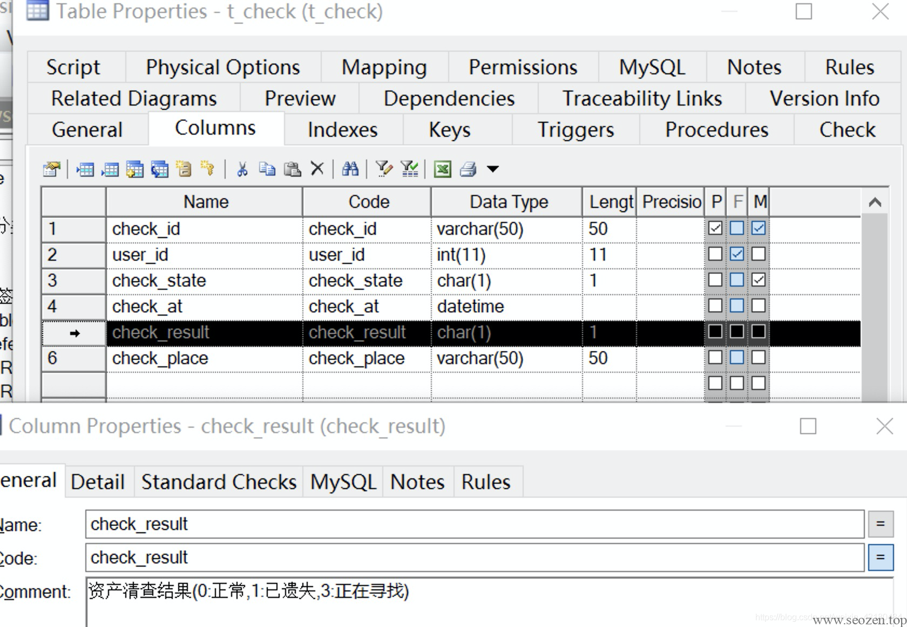
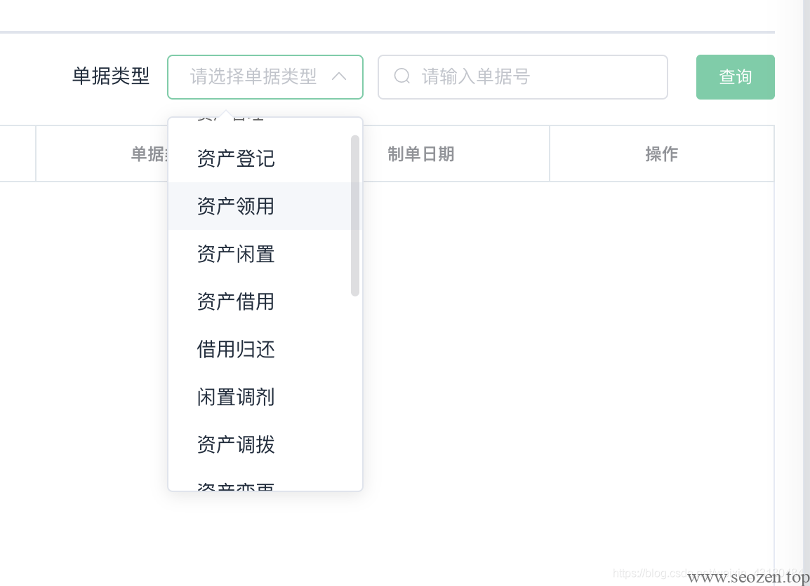
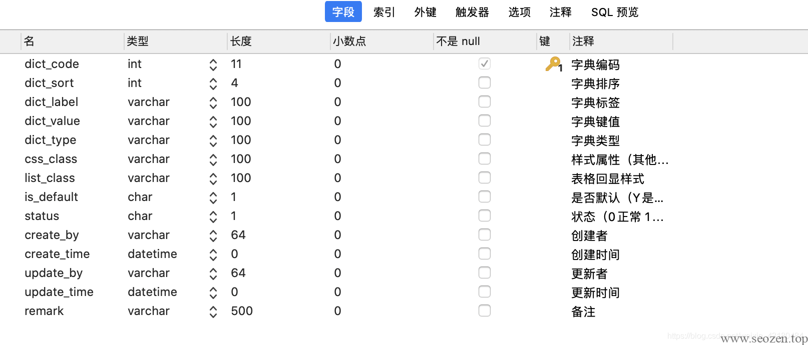
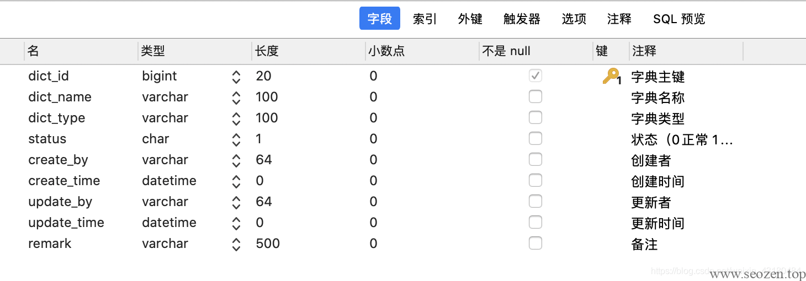
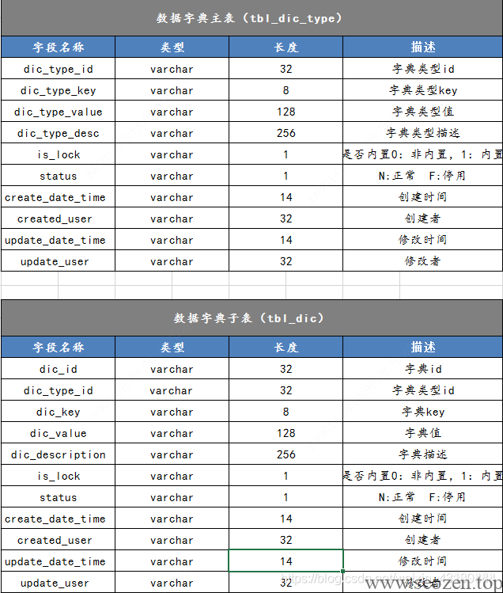

# 使用场景

  
在平时开发的过程中，特别是在遇到表单时候，我们经常需要为前端提供一些下拉选项的信息，这时候我们需要为前端提供下拉菜单的信息，让前端进行渲染。同时我们在数据库中存储的只可能是对应的编码，例子如下：


这里我们可以看到在搜索栏中，有一个下拉菜单。如果前端直接将value值写死在前端代码中，那么就破坏了低耦合原则，如果未来清查状态有增加或者管理员想要修改，那么需要修改前端代码，会带来非常大的麻烦  

## 解决方案

  
**简单解决：  
**对字段值比较稳定，不存在比较大的变动,同时对应的分类数不超过3个，例如：性别(用0表示男，1表示女），我们在数据库中呢可以用char(1)这种数据类型来进行存储，同时在pdm文件中注释标明对应表示的含义



企业级理解：  
对于字段数目比较多，情况复杂的情况（如下），我们考虑通过设计数据字典来解决这类问题。



**数据字典是什么**：  
直接附上数据库设计


  
这里我们可以看到，某一个下拉框的数据通过标识字段dict\_type存储，查询时如果我们需要某一个下拉框的数据，我们只需要获得该标识字段，同时进入数据字典查询即可，其中dict\_label就是前端显示的文字。同时我们还添加了一些用于前端页面显示的字段，比如说有些选项需要高亮显示，或者设置一些默认值，我们可以通过在渲染时判断该关键值比如途中is\_dafault 是否为N，或者绑定css字段中的class字段来实现样式的变换，这样通过接口返回给前端list时，前端便可以直接获取清晰明了的字段id，含义，同时还可以进行一些特殊样式的渲染等。

我的表字段设计：

**字典数据表**  



**字典类型表**  



其他人的设计：  



**使用数据字典的优点：**  
一， 在一定程度上，通过系统维护人员即可改变系统的行为（功能），不需要开发人员的介入。使得系统的变化更快，能及时响应客户和市场的需求。

二， 提高了系统的灵活性、通用性，减少了主体和属性的耦合度

三， 简化了主体类的业务逻辑

四， 能减少对系统程序的改动，使数据库、程序和页面更稳定。特别是数据量大的时候，能大幅减少开发工作量

五， 使数据库表结构和程序结构条理上更清楚，更容易理解，在可开发性、可扩展性、可维护性、系统强壮性上都有优势。  
```
/\*==============================================================\*/
/\* Table: sys\_dict\_data                                         \*/
/\*==============================================================\*/
create table sys\_dict\_data
(
   dict\_code            int(11) not null auto\_increment comment '字典编码',
   dict\_sort            int(4) default 0 comment '字典排序',
   dict\_label           varchar(100) default '' comment '字典标签',
   dict\_value           varchar(100) default '' comment '字典键值',
   dict\_type            varchar(100) default '' comment '字典类型',
   css\_class            varchar(100) default '' comment '样式属性（其他样式扩展）',
   list\_class           varchar(100) default '' comment '表格回显样式',
   is\_default           char(1) default 'N' comment '是否默认（Y是 N否）',
   status               char(1) default '0' comment '状态（0正常 1停用）',
   create\_by            varchar(64) default '' comment '创建者',
   create\_time          datetime default NULL comment '创建时间',
   update\_by            varchar(64) default '' comment '更新者',
   update\_time          datetime default NULL comment '更新时间',
   remark               varchar(500) default '' comment '备注',
   primary key (dict\_code)
)
ENGINE=InnoDB AUTO\_INCREMENT=410 DEFAULT CHARSET=utf8 ROW\_FORMAT=COMPACT COMMENT='字典数据表';

alter table sys\_dict\_data comment '字典数据表';

/\*==============================================================\*/
/\* Table: sys\_dict\_type                                         \*/
/\*==============================================================\*/
create table sys\_dict\_type
(
   dict\_id              bigint(20) not null auto\_increment comment '字典主键',
   dict\_name            varchar(100) default '' comment '字典名称',
   dict\_type            varchar(100) default '' comment '字典类型',
   status               char(1) default '0' comment '状态（0正常 1停用）',
   create\_by            varchar(64) default '' comment '创建者',
   create\_time          datetime default NULL comment '创建时间',
   update\_by            varchar(64) default '' comment '更新者',
   update\_time          datetime default NULL comment '更新时间',
   remark               varchar(500) default NULL comment '备注',
   primary key (dict\_id),
   unique key dict\_type (dict\_type)
)
ENGINE=InnoDB AUTO\_INCREMENT=131 DEFAULT CHARSET=utf8 COMMENT='字典类型表';

alter table sys\_dict\_type comment '字典类型表';
```