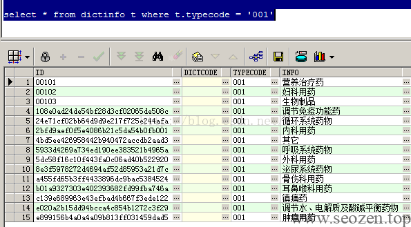
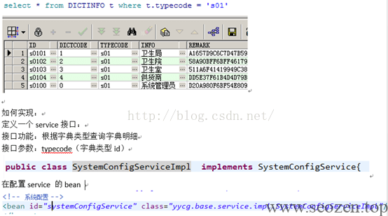

## 1.1什么是数据字典

将如下这些具有相同类型的配置项，配置到系统的**数据字典表**中，方便系统维护，由超级管理员统一在后台进行数据字典维护，如果用户需求要增加变更配置项，只需要修改数据字典表记录即可，不需要修改代码。


## 1.2数据字典需求

相同类型的配置项：

在系统中创建一张记录数据**字典类型**，数据字典类型表记录数据的类型（例如用户状态）

创建一张表记录数据**字典明细**：（例如用户状态为正常 暂停）

数据字典明细表


将上边变化灵活的配置项叫做：“**普通配置项**”

将上边固定的配置项（**每个配置项都有一个代码**）：“**业务代码**”（上图好像图文不匹配--我）

## 1.3数据字典表结构

字典类型表DICTTYPE：记录数据字典类型

字典明细表DICTINFO：记录数据字典明细


字典明细表中如何存储普通配置项和业务代码？

**普通配置项存储：**

普通配置项名称存储在DICTINFO表中info字段

普通配置项对应的类型id存储在DICTINFO表中TYPECODE

查询普通配置顶：



**业务代码存储：**

业务代码对应的名称存储在DICTINFO表中info字段

业务代码对应的类型id存储在DICTINFO表中TYPECODE

**业务代码存储在DICTINFO表中DICTCODE(是和普通配置项的区别)**

业务代码查询：


（这里感觉设计有点冗余，区分普通配置项和业务配置项，而且是不同字段存储的，可以参考《[数据字典的使用与设计](https://www.helloyu.top/data-dictionary-design-for-software-architecture.html)》。——我）

## 1.4数据字典使用

1、在页面上的下拉框中显示业务代码或普通配置

比如：在系统用户查询页面，查询条件就是用户类型，用户类型不能在jsp上硬编码，需要在action方法中取出用户类型所有配置项，在jsp页面动态遍历。

2、在查询业务表需要关联查询出业务代码对应的名称

在查询业务表时，根据业务代码，关联查询出代码对应的名称。

关联查询字典明细时**指定业务代码和类型id**


3、在查询业务表需要关联查询出普通配置项所对应的名称

关联查询字典明细时**指定明细表的主键**


## 1.5小结

普通配置项：对业务数据进行简单的归类，这些归类受用户要求变化较灵活，将这些配置项作普通配置项配置数据字典表。

业务代码：系统运行所必须的，在系统设计时定义的固定代码，这些代码可能需要在程序代码进行硬编码。

## 1.6数据字典在系统中应用

1.6.1用户查询页面用户类型下拉框

用户类型：属于业务代码

获取用户类型下所有明细：

从数据字典明细表查询，根据typecode查询



Action：

修改用户查询页面方法，调用systemConfigService查询用户类型信息，将用户类型列表信息传入页面。
```
// 用户查询页面

   @RequestMapping("/queryuser")

   public String queryuser(Modelmodel)throwsException {

      //将页面所需的数据取出传入页面

      List<Dictinfo>groupList =systemConfigService.findDictinfoByType("s01");

      model.addAttribute("groupList",groupList);

      return"/base/user/queryuser";

   }
```
页面：

将用户类型下拉框值，改成遍历groupList列表。
```
<TDclass="left">用户类型：</TD>

                <td><selectname="sysuserCustom.groupid">

                      <option value="">请选择</option>

                      <!-- <option value="1">卫生局</option>

                      <optionvalue="2">卫生院</option>

                      <optionvalue="3">卫生室</option>

                      <optionvalue="4">供货商</option>

                      <optionvalue="0">系统管理员</option> -->

                      <c:forEach items='${groupList}'var="dictinfo">

                      <option value="${dictinfo.dictcode}">${dictinfo.info}</option>

                      </c:forEach>                  

                </select>

                </TD>
```
1.6.2用户查询列表中用户类型列

Dao:

修改用户查询列表mapper，添加一列需要关联用户类型的代码查询代码对应的名称。


页面：

修改datagrid的列定义，
```
{

      field : 'groupname',//对应json中的key

      title : '用户类型',

      width : 120,

      /\* formatter : function(value, row,index) {//通过此方法格式化显示内容,value表示从json中取出该单元格的值，row表示这一行的数据，是一个对象,index:行的序号

         if(value =='1'){

            return "卫生局";

         }else if(value =='2'){

            return "卫生院";

         }else if(value =='3'){

            return "卫生室";

         }else if(value =='4'){

            return "供货商";

         }else if(value =='0'){

            return "系统管理员";

         }

      } \*/

   }
```
普通配置项下拉框

查询出普通配置项列表，

页面中下拉框遍历list（option的value是${dictinfo.id}）
```
<c:forEachitems="${list}"var="dictinfo">

    <option value="${dictinfo.id }">${dictinfo.info}</option>

</c:forEach>
```
转载自：未找到实际出处
