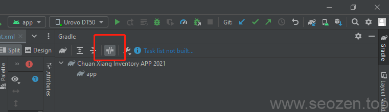

SEO禅今天打开以前的一个安卓项目，想做些修改，运行的时候遇到了如下的错误提示：
```
Caused by: org.gradle.api.internal.artifacts.ivyservice.DefaultLenientConfiguration$ArtifactResolveException: Could not resolve all files for configuration ':app:debugRuntimeClasspath'.
```
网上大多数解决方案都是更换Maven库代理，或者更换顺序，其实很有可能你现在的Gradle是处于离线模式，看看是不是如下图:



Gradle处于离线模式

点击上面的红框图标，把Gradle改成online模式，可以试试解决这个问题。
