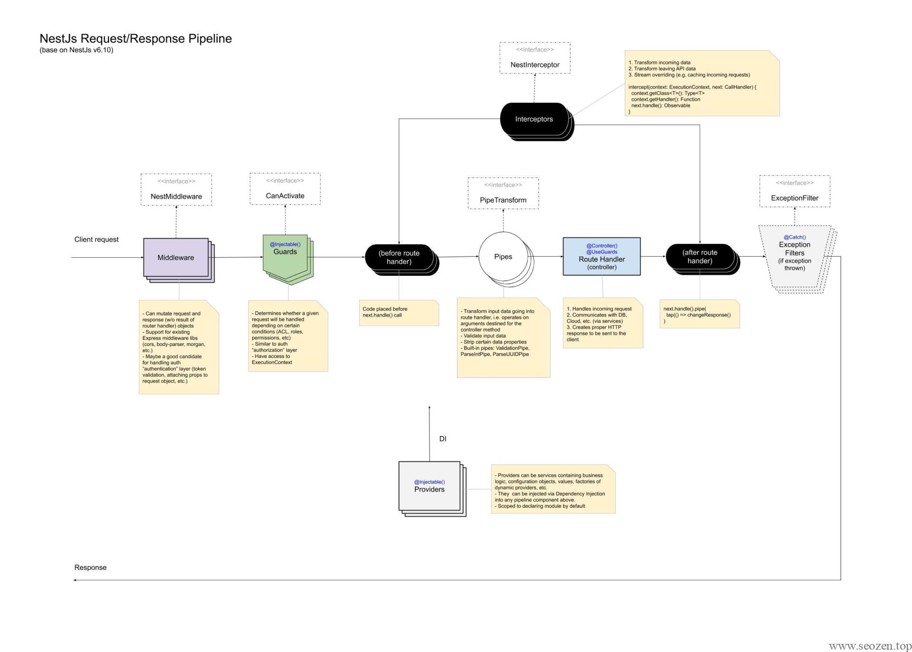
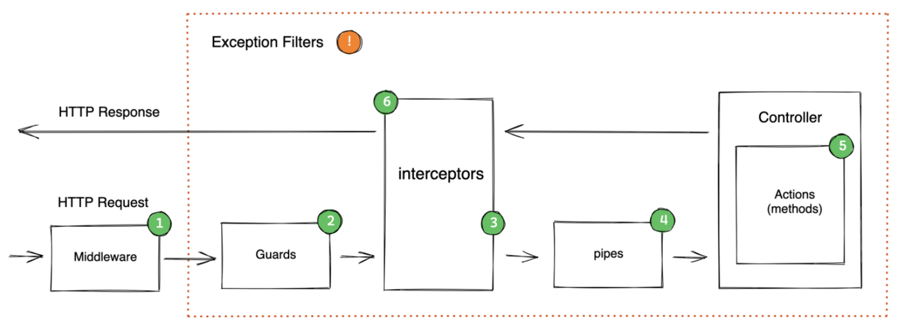

玩过Java的同学，肯定知道**AOP（Aspect Oriented Programming）**切面编程的概念，NestJS中也能见到AOP的影子，今天就跟我一起学习下NestJS中的请求周期的概念，如下图：

在开始之前，我想先说一个猜想，也就是AOP实现的原理，像不像[WordPress开发](https://www.helloyu.top/tag/wordpress-develop)中的Hook机制？或者是React开发中的Hook？就是在特定的代码位置，加载执行用户特定的代码，无论名称怎么变，Middleware、Interceptors、Pipes还是Guards，其实都是Hook或者说是AOP，只是他们执行的位置和作用有所区别。

## NestJS请求周期

下面这张图会更直观的反应NestJS请求周期的全貌，`Exception Filters`是会拦截这个周期任何阶段抛出的异常，所以上面那副图把Filter放在最好，并不是很准确。

上面这张图只是粗略的表示，用户发起请求到服务器返回信息，执行的顺序，其实NestJS整个请求周期要比上面的内容多的多，可以总结如下：

1. 用户请求

3. 全局绑定的middleware

5. 模块绑定的middleware

7. 全局guards

9. Controller绑定的guards

11. Rout绑定的guards

13. 全局绑定的interceptors (在请求到达controller之前)

15. Controller绑定的interceptors (在请求到达controller之前)

17. Route绑定的interceptors (在请求到达controller之前)

19. 全局pipes

21. Controller绑定的pipes

23. Route绑定的pipes

25. Route parameter（参数的） pipes

27. Controller (method handler)

29. Service (如果存在)

31. Route interceptor (Controller执行请求后)

33. Controller interceptor ((Controller执行请求后)

35. Global interceptor ((Controller执行请求后)

37. Exception filters (route, then controller, then global)

39. 服务器返回

从上面的顺序我们可以看出来，大部分的拦截器或者说Hook，都是全局先执行，然后局部再执行，只有`filters`是先执行局部，然后再到全局的，其他没有什么特别需要注意的地方，也可以到官网的[NestJS Request Lifecycle](https://docs.nestjs.com/faq/request-lifecycle)看看详细的解释，不过知道上面这些内容也就差不多了。

**以下内容来源于ChatGPT:**

在 NestJS 中，拦截器(interceptors)、中间件(middleware)、守卫(guards)和管道(pipes)的执行顺序是固定的，可以总结为以下顺序：

1. 中间件(middleware)：在 NestJS 中，中间件是最先执行的功能，它们在每个请求处理程序之前运行。在执行主要的请求处理程序之前，中间件可以用于执行一些前置逻辑，例如：记录请求日志、处理请求头或者验证请求。

3. 守卫(guards)：在中间件之后执行，但在管道(pipes)和请求处理程序之前运行。守卫主要用于在请求到达路由处理程序之前执行某些逻辑，例如：验证用户身份、检查权限或者检查请求参数。

5. 管道(pipes)：在守卫之后执行，但在请求处理程序之前运行。管道用于转换和验证输入数据，可以在处理程序执行之前对请求数据进行一些预处理或者验证。

7. 拦截器(interceptors)：拦截器是最后执行的功能，它们在请求处理程序执行之前或之后运行。拦截器可以在请求到达路由处理程序之前或之后对请求或响应进行处理，例如：添加一些公共的响应头、对响应进行日志记录或者在请求处理程序执行之后执行一些清理操作。

需要注意的是，每个功能可以具有多个实例，并且每个实例可以具有不同的优先级。优先级高的实例将首先执行。可以通过将 `@UseXXX()` 装饰器应用到控制器、模块或路由处理程序来定义执行顺序。例如，可以使用 `@UseGuards()` 装饰器将一个或多个守卫应用于控制器或路由处理程序，以控制守卫的执行顺序和优先级。同样，可以使用 `@UseInterceptors()` 装饰器将一个或多个拦截器应用于控制器或路由处理程序，以控制拦截器的执行顺序和优先级。使用 `@UsePipes()` 装饰器来应用管道，并指定管道的执行顺序和优先级。
