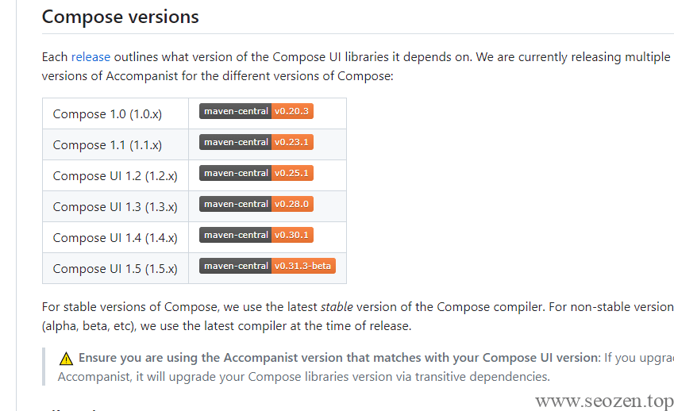

SEO禅最近在看CameraX的资料，看到一个系列文章，讲解的挺好，打算翻译成中文，顺便学习下，这个系列会分解成4篇小文章，每个文章都有自己的主题，分别是：

- 《在Jetpack Compose中使用Accompanist获取设备权限》(本文)

- 《在Jetpack Compose中使用CameraX进行照相预览》

- 《在Jetpack Compose中使用CameraX对相机截图操作》

- 《在Jetpack Compose中从图库选择照片》

## Manifest添加权限配置

Android在使用设备功能的时候，都要进行权限的申请，我们可以通过配置`AndroidManifest.xml`文件来注册软件所需要的功能权限，比如我们要使用相机功能，可以添加如下配置：
```
<uses-feature android:name="android.hardware.camera" />
<uses-permission android:name="android.permission.CAMERA" />
```
## 动态权限获取Accompanist

这种方式并不一定保险，因为用户可能在安装软件的时候，选择了不授权给软件相应的功能，所以我们还要增加一个软件运行时，能够动态判断和动态获取权限的能力，这时候我们就可以用到`Accompanist`这个库，其中提供了[accompanist-permissions](https://google.github.io/accompanist/permissions/)子库，我们可以用这个库来实现动态获取权限，首先我们要加载这个库，在Module级别的`build.gradle`文件写入：
```
    implementation "com.google.accompanist:accompanist-permissions:0.23.1"
```
写这篇文章的时候，最新版本是`0.31.3-beta`，但是新建的`compose`项目使用的是1.1.1的compose版本，所以要选`0.23.1`的兼容版本，你们根据自己的兼容版本自行选择：



之后创建一个Permission的方法，方便获取权限：
```
@Composable
private fun Rationale(
    text: String,
    onRequestPermission: () -> Unit
) {
    AlertDialog(
        onDismissRequest = { /\* Don't \*/ },
        title = {
            Text(text = "Permission request")
        },
        text = {
            Text(text)
        },
        confirmButton = {
            Button(onClick = onRequestPermission) {
                Text("Ok")
            }
        }
    )
}

@OptIn(ExperimentalPermissionsApi::class)
@Composable
fun Permission(
    permission: String = android.Manifest.permission.CAMERA,
    rationale: String = "This permission is important for this app. Please grant the permission.",
    permissionNotAvailableContent: @Composable () -> Unit = { },
    content: @Composable () -> Unit = { }
) {
    val permissionState = rememberPermissionState(permission)
    PermissionRequired(
        permissionState = permissionState,
        permissionNotGrantedContent = {
            Rationale(
                text = rationale,
                onRequestPermission = { permissionState.launchPermissionRequest() }
            )
        },
        permissionNotAvailableContent = permissionNotAvailableContent,
        content = content
    )
}
```
Rationale的方法这里面就是一个Dialog的提示，主要是Permission中的`rememberPermissionState`和`[PermissionRequired](https://github.com/google/accompanist/commit/478398e4b4a0cabe8081fd8d4218f2a1e59da8aa)`两个方法，这两个方法是`Accompanist`提供的，可以自己看看[API文档](https://google.github.io/accompanist/api/permissions/com.google.accompanist.permissions/index.html),之后我们在项目中调用我们的Permission方法请求权限就行：
```
class MainActivity : ComponentActivity() {
    override fun onCreate(savedInstanceState: Bundle?) {
        super.onCreate(savedInstanceState)
        setContent {
            PhotoAppWithCameraX\_ComposeTheme {
                // A surface container using the 'background' color from the theme
                Surface(modifier = Modifier.fillMaxSize(),
                    color = MaterialTheme.colors.background) {
                    val context = LocalContext.current
                    Permission(
                        permission = android.Manifest.permission.CAMERA,
                        rationale = "You said you wanted a picture, so I'm going to have to ask for permission.",
                        permissionNotAvailableContent = {
                            Column() {
                                Text("O noes! No Camera!")
                                Spacer(modifier = Modifier.height(8.dp))
                                Button(onClick = {
                                    context.startActivity(Intent(Settings.ACTION\_APPLICATION\_DETAILS\_SETTINGS).apply {
                                        data = Uri.fromParts("package", context.packageName, null)
                                    })
                                }) {
                                    Text("Open Settings")
                                }
                            }
                        }
                    ) {
                        Text("It worked!")
                    }
                }
            }
        }
    }
}
```
运行之后会有如下图示结果：


一开始会提示请求权限，如果不成功会提示打开设置菜单，进行手动开启权限，如果成功会显示成功提示。到这里我们就算使用Accompanist成功请求到照相机的权限，下一篇文章我们尝试在Compose中预览相机实时取景的功能。
