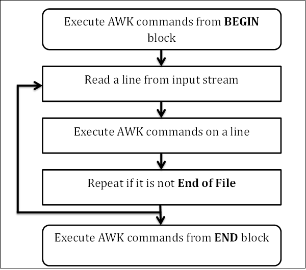

Linux中有著名的三剑客，他们是·`grep`，`awk`，`sed`，我已经介绍过Linux三剑客其中之一的grep：[Linux入门：grep命令基础使用-Linux三剑客](https://www.helloyu.top/linux-grep-command.html)，今天来详细介绍awk命令，grep命令上次只是简单介绍了下，以后会详细写一篇文章来介绍，这篇文章就让你完全搞懂awk。

## 什么是Awk

首先我们要搞清楚什么是Awk，我使用`man awk`得到如下描述信息：

> awk - pattern-directed scanning and processing language

可以清楚的看到，它是一个language(编程语言)，当然我们平常使用的**awk命令**，他是一个文本处理应用程序，就像我们Linux中使用的[crontab](https://www.helloyu.top/linux-cron-jobs.html)，他是一个程序，也是任务表文件，虽然名字一样，但是他们在不同环境下的意思是不同的，这是在我们学习Linux过程中很容易搞混的地方。

Awk作为一款强大的文本处理程序，被我们经常使用在数据排序，统计，格式化输出等方面，比如说统计TCP链接状态，我们就会使用下面的awk语句：

```
netstat -n | awk '/^tcp/ {++state[$NF]} END {for(key in state) print key,"\t",state[key]}'

// 输出样式
FIN_WAIT_2 	 1
SYN_SENT 	 1
CLOSE_WAIT 	 3
TIME_WAIT 	 7
ESTABLISHED 	 70
```

上面的语句是什么意思我后面会详细介绍，这里需要记住一个关键点：**awk是以『行』为基本处理单位**，就是每次输入的数据都是一行，**最小的处理单元是字段**（列），就像我们的进程是资源分配的最小单位，线程是系统最小的执行单元一个概念。

## Awk基本语法

既然是一门语言，那他一定有自己的语法结构，下面是awk的基本语法：

```
awk 'pattern{ action }' file ...
```

其中pattern代表条件，action代表动作，拿最开始的那段代码来进行解释：

```
awk '/^tcp/ {++state[$NF]} END {for(key in state) print key,"\t",state[key]}
```

首先这里的pattern是正则表达式`/^tcp/`，每一行的输入进行匹配，如果是tcp开头，执行`++state[$NF]`动作，这个`pattern-action`的语法结构可以无限次数，所以你在后面能看到另一个pattern-action : END { action } ，到这里估计会有点懵，这个$NF和END是什么鬼？不用着急，听我继续讲解。

既然是一门编程语言，那他一定有系统内置的变量，常量和函数等，上面看到的$NF和END就是awk内置的常量和关键词，先不急搞清楚上面语句什么意思，跟着我先来了解下awk的处理流程。

## Awk工作流程

在学习awk之前，我们先了解下awk的工作流程：



linux awk 工作流程

这里从BEGIN模块开始，到前面看到的END模块结束，可以看到END模块是在循环模块之外的，所以通常我们在**END模块是做一些输出打印的工作，在BEGIN模块是做一些配置类的工作**，上面的流程是，从BEGIN模块开始，每一次从输入读一行数据进行处理，直到文件底部的EOF，之后退出循环，执行END模块内容。

## Awk使用示例

最开始那段例子是通过管道来获取输入数据，平时使用可能是处理文件，或者是把awk的语句单独写入到一个文件中去运行，这样不用每次在命令行输入，因为awk既然是编程语言，那一般一个处理命令都短不了，所以就会有如下用法：

```
awk -f awk程序文件.awk 需要处理的文件.txt
```

这里我们主要使用了`-f`参数，指定执行文件中的awk语句。

awk中有两个基本的输出函数，`print`和`printf`，这两个函数和C基本一样，语法可以参考，print是输出一行，printf是格式化输出，如：

```
awk -v name=我 'BEGIN{printf "SEO优化专家 -> %s\n", name}'

SEO优化专家 -> 我
```

可以看到上面我们使用了printf函数，这里使用`,`号来分割printf的name变量和String字符串，那如果我有多个输出语句怎么办？awk规定语句的分割使用`;`，新行，`}`这三种方式，比如说：

```
awk -v name=我 -v skill=SEO技术 'BEGIN{printf "SEO优化专家 -> %s", name;printf "分享%s",skill}'

SEO优化专家 -> 我分享SEO技术
```

这里的`-v`是命令行设置变量的用法。

## Awk内置变量

上面使用了BEGIN作了简单的演示，就像开头说的BEGIN模块主要是为了配置参数，配合系统内部的默认变量，我们就可以灵活的处理文本，比如说有如下的TCP/IP数据：

```
tcp4       0      0  192.168.43.142.52478   183.6.248.180.443      CLOSE_WAIT
tcp4       0      0  127.0.0.1.7890         127.0.0.1.52477        ESTABLISHED
tcp4       0      0  127.0.0.1.52477        127.0.0.1.7890         ESTABLISHED
tcp4       0      0  192.168.43.142.52473   59.111.183.194.443     TIME_WAIT
tcp4       0      0  127.0.0.1.7890         127.0.0.1.52471        ESTABLISHED
tcp4       0      0  127.0.0.1.52471        127.0.0.1.7890         ESTABLISHED
tcp6       0      0  fe80::bbf4:f53f:.1024  fe80::47f:fece:3.1024  SYN_SENT
```

在awk中，默认提供了变量让我们取一行和一列的数据，比如说$0，$1，$2......$n，其中$0表示整行的输入数据，后面依次类推表示每一列的数据，上面的数据有6列，我们使用$NF和$6是等价的，$NF代表最后一列，还有$NR代表行的编号，还有其他许多变量可以自己打开`man awk`看看。

## Awk编程

前面的都是基础，现在我们整点有难度的，还是拿上面那个TCP数据作例子，现在我们要统计出各端口的连接数量，就可以新建一个文件，把下面语句写入到文件：

```
/^tcp/{
  # foreign address
  split($5,tmp,".")
  if(length(tmp)>4) {
    ++state[tmp[5]]
  }
}
END{
 for( i in state){
    printf "port: %s connects: %s \n",i,state[i]
  }
}
```

这里的split，length都是内置函数，还使用了if条件控制语句和for循环语句，是不是和C很像呢，后面输出的内容就不贴出来了，既然是一门编程语言，你的思想有多远，他就有多强大，这篇文章就先分享到这里，再复杂的编程我会放到后面的文章去说，举一反三，开阔自己的思路，有什么不懂得或者觉得有说错的地方，欢迎评论留言。
