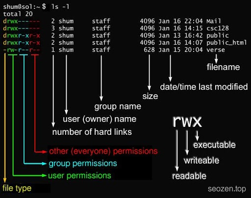
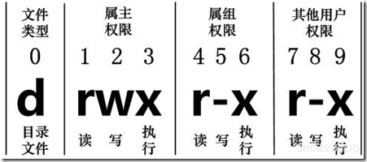

## 文件基本属性

下面这张图能很直观的看出来通过`ls - l`命令显示的各个列所表达的意思：

在 Linux 中第一个字符代表这个文件是目录、文件或链接文件等等。

当为 `d` 则是目录 当为 `-`则是文件； 若是 `l` 则表示为链接文档(link file)； 若是 `b` 则表示为装置文件里面的可供储存的接口设备(可随机存取装置)； 若是 `c` 则表示为装置文件里面的串行端口设备，例如键盘、鼠标(一次性读取装置)。 

在上图可以看出**文件类型**之后，均为 `rwx` 的三个参数的组合。其中，`r` 代表**可读(read)**、 `w` 代表**可写(write)**、 `x`代表**可执行(execute)**。如果没有权限，就会是减号`-`。

## 文件常用命令

下面是几个常见的处理目录的命令：

- `ls` **（英文全拼：list files）**：列出目录及文件名
- `cd` **（英文全拼：change directory）**：切换目录
- `pwd` **（英文全拼：print work directory）**：显示目前的目录
- `mkdir` **（英文全拼：make directory）**：创建一个新的目录
- `rmdir` **（英文全拼：remove directory）**：删除一个空的目录
- `cp` **（英文全拼：copy file）**：复制文件或目录
- `rm` **（英文全拼：remove）**：移除文件或目录
- `mv` **（英文全拼：move file）**：移动文件与目录，或修改文件与目录的名称 你可以使用 `man` \[命令\] 来查看各个命令的使用文档，如：`man cp`。

## 更改文件属性

- `chgrp` ：更改文件属于哪个组
- `chown`：更改文件属于哪个用户，也可以同时更改文件属于哪个组
- `chmod`：更改文件9个属性

### chgrp 设置文件用户分组

chgrp \[-R\] 属组名 文件名

`-R`：递归更改文件属组，就是在更改某个目录文件的属组时，如果加上-R的参数，那么该目录下的所有文件的属组都会更改。

举个栗子：
```
chgrp -R wheel SEO
```
### chown 设置文件拥有者
```
chown \[–R\] 属主名 文件名
chown \[-R\] 属主名：属组名 文件名
```
### chmod 设置文件权限

改变文件权限有两种方法，一种是数值类型，一种是符号。

#### 数值法
```
chmod \[-R\] xyz 文件或目录
```
**xyz** : 就是下面数字类型 `rwx` 数值相加的值。

- `r`:4 可读数值
- `w`:2 可写数数值
- `x`:1 可执行数值

举个栗子：
```
chmod -R 740 SEO
```
其中`7`表示文件拥有者的权限，`r+w+x=7`，`4`代表用户组只有`r`属性，`0`表示其它用户没有任何权限。

#### 符号法
```
chmod u=rwx,g=rx,o=r  SEO   
```
其中：

- `u`：user用户
- `g`：group组
- `o`：others其他其中

还可以进行单独设置权限：
```
chmod  u-x SEO
```
意思是将收回用户的可执行权限
```
chmod  a+w SEO
```
将三种身份都加上可写权限

以上是Linux中对文件的基本操作，熟练的掌握和控制用户权限，才能用好Linux系统。
