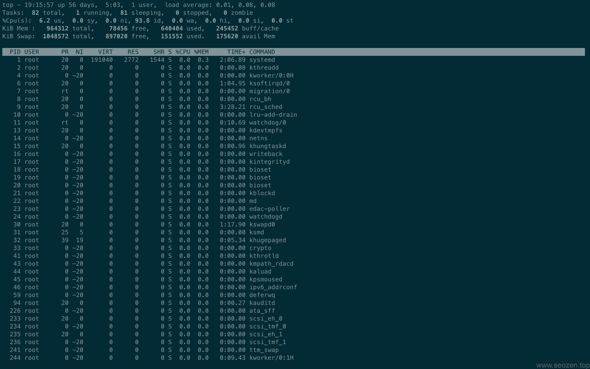

使用过Linux的朋友应该对`top`程序不会陌生，但是很多人并没有真正的把top用起来，有很多功能估计都没有使用到，这篇文章就分享下我在网站**运维服务器**过程中使用top的技巧。

## 使用top

首先我们要查看下top的版本，如果版本太低，有可能不支持下面介绍的一些功能，输入`top -v`看看自己的Linux安装的TOP程序是什么版本：
```bash
[root@SEOZEN ~]# top -v
  procps-ng version 3.3.10
```
在终端输入top应该可以看到类似下面界面的样式：



这个界面包含两部分，分别是`系统摘要`和`进程列表`，我会详细的一行一行的介绍。

## 系统统计信息

### **第一行：概况**
```bash
top - 19:42:49 up 56 days,  5:30,  1 user,  load average: 0.00, 0.01, 0.05
```
- `19:42:49`: 系统当前时间

- `up 56 days, 5:30`: 表示从服务器开机到现在一共运行的时间，这是是56天，19个小时42分49秒。

- `1 user`: 当前登录用户数

- `load average: 0.00, 0.01, 0.05`: 系统1分钟、5分钟、15分钟内的平均负载值，具体数值的含义和算法参考[这里](http://www.brendangregg.com/blog/2017-08-08/linux-load-averages.html)。

### 第二行：进程计数
```bash
Tasks:  82 total,   1 running,  81 sleeping,   0 stopped,   0 zombie
```
- `total`：进程总数。 
- `running`：正在运行的进程数，对应状态TASK_RUNNING。 
- `sleeping`：睡眠的进程数，对应状态TASK_INTERRUPTIBLE和TASK_UNINTERRUPTIBLE。 
- `stopped`：停止的进程数，对应状态TASK_STOPPED。 
- `zombie`：僵尸进程数，对应状态TASK_ZOMBIE。

### **第三行：**CPU使用率（%Cpu(s)）
```bash
%Cpu(s):  0.0 us,  0.0 sy,  0.0 ni,100.0 id,  0.0 wa,  0.0 hi,  0.0 si,  0.0 st
```
 - `us`：进程在用户空间（user space）消耗的CPU时间占比，不包含调整过优先级的进程。 
 - `sy`：进程在内核空间（kernel space）消耗的CPU时间占比。 
 - `ni`：手动调整过用户态优先级的（niced）进程的CPU时间占比。 
 - `id`：空闲的（idle）CPU时间占比。 
 - `wa`：等待（wait）I/O完成的CPU时间占比。 
 - `hi`：处理硬中断（hardware interrupt）的CPU时间占比。 
 - `si`：处理软中断（software interrupt）的CPU时间占比。 
 - `st`：当Linux系统是在虚拟机中运行时，等待CPU资源的时间（steal time）占比。

### **第四、五行：物理内存和交换空间（Mem/Swap）**
```bash
KiB Mem :   964312 total,    85656 free,   687008 used,   191648 buff/cache
```
单位为KB，以物理内存为例： 
- `total`：内存总量。 
- `free`：空闲内存量。 
- `used`：使用中的内存量。 
- `buff/cache`：缓存和page cache占用的内存量。

## **进程详细信息**

这里显示的数据列是可以改的，默认会显示如图中的12列。其含义分别如下：
- `PID`：进程ID。 
- `USER`：进程所有者的用户名。 
- `PR`：从系统内核角度看的进程调度优先级。
- `NI`：进程的nice值，即从用户空间角度看的进程优先级。值越低，优先级越高。
- `VIRT`：进程申请使用的虚拟内存量。 
- `RES`：进程使用的驻留内存（即未被swap out的内存）量。 
- `SHR`：进程使用的共享内存量。 
- `S`：进程状态可以为R=running，S=interruptible sleeping，D=uninterruptible sleeping，T=stopped，Z=zombie。 
- `%CPU`：进程在一个更新周期内占用的CPU时间比例。 
- `%MEM`：进程占用的物理内存比例。 
- `TIME+`：进程创建后至今占用的CPU时间长度。 
- `COMMAND`：运行进程使用的命令。

## TOP内的操作

- `上下移动`: 通过键盘上下箭头来移动显示其它进程的信息。

- `左右移动`: 通过键盘左右箭头来移动显示进程列信息可见性，如果有的行显示太长就可以通过这个操作查看。
 
- `改变数值单位`: 通过小写`e`和大写`E`来分别改变系统统计信息和进程详细信息的数值单位。

- `多cpu使用情况`: 如果你有不止一个cpu内核，可以通过按下`1`按钮来显示其它CPU信息，因为我的服务器就一个CPU内核，所以没得东西看。

- `切换CPU图表`: 按下`t`按钮来切换CPU实用的显示方式，挺有意思的自己可以试试。

- `切换内存/SWAP图表`: 按下`m`按键来切换内存和交换区的显示方式。
 
- `添加颜色显示`: 可以按下`z`来切换颜色显示程序进程信息。
 
- `高亮运行进程`: 按下键盘`y`来显示正在运行的进程。
 
- `高亮显示当前排序列`: 按下键盘`x`会高亮显示当前排序依据的列，默认是CPU列，可以能过按下如下大小字母来选择排序的表：

- **P:** The `%CPU` column.
- **M:** The `%MEM` column.
- **N:** The `PID` column.
- **T:** The `TIME+` column.

- `切换command列显示`: 按下`c`按键可以切换command列的显示。

- `单独显示特定用户进程`: 按钮`u`按键，再输入用户名称就可以查看特定用户的进程信息。

- `设置进程的优先级`: 按下键盘中的`r`，再输入PID进可以设置进程的nice值了。

- `结束一个进程`: 按下键盘`k`，再输入PID结束一个进程。

基本使用差不多就上面这些，主要我们使用TOP程序来查看系统进程，来发现一些有问题的进程及时进行处理，保持服务器的速度和稳定，这对于我们做SEO优化来说是很重要的。

本文参考资料：

https://www.howtogeek.com/668986/how-to-use-the-linux-top-command-and-understand-its-output/

https://www.jianshu.com/p/a6e96c102881

https://blog.csdn.net/dxl342/article/details/53507673
