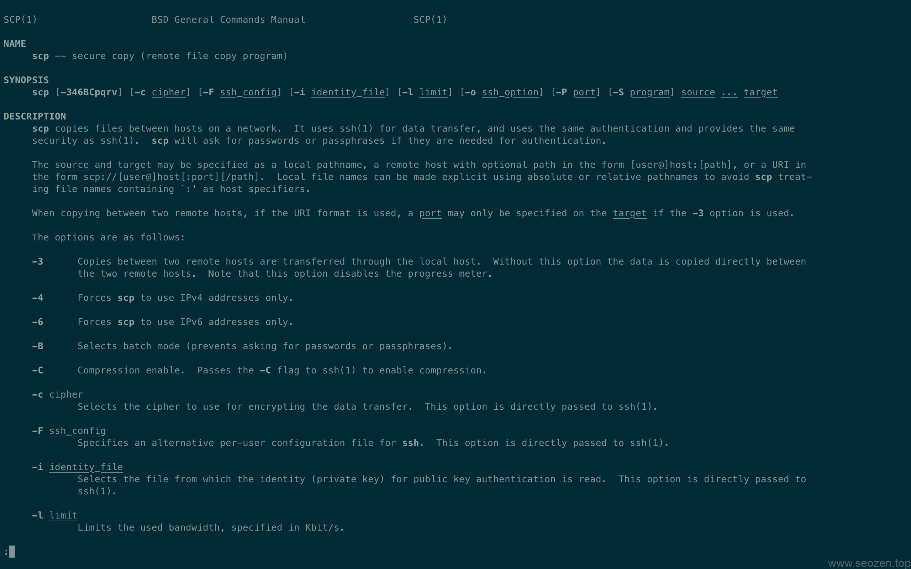

在Linux上我经常使用的一个命令就是`scp`，比如说我们要拷贝**apache服务器日志**就可以在使用`SSH`的情况下直接使用SCP这个命令把远程服务器的文件下载到本地计算机，在日常运维的时候非常方便，这篇来介绍下如何使用SCP命令。

## 认识SCP

SCP是（secure copy)的缩写，主要是用来进行不同主机之间文件的拷贝，如果是想备份或者同步数据，我一般使用的是`rsync`命令，Linux有一个`cp`命令，但是这个命令只能拷贝本机文件，而`scp`可以拷贝远程主机的文件，而且是加密的形式，有多种加密方式可选，但是大部分使用默认参数就好，下面就使用实际例子来说下，其实也就两个方向的数据流，继续看下面的介绍，也可以使用`man scp`看看使用说明。



## 从远程拷贝到本地

scp \[参数\] \[原路径\] \[目标路径\]

这是scp的命令格式，如果从远程将文件拷贝到本地，可以使用如下的方式：
```bash
$scp root@ip:/opt/demo.tar /opt/
```
回程之后会提示你输入密码，输入完成后就会开始拷贝，上面代码是将`ip`主机的`demo.tar`文件拷贝到本地`/opt/`目录下，如果要拷贝整个目录怎么操作？使用`-r`参数，如下：
```bash
$scp -r root@ip:/opt/test /opt/
```
就会将远程主机的`test`目录整个拷贝到本地。

## 从本地上传到远程

命令格式：
```bash
$scp local\_file remote\_username@remote\_ip:remote\_folder
$scp local\_file remote\_username@remote\_ip:remote\_file
$scp local\_file remote\_ip:remote\_folder
$scp local\_file remote\_ip:remote\_file
```
有时候要将本地的一些配置文件上传到服务器，就可以使用上面的命令格式，和从远程主机拷贝到本地是一样的，这里就不多举例，平时比较多使用的参数就是`-vr`显示详细过程和目录拷贝，其它的可以使用的时候参考`man page`文档手册。
