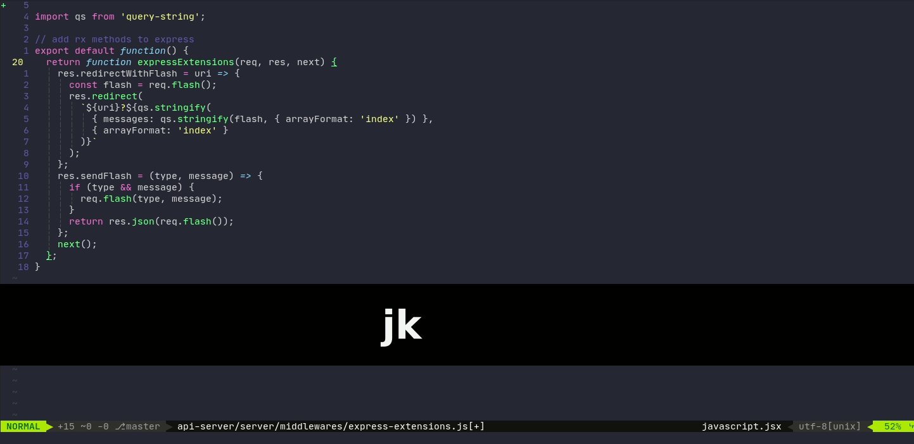
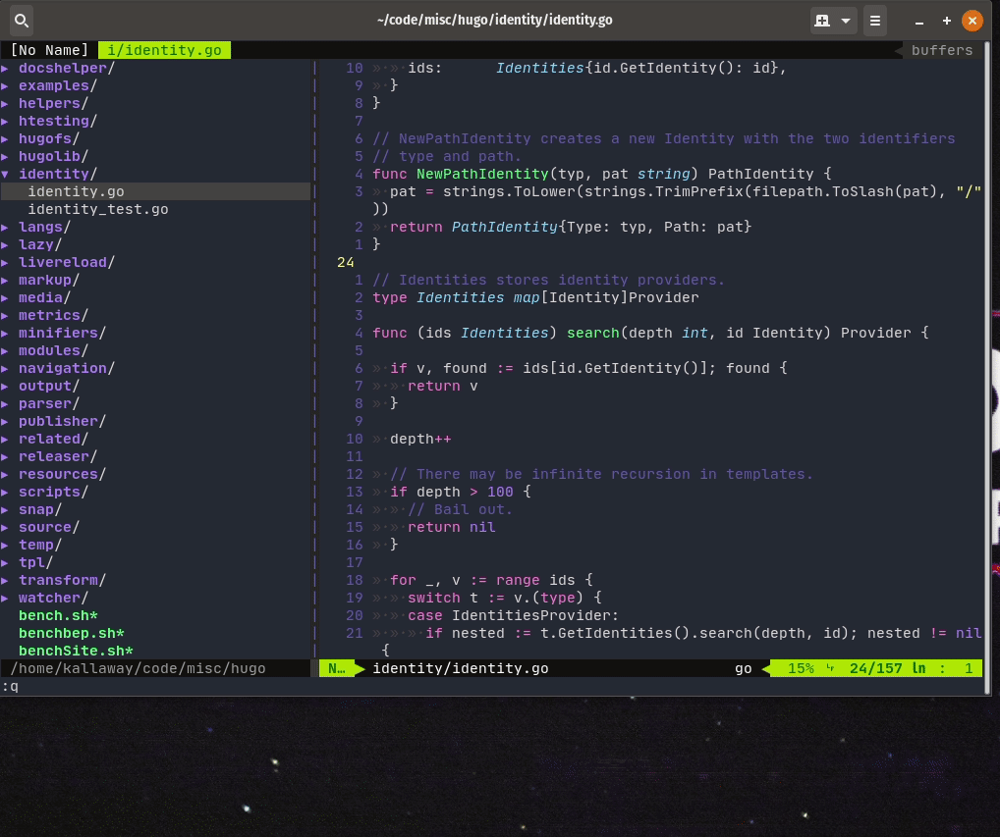
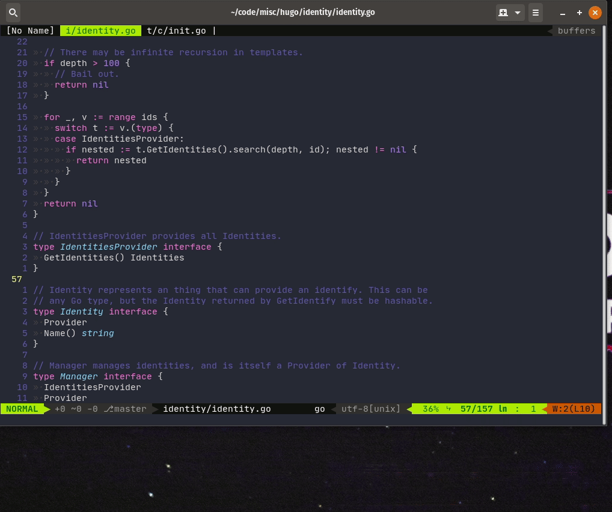

使用过Linux系统的朋友应该对[Vim编辑器](https://zh.wikipedia.org/zh-hans/Vim)非常的熟悉吧，大多数情况，在管理Linux服务器，都使用Vim去编辑配置文件，因为Vim是Linux系统的标配，而且也是功能非常强大，效率非常高的编辑软件，不过我在刚开始接触使用的时候并不高效，尤其是用惯了可视化的编辑器，对于Vim这种命令行的编辑器就无从下手，好几次都要放弃，但是慢慢的就越来越喜欢上这种流畅，不使用鼠标的感觉，这篇文章说的不是Vim的基础教学，而是一些使用技巧分享，Vim入门教程会单独写一系列文章来分享。

## Vim基础

因为这篇文章不是Vim的基础知识，所以在看之前一定需要了解或者有使用过Vim，如果你还没有使用过的话，推荐你通过下面这些方式来先熟悉下：

- [OpenVim](https://www.openvim.com/) - 交互式Vim教程
- vimtutor - Mac和一些Linux系统自带的命令行vim教程，在**终端命令行**输入`vimtutor`
- [Vim教程](https://www.runoob.com/linux/linux-vim.html) - 国内做的比较简单易懂的菜鸟教程

Vim是一款强大的编辑软件，没有什么人能真正能把全部功能用好，你只要能熟练的使用Vim完成你日常的工作就可以，如果遇到什么问题，就记录下来，再去搜索引擎搜索看看，日积月累，就会越来越熟练的使用Vim去完成你需要他完成的工作，你会喜欢上他的！

## Vim使用技巧

### `%`块级元素跳转

在编程的时候，我们经常使用`{}`,`()`块级元素，如果光标在`(`符号，可以使用`%`(shift+5)来跳转到`)`符号，再按一下就可以跳转回来，这在写代码的时候很方便去查找匹配的符号位置。

### Vim多窗口

平常我们都是使用`vim 文件`来打开单个文件进行编辑，但是Vim其实支持多窗口同时工作的，在命令模式`:tabnew`就可以创建新的窗口，`gt`切换到下一个窗口，`gT`切换到上一个窗口，`:tabo`关闭除当前窗口以外其它窗口。

### 返回上一个工作文件

我们编写代码的时候，有时候需要返回上一个编辑的位置，有时候是在另一个文件，我们可以使用`ctrl+o`来实现快速跳转。

### 其它一些技巧

- `~` - 转换大小写
- `:s/old/new/` - 替换字符串
- `ddp` - 上下行交换
- `g;` - 光标回到上一个位置
- `:help` - 帮助文档
