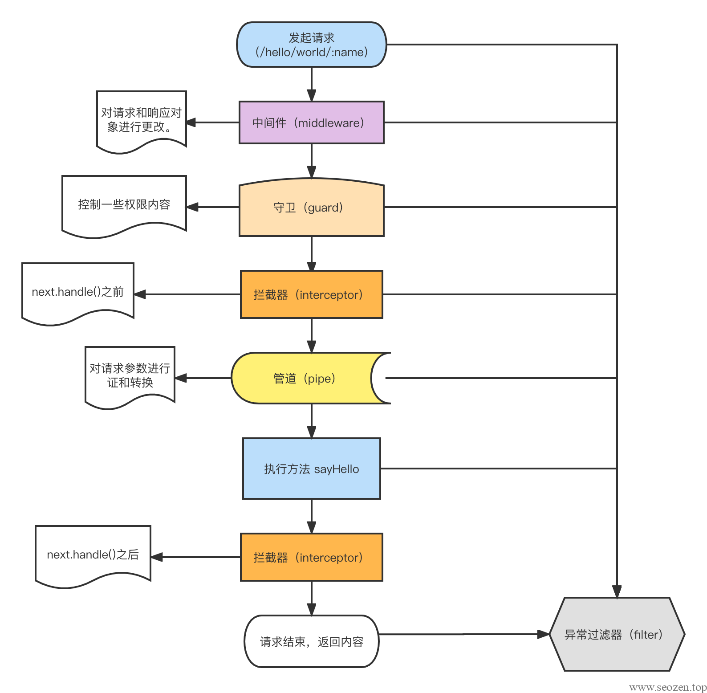

## NestJS基础知识

NestJS 是一个基于 TypeScript 构建的现代化 Web 应用程序开发框架。它采用了模块化的体系结构，并且具有类似于 Angular 的注入器和依赖注入的功能。下面是一些 NestJS 的基础知识（ChatGPT生成）：

1. 控制器（Controller）：控制器是处理客户端请求并返回响应的类。它们使用装饰器来定义路由和处理请求的方法。

3. 模块（Module）：模块是应用程序的基本构建块，它用于将应用程序的不同部分组织在一起。每个 NestJS 应用程序至少有一个模块。

5. 服务（Service）：服务是处理应用程序中复杂业务逻辑的类。服务可以注入到控制器、其他服务或模块中。

7. 中间件（Middleware）：中间件是处理 HTTP 请求的函数。它们可以用于在请求到达控制器之前或之后执行一些逻辑。

9. 路由（Router）：路由是连接请求 URL 和控制器处理方法的机制。NestJS 支持常规路由和参数化路由。

11. 异常（Exception）：异常是应用程序的错误状态，例如请求超时或未找到路由。NestJS 允许您定义自己的异常类型，并使用异常过滤器处理它们。

13. 管道（Pipe）：管道是处理输入数据的机制，例如验证数据或转换数据类型。

15. 守卫（Guard）：守卫是用于控制访问应用程序资源的机制，例如验证用户身份。

17. 依赖注入（Dependency Injection）：依赖注入是一种设计模式，允许您将类的依赖项注入到其构造函数中，而不是在类中硬编码它们。

19. 生命周期钩子（Lifecycle Hook）：生命周期钩子是在应用程序或组件的生命周期中执行的方法，例如在应用程序启动时执行一些初始化逻辑。

21. WebSocket：NestJS 提供了对 WebSocket 的内置支持。您可以使用 WebSocket 控制器和事件来处理 WebSocket 连接和消息。

23. 拦截器（Interceptor）：拦截器是在请求到达控制器之前或响应发送到客户端之前执行的函数。它们可以用于修改请求或响应数据。

25. WebSocket 网关（WebSocket Gateway）：WebSocket 网关是一种机制，允许您将 WebSocket 和 HTTP/S 协议在同一端口上进行处理。

27. 跨域资源共享（CORS）：CORS 是一种机制，允许跨域请求资源。NestJS 提供了内置的 CORS 中间件。

29. 数据库集成：NestJS 支持各种数据库，例如 MySQL、PostgreSQL、MongoDB 等。它提供了一些内置的模块和插件来简化数据库集成。

31. 环境变量（Environment Variable）：NestJS 支持使用环境变量来配置应用程序。您可以使用 `dotenv` 模块来从 `.env` 文件中加载环境变量。

33. 单元测试（Unit Test）：NestJS 支持使用 Jest 进行单元测试。它提供了一些内置的测试工具和模块来简化单元测试。

35. 构建和部署（Build and Deploy）：NestJS 应用程序可以使用常规的 Node.js 构建和部署工具进行构建和部署。您可以使用 Docker 容器或云平台，例如 Heroku 或 AWS，来部署 NestJS 应用程序。

## NestJS执行顺序

如下图，是一个请求从发起到返回的执行顺序：

注：图片来源网络

想要了解更详细点内容，可参看《[NestJS中middleware、interceptor、guards、pipe等的执行顺序？NestJS请求周期？](/nestjs/nestjs-request-lifecycle-middlerware-interceptors-pipes-guards/)》

## NestJS基础知识

我花了点时间，整理了一份比较详细的NestJS学习入门基础知，分享给各位：

注：图片太大，如果模糊可以右键新窗口打开，或者下载查看。或者在MindMaster搜索NestJS基础知识。
