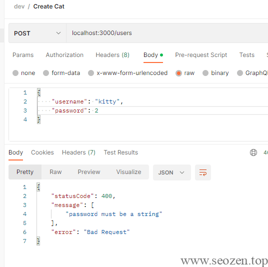

上一篇文章《[Clean Architecture在NestJS中的实践（二）：连接MongoDB数据库(Dockerization)](../clean-architecture-with-nestjs-best-practice-mongodb-dockerization/)》我已经介绍了如何使用Docker配置一个MongoDB服务，并使用Mongoose连接和使用数据库，上一篇文章的代码在`CatModule`中调用Mongoose包来使用MongoDB数据库，这样的耦合性太高了一点，不利于后期更换数据库，而且会在service中编写大量业务代码，Clean Architecture架构就是将业务代码抽象为`usecase`，并且在调用framework的时候以接口的形式作进一步抽象，下面我首先介绍CA架构的核心内容。

## UsecaseProxy

学过软件工程的同学应该都很熟悉一句话：“高内聚，低耦合”，我们CA的核心也是这个思想，内层的实体不会依赖外层，在NestJS中，我们用DynamicModule的方式来实现动态实例化模块，我们可以根据条件来改变模块注入的内容，这样我们就能很方便的进行测试或者是更换第三方插件，只要实现同一个接口，就像一个中继器一样，做数据整合分发，下面看一个UsecaseProxy的代码示例：
```ts
@Module({
  imports: [MongooseRepositoriesModule],
})
export class UserUsecasesProxyModule {
  static GET_USERS_USECASE_PROXY = 'GetUsersUsecaseProxy';

  static register(): DynamicModule {
    return {
      module: UserUsecasesProxyModule,
      providers: [
        {
          inject: [UserRepository],
          provide: UserUsecasesProxyModule.GET_USERS_USECASE_PROXY,
          useFactory: (userRepository: UserRepository) =>
            new UsecaseProxy(new GetUsersUsecase(userRepository)),
        },
      ],
      exports: [UserUsecasesProxyModule.GET_USERS_USECASE_PROXY],
    };
  }
}
```
从代码里我们可以知道`register`这个静态方法返回的是一个DynamicModule，重要的是这个`providers`里面的内容，这里面的内容，我们可以根据条件动态来切换返回的模块，比如说给register函数加上参数，我们可以根据条件不同，返回不同的动态模块，`UsecaseProxy`只是一个简单的适配器（adapter）：
```ts
export class UsecaseProxy<T> {
  constructor(private readonly usecase: T) {}
  getInstance(): T {
    return this.usecase;
  }
}
```
这里的`UserRepository`是在MongooseRepositoriesModule里导出的：
```ts
@Module({
  imports: [
    MongoDBConfigModule,
    MongooseModule.forFeature([{ name: User.name, schema: UserSchema }]),
  ],
  providers: [UserRepository],
  exports: [UserRepository],
})
export class MongooseRepositoriesModule {}
```
UserRepository实现了`IUserRepository`这个接口：
```ts
import { Injectable } from '@nestjs/common';
import { InjectModel } from '@nestjs/mongoose';
import { Model } from 'mongoose';
import { UserModel } from 'src/domain/models/user.model';
import { IUserRepository } from 'src/domain/repositories/user-repository.interface';
import { User } from 'src/infrastructure/entities/user.entity';

@Injectable()
export class UserRepository implements IUserRepository {
  constructor(
    @InjectModel(User.name)
    private readonly userEntity: Model<User>,
  ) {}

  async insert(userModel: UserModel): Promise<UserModel> {
    const created = await this.userEntity.create(userModel);

    return userModel;
  }
  async findAll(): Promise<UserModel[]> {
    const users = await this.userEntity.find();

    return;
  }
  async findById(id: String): Promise<UserModel> {
    return;
  }
}
```
具体实现是注入了Mongoose模块来操作的MongoDB数据库，看到这里应该就能明白`UsecaseProxy`就是Clean Architecture架构的粘合剂，也可以说是依赖注入的管理者。

## Controller

所有的请求都会进入Controller，也会从这里流出，下面来看一个`UserController`的代码：
```ts
@Controller('users')
export class UserController {
  constructor(
    @Inject(UserUsecasesProxyModule.GET_USERS_USECASE_PROXY)
    private readonly getUsersUsecaseProxy: UsecaseProxy<GetUsersUsecase>,
    @Inject(UserUsecasesProxyModule.CREATE_USER_USECASE_PROXY)
    private readonly createUserUsecaseProxy: UsecaseProxy<CreateUsersUsecase>,
    @Inject(UserMapper)
    private readonly mapper: UserMapper,
  ) {}

  @Post()
  async create(@Body() userRequestDto: UserRequestDto): Promise<UserPresenter> {
    const user = this.mapper.fromDtoToModel(userRequestDto);

    const created = await this.createUserUsecaseProxy
      .getInstance()
      .execute(user);

    return this.mapper.fromModelToPresenter(created);
  }

  @Get()
  async getUsers(): Promise<UserPresenter[]> {
    const users = await this.getUsersUsecaseProxy.getInstance().execute();

    return users.map((item) => this.mapper.fromModelToPresenter(item));
  }
}
```
可以看到`constructor`中，有很多注入，比如我们要插入一条用户信息，首先我们需要通过`@Body`装饰器来获得`Post`中的信息，再通过`DTO`来效验和映射数据：
```ts
import { ApiProperty } from '@nestjs/swagger';
import { IsNotEmpty, IsString } from 'class-validator';

export class UserRequestDto {
  @ApiProperty({ required: true })
  @IsNotEmpty()
  @IsString()
  readonly username: string;

  @ApiProperty({ required: true })
  @IsNotEmpty()
  @IsString()
  readonly password: string;
}
```
如果数据有问题，则直接回返回错误信息：



如何使用上面的装饰器，可以参考官方文档[class-validator](https://docs.nestjs.com/pipes#class-validator)，因为我们的Usecase是不依赖任何第三方框架代码，所以我们最好把DTO转换成Model，再传递给usecase，当然如果你觉得多余或者麻烦，也可以直接传DTO，这个根据你自己对项目的理解来决定，分的清楚点，后期改动会方便一些，但是前期会需要写比较多的代码。

## Usecase

在这一层就是纯业务逻辑，除了依赖`domain`层的代码，不会有任何其他层的代码，来看个简单的例子：
```ts
import { UserModel } from 'src/domain/models/user.model';
import { IUserRepository } from 'src/domain/repositories/user-repository.interface';

export class CreateUsersUsecase {
  constructor(private readonly repository: IUserRepository) {}

  async execute(user: UserModel): Promise<UserModel> {
    const created = await this.repository.create(user);

    return created;
  }
}
```
可以看到我们插入一条用户信息，这里是看不到有任何第三方框架的东西，依赖也都是domain层的内容，到这里应该会比较清楚要如何在NestJS中实现Clean Architecture架构了吧，接下去的任何扩展，都是以这个为基础去做，把地基建好，接来下就是一些非常机械化的复制粘贴操作了，我就不做过多讲解了，文章末尾会贴出源码地址，最好能把前两篇文章都看看：

《[Clean Architecture在NestJS中的实践（一）：项目初始化](../clean-architecture-with-nestjs-best-practice-init/)》

《[Clean Architecture在NestJS中的实践（二）：连接MongoDB数据库(Dockerization)](../clean-architecture-with-nestjs-best-practice-mongodb-dockerization/)》

Github: [clean-architecture-with-nestjs](https://github.com/HelloYu/clean-architecture-with-nestjs) (不要忘记star下哦！)
