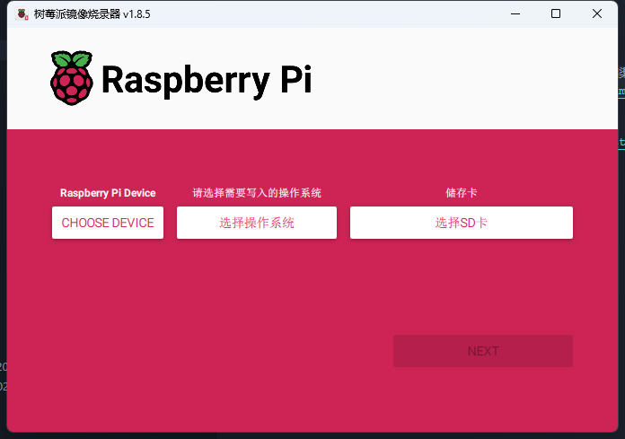

树莓派能使用的操作系统挺多，不过还是从官网推荐的方式和渠道下载会比较好点，我是通过[Raspberry Pi Imager](https://www.raspberrypi.com/documentation/computers/getting-started.html#raspberry-pi-imager)直接写入SD卡的方式来安装，也比较方便快捷:

## 下载Raspberry Pi Imager
通过访问[下载Raspberry Pi Imager](https://www.raspberrypi.com/software/)，选择自己合适的操作系统：

## 写入OS到TF卡中
分别选择自己相对应的树莓派版本，需要安装的操作系统，还有需要写入哪张卡，第一次写入需要下载系统，需要多点时间等待：

## 自定义系统配置信息
如果像我没有使用外接键盘和显示器，直接通过SSH连接，需要先把一些WIFI信息预设进操作系统，之前是通过修改根目录的配置文件，但是新版本的系统是需要在写入之前使用**Raspberry Pi Imager**进行配置写入：

::: tip
上面的一些截图，使用的都是树莓派官方文档中的，这里只是做个参考，基本是傻瓜无脑操作。很多时候树莓派出现一些奇奇怪怪的问题，要先检查电源供电是否存在问题，一定要用2.5A或者3A以上的5V电源。
:::
## 参考资料
[Raspberry Pi Install an operating system](https://www.raspberrypi.com/documentation/computers/getting-started.html#install-an-operating-system)