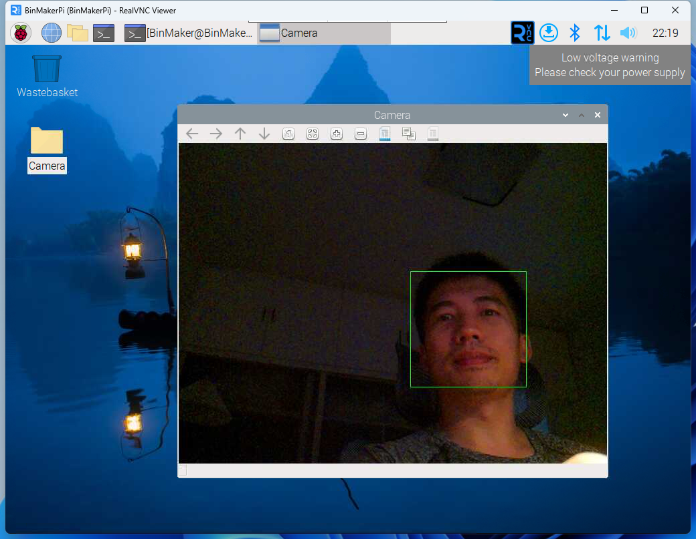

在前面我已经通过**picamera2**库调用了树莓派的摄像头，现在要实现一下人脸检测的功能，需要安装`opencv`和`opencv data`:
```bash
sudo apt install -y python3-opencv
sudo apt install -y opencv-data
```
之后拷贝如下代码并运行：
```python
#!/usr/bin/python3

import cv2

from picamera2 import Picamera2

# Grab images as numpy arrays and leave everything else to OpenCV.

face_detector = cv2.CascadeClassifier("/usr/share/opencv4/haarcascades/haarcascade_frontalface_default.xml")
cv2.startWindowThread()

picam2 = Picamera2()
picam2.configure(picam2.create_preview_configuration(main={"format": 'XRGB8888', "size": (640, 480)}))
picam2.start()

while True:
    im = picam2.capture_array()

    grey = cv2.cvtColor(im, cv2.COLOR_BGR2GRAY)
    faces = face_detector.detectMultiScale(grey, 1.1, 5)

    for (x, y, w, h) in faces:
        cv2.rectangle(im, (x, y), (x + w, y + h), (0, 255, 0))

    cv2.imshow("Camera", im)
    cv2.waitKey(1)
```
如果不出错的画就能看到视频画面，面部会被绿框标记：


## 参考资料
[picamera2 face detection example](https://github.com/raspberrypi/picamera2/blob/main/examples/opencv_face_detect.py)

[picamera2 manual](https://datasheets.raspberrypi.com/camera/picamera2-manual.pdf)