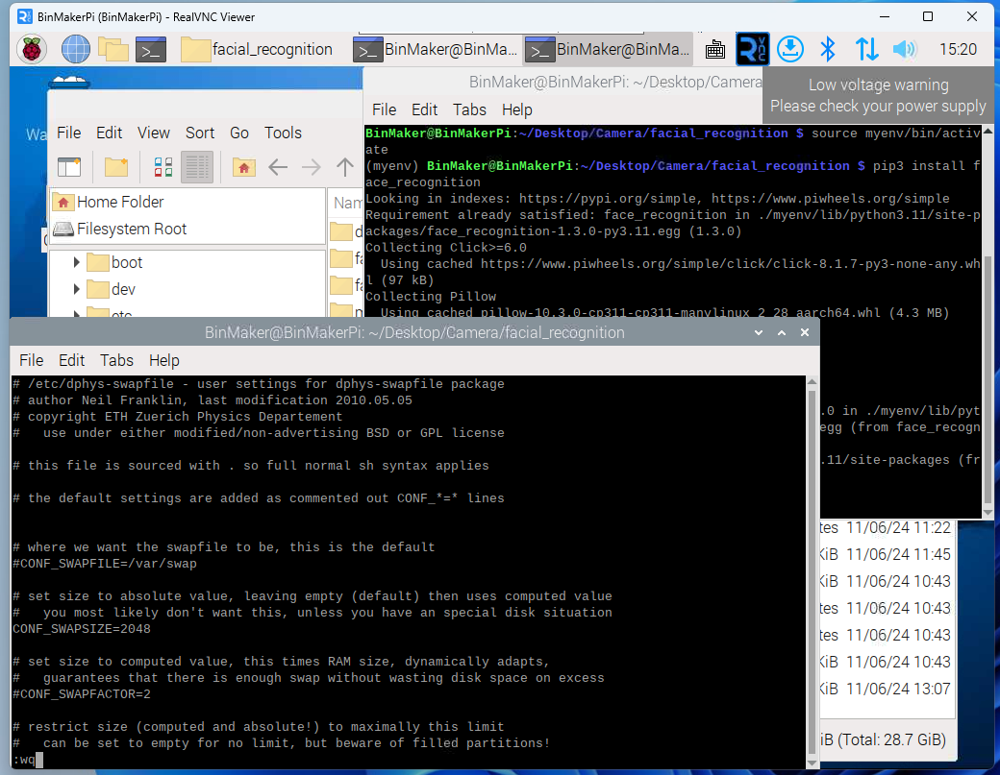
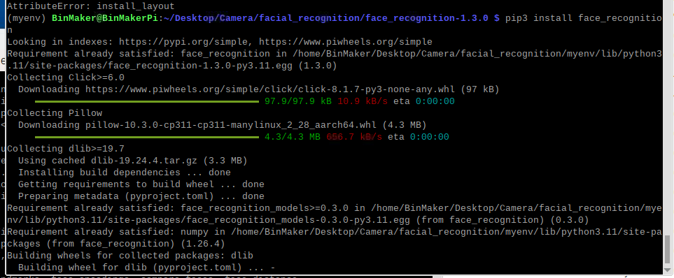

## 替换apt和pip3镜像源（可选）
在开始安装各种依赖库之前，最好先更换镜像源，执行如下命令：
```bash
sudo cp /etc/apt/sources.list /etc/apt/sources.list.bak
sudo vi /etc/apt/sources.list
# 替换sources.list文件内容
# 默认注释了源码镜像以提高 apt update 速度，如有需要可自行取消注释
deb http://mirrors.tuna.tsinghua.edu.cn/debian/ bookworm main contrib non-free non-free-firmware
# deb-src http://mirrors.tuna.tsinghua.edu.cn/debian/ bookworm main contrib non-free non-free-firmware

deb http://mirrors.tuna.tsinghua.edu.cn/debian/ bookworm-updates main contrib non-free non-free-firmware
# deb-src http://mirrors.tuna.tsinghua.edu.cn/debian/ bookworm-updates main contrib non-free non-free-firmware

deb http://mirrors.tuna.tsinghua.edu.cn/debian/ bookworm-backports main contrib non-free non-free-firmware
# deb-src http://mirrors.tuna.tsinghua.edu.cn/debian/ bookworm-backports main contrib non-free non-free-firmware

# 以下安全更新软件源包含了官方源与镜像站配置，如有需要可自行修改注释切换
deb https://security.debian.org/debian-security bookworm-security main contrib non-free non-free-firmware
# deb-src https://security.debian.org/debian-security bookworm-security main contrib non-free non-free-firmware

sudo vi /etc/apt/sources.list.d/raspi.list 
#替换
deb https://mirrors.tuna.tsinghua.edu.cn/raspberrypi/ bookworm main


sudo apt update && sudo apt -y upgrade

sudo vi /etc/pip.conf
[global]
index-url = https://pypi.tuna.tsinghua.edu.cn/simple
# extra-index-url = https://www.piwheels.org/simple
```
## 安装face_recognition库依赖
在进行人脸识别的时候需要用到`face_recognition`、`opencv`和`imtuils`等库，这些库在Raspberry Pi OS上安装比较麻烦，需要创建一个Python的虚拟环境，并切换到虚拟环境中去安装，首先创建一个虚拟环境：
```bash
# 使用 venv 模块
python3 -m venv myenv --system-site-packages
```
`--system-site-packages`这个参数为了能使用系统级别的库，不然可能很多基础库要重新安装，之后切换使用虚拟环境：
```bash
source myenv/bin/activate
```
这时候就能在你的命令行前面看到虚拟环境的前缀，之后执行如下安装命令：
```bash

# 安装相关依赖包 
sudo apt -y update && sudo apt -y full-upgrade
sudo apt -y install cmake build-essential pkg-config git

sudo apt -y install libjpeg-dev libjxl-dev libtiff-dev libpng-dev libwebp-dev libopenexr-dev
sudo apt -y install libavdevice-dev libavfilter-dev libavformat-dev libopenblas-dev

sudo apt -y install libavcodec-dev libavformat-dev  libswresample-dev libswscale-dev libv4l-dev libxvidcore-dev libx264-dev libdc1394-dev libgstreamer-plugins-base1.0-dev libgstreamer1.0-dev libavutil-dev

sudo apt -y install libgtk-3-dev  python3-pyqt5
sudo apt -y install libqt5gui5 libqt5webkit5 libqt5test5
sudo apt -y install libatlas-base-dev liblapacke-dev gfortran

sudo apt -y install libhdf5-dev libhdf5-103
sudo apt -y install python3-dev python3-pip python3-numpy
sudo apt -y install fonts-wqy-zenhei

pip3 install imutils
pip3 install opencv-contrib-python
```
在安装`face_recognition`之前最好先把swap改大点，不然容易奔溃：
```bash
sudo vi /etc/dphys-swapfile 
```
把`CONF_SWAPSIZE = 100` 改成 `CONF_SWAPSIZE=2048`，等下安装完成后再改回来



改好后运行如下命令进行生效：
```bash
sudo systemctl restart dphys-swapfile
```
```bash
pip3 install face_recognition -vvv #这个安装很慢，-vvv可以查看具体进度
```
这条命令需要运行一段时间，耐心等待，大概一个半小时左右。

::: info
如果有更快速安装face_recognition库的办法，请告诉我，不胜感激。
:::
## 获取头像数据
前面已经实现了摄像头的人脸检测，下面使用`face_recognition`库实现下人脸识别，人脸检测和识别是两个不同的概念，检测是知道图片上有人脸，识别是知道这张脸是谁，要让计算机知道你是谁，首先你要告诉他你是谁，我们就要给他准备我们自己的人脸照片，让他先训练识别这个人是我，首先是如下代码：
```python
from picamera2 import Picamera2, Preview
import cv2
import numpy as np
import os

# 提示用户输入名字
name = input('请输入你的名字: ')

# 如果目录不存在，则创建目录
os.makedirs(f"dataset/{name}", exist_ok=True)

# 初始化摄像头
picam2 = Picamera2()
config = picam2.create_preview_configuration(main={"size": (512, 304)})
picam2.configure(config)
picam2.start()

img_counter = 0

while True:
    # 捕获一帧图像
    frame = picam2.capture_array()

    # 将图像从 RGB 转换为 BGR
    frame_bgr = cv2.cvtColor(frame, cv2.COLOR_RGB2BGR)
    
    # 显示图像
    cv2.imshow("Press Space to take a photo", frame_bgr)
    
    # 处理按键事件
    k = cv2.waitKey(1)
    if k % 256 == 27:  # 按下 ESC 键
        print("按下 ESC 键，关闭...")
        break
    elif k % 256 == 32:  # 按下空格键
        img_name = f"dataset/{name}/image_{img_counter}.jpg"
        # 保存图像
        cv2.imwrite(img_name, frame_bgr)
        print(f"{img_name} 已保存!")
        img_counter += 1

cv2.destroyAllWindows()
picam2.stop()

```
运行上面代码，会弹出一个摄像头预览窗口，按空格键进行截图保存你的面部数据，至少在10张以上的数据比较好，头转动要慢点，不然容易模糊。

## 训练模型
有了人脸的数据，接下去就需要让计算机处理这些数据，运行如下代码：
```python
# 导入必要的包
from imutils import paths
import face_recognition
import pickle
import cv2
import os

# 图片位于 dataset 文件夹中
print("[INFO] 开始处理人脸...")
imagePaths = list(paths.list_images("dataset"))

# 初始化已知的编码和名字列表
knownEncodings = []
knownNames = []

# 遍历图片路径
for (i, imagePath) in enumerate(imagePaths):
    # 从图片路径中提取人物名字
    print("[INFO] 处理图像 {}/{}".format(i + 1, len(imagePaths)))
    name = imagePath.split(os.path.sep)[-2]
    print(f"[DEBUG] 当前处理的图片路径: {imagePath}")
    print(f"[DEBUG] 当前处理的名字: {name}")

    # 读取输入图像并将其从 BGR (OpenCV 读取顺序) 转换为 RGB (dlib 使用的顺序)
    image = cv2.imread(imagePath)
    rgb = cv2.cvtColor(image, cv2.COLOR_BGR2RGB)
    print(f"[DEBUG] 图像读取并转换为 RGB 格式")

    # 检测输入图像中每张人脸的 (x, y)-坐标的边界框
    boxes = face_recognition.face_locations(rgb, model="hog")
    print(f"[DEBUG] 检测到 {len(boxes)} 张人脸")

    # 计算人脸的嵌入（即人脸编码）
    encodings = face_recognition.face_encodings(rgb, boxes)
    print(f"[DEBUG] 计算到 {len(encodings)} 个编码")

    # 遍历每一个编码
    for encoding in encodings:
        # 将每个编码和名字添加到已知的编码和名字列表中
        knownEncodings.append(encoding)
        knownNames.append(name)
        print(f"[DEBUG] 已知编码和名字列表更新")

# 将人脸编码和名字序列化到磁盘中
print("[INFO] 序列化编码...")
data = {"encodings": knownEncodings, "names": knownNames}
f = open("encodings.pickle", "wb")
f.write(pickle.dumps(data))
f.close()
print("[INFO] 编码序列化完成")

```
处理好这些数据之后，就可以给后续识别使用。
## 人脸识别
人脸识别的主要代码如下：
```python
from picamera2 import Picamera2, Preview
import cv2
import face_recognition
import pickle
import time
from PIL import Image, ImageDraw, ImageFont
import numpy as np

# 初始化当前识别的名字为“未知”
currentname = "Unknown"
# 加载 encodings.pickle 文件
encodingsP = "encodings.pickle"

# 加载已知的面部和嵌入
print("[INFO] 正在加载 encodings + 人脸检测器...")
try:
    with open(encodingsP, "rb") as f:
        data = pickle.load(f)
    print("[INFO] encodings 加载成功")
except Exception as e:
    print(f"[ERROR] 无法加载 encodings: {e}")
    exit()

# 初始化摄像头
print("[INFO] 初始化摄像头...")
try:
    picam2 = Picamera2()    
    # 创建配置
    config = picam2.create_preview_configuration(main={"size": (640, 480)})
    picam2.configure(config)

    picam2.start()
    
    time.sleep(2.0)
    print("[INFO] 摄像头初始化成功")
except Exception as e:
    print(f"[ERROR] 摄像头初始化失败: {e}")
    exit()

# 创建窗口
cv2.namedWindow("Face Recognition Running", cv2.WINDOW_NORMAL)
print("[INFO] 创建窗口之后")

# 开始 FPS 计数器
fps_start_time = time.time()
print("[INFO] 开始 FPS 计数器之后")
frame_count = 0

# 加载中文字体
font_path = "/usr/share/fonts/truetype/wqy/wqy-zenhei.ttc"  # 确保字体文件存在
try:
    font = ImageFont.truetype(font_path, 30)  # 字体大小调整为 30
except Exception as e:
    print(f"[ERROR] 无法加载字体: {e}")
    exit()

while True:
    try:
        frame_start_time = time.time()
        
        # 捕获一帧图像
        frame = picam2.capture_array()
        capture_time = time.time()
        print(f"[TIME] 捕获图像时间: {capture_time - frame_start_time:.4f} 秒")
        
        # 将图像从 RGB 转换为 BGR
        frame_bgr = cv2.cvtColor(frame, cv2.COLOR_RGB2BGR)
        conversion_time = time.time()
        print(f"[TIME] 图像转换时间: {conversion_time - capture_time:.4f} 秒")
        
        frame_gray = cv2.cvtColor(frame_bgr, cv2.COLOR_BGR2GRAY)
        gray_conversion_time = time.time()
        print(f"[TIME] 灰度转换时间: {gray_conversion_time - conversion_time:.4f} 秒")

        # 检测人脸框
        boxes = face_recognition.face_locations(frame_gray)
        detection_time = time.time()
        print(f"[TIME] 人脸检测时间: {detection_time - gray_conversion_time:.4f} 秒")
        print(f"[INFO] 检测到 {len(boxes)} 张人脸")

        # 初始化时间变量
        encoding_time = detection_time
        draw_time = detection_time

        # 为每个人脸边界框计算人脸嵌入
        if len(boxes) > 0:
            try:
                encodings = face_recognition.face_encodings(frame_bgr, boxes)
                encoding_time = time.time()
                print(f"[TIME] 计算人脸嵌入时间: {encoding_time - detection_time:.4f} 秒")
                print(f"[INFO] 计算了 {len(encodings)} 个人脸嵌入")
                
                if len(encodings) == 0:
                    print("[WARNING] 未计算到人脸嵌入，跳过当前帧")
                    continue
            except Exception as e:
                print(f"[ERROR] 计算人脸嵌入时发生错误: {e}")
                continue  # 跳过当前帧继续下一帧

            names = []

            # 遍历人脸嵌入
            for encoding in encodings:
                # 尝试将输入图像中的每个人脸与我们已知的嵌入进行匹配
                matches = face_recognition.compare_faces(data["encodings"], encoding)
                print(f"[INFO] 找到匹配: {matches}")
                name = "未知"  # 如果未识别人脸，则打印“未知”

                # 检查是否找到匹配项
                if True in matches:
                    # 找到所有匹配人脸的索引，然后初始化一个字典来计算每个人脸被匹配的总次数
                    matchedIdxs = [i for (i, b) in enumerate(matches) if b]
                    counts = {}

                    # 遍历匹配的索引并维护每个被识别人脸的计数
                    for i in matchedIdxs:
                        name = data["names"][i]
                        counts[name] = counts.get(name, 0) + 1

                    # 确定得到票数最多的已识别人脸（注意：在不太可能的平局情况下，Python 将选择字典中的第一个条目）
                    name = max(counts, key=counts.get)

                    # 如果识别到数据集中的人，则在屏幕上打印他们的姓名
                    if currentname != name:
                        currentname = name
                        print(f"[INFO] 识别到: {currentname}")

                # 更新姓名列表
                names.append(name)

            draw_start_time = time.time()
            # 将 OpenCV 图像转换为 PIL 图像
            pil_image = Image.fromarray(cv2.cvtColor(frame_bgr, cv2.COLOR_BGR2RGB))
            draw = ImageDraw.Draw(pil_image)
            
            # 遍历已识别人脸
            for ((top, right, bottom, left), name) in zip(boxes, names):
                try:
                    print(f"[INFO] 绘制人脸框和姓名: {name}, 框: {top, right, bottom, left}")
                    # 在图像上绘制预测的人脸姓名 - 颜色为绿色
                    draw.rectangle([(left, top), (right, bottom)], outline=(255, 0, 0), width=2)  # 红色边框
                    y = top - 30 if top - 30 > 30 else top + 30
                    draw.text((left, y), name, font=font, fill=(0, 255, 0))  # 绿色字体
                except Exception as e:
                    print(f"[ERROR] 绘制人脸框和姓名时出错: {e}")
            draw_time = time.time()
            print(f"[TIME] 绘制时间: {draw_time - draw_start_time:.4f} 秒")
            
            # 将 PIL 图像转换回 OpenCV 图像
            frame_bgr = cv2.cvtColor(np.array(pil_image), cv2.COLOR_RGB2BGR)

        # 在屏幕上显示图像
        cv2.imshow("Face Recognition Running", frame_bgr)
        key = cv2.waitKey(1) & 0xFF
        waitkey_time = time.time()
        print(f"[TIME] waitKey 时间: {waitkey_time - draw_time:.4f} 秒")
        print("[INFO] 调用 waitKey 完成")

        # 按 'q' 键退出
        if key == ord("q"):
            break

        # 更新 FPS 计数器
        frame_count += 1
        if frame_count >= 10:
            elapsed_time = time.time() - fps_start_time
            fps = frame_count / elapsed_time
            print(f"[INFO] 每秒帧数 (FPS): {fps:.2f}")
            frame_count = 0
            fps_start_time = time.time()

        frame_end_time = time.time()
        print(f"[TIME] 处理一帧总时间: {frame_end_time - frame_start_time:.4f} 秒")

    except Exception as e:
        print(f"[ERROR] 在主循环中发生错误: {e}")
        break

# 清理工作
cv2.destroyAllWindows()
picam2.stop()
print("[INFO] 清理完成，程序退出")


```

Github仓库地址：https://github.com/HelloYu/FaceRecognitionOnRaspberryPi.git

## 参考资料
 - [https://github.com/carolinedunn/facial_recognition](https://github.com/carolinedunn/facial_recognition)
 - [https://github.com/justsaumit/opencv-face-recognition-rpi4](https://github.com/justsaumit/opencv-face-recognition-rpi4)
 - [https://github.com/ageitgey/face_recognition/blob/master/examples/facerec_from_webcam_faster.py](https://github.com/ageitgey/face_recognition/blob/master/examples/facerec_from_webcam_faster.py)
 - [https://pypi.org/project/face-recognition/#files](https://pypi.org/project/face-recognition/#files)
 - [https://mirrors.tuna.tsinghua.edu.cn/help/debian/](https://mirrors.tuna.tsinghua.edu.cn/help/debian/)