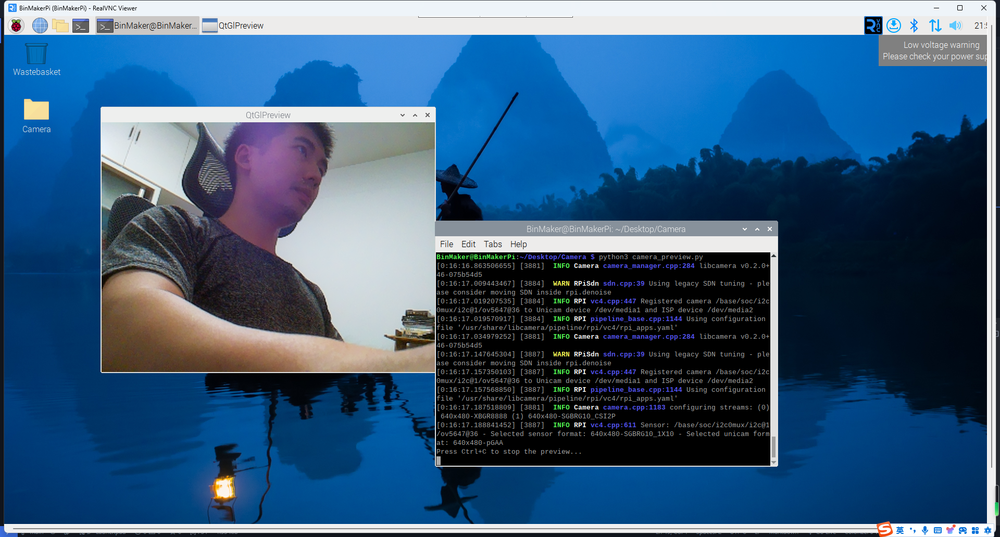

之前已经通过命令行的模式调用了摄像头的预览，下面我们使用python的Picamera2库作一个简单的摄像头预览程序，新版本的Bookworm系统已经默认安装Picamera2了，不需要手动安装，如果没有安装的运行下面的命令：
```bash
sudo apt update
sudo apt install -y python3-picamera2
```
之后创建一个python文件，拷入下面代码：
```python
from picamera2 import Picamera2, Preview
import time

# 创建 Picamera2 对象
picam2 = Picamera2()

# 配置摄像头
config = picam2.create_preview_configuration(main={"size": (640, 480)})
picam2.configure(config)

# 启动摄像头预览
picam2.start_preview(Preview.QTGL)
picam2.start()

print("Press Ctrl+C to stop the preview...")

try:
    # 保持预览运行直到手动终止程序
    while True:
        time.sleep(1)  # 使用 sleep 代替 pass，以减少 CPU 占用
except KeyboardInterrupt:
    # 捕捉到 Ctrl+C 中断信号后停止预览
    picam2.stop_preview()
    picam2.close()
    print("Preview stopped.")
except Exception as e:
    # 捕捉其他可能的错误
    picam2.close()
    print(f"An error occurred: {e}")

```
在命令行运行这个文件，就可以看到图像预览：

## 参考资料
[Use libcamera from Python with Picamera2](https://www.raspberrypi.com/documentation/computers/camera_software.html#use-libcamera-from-python-with-picamera2)