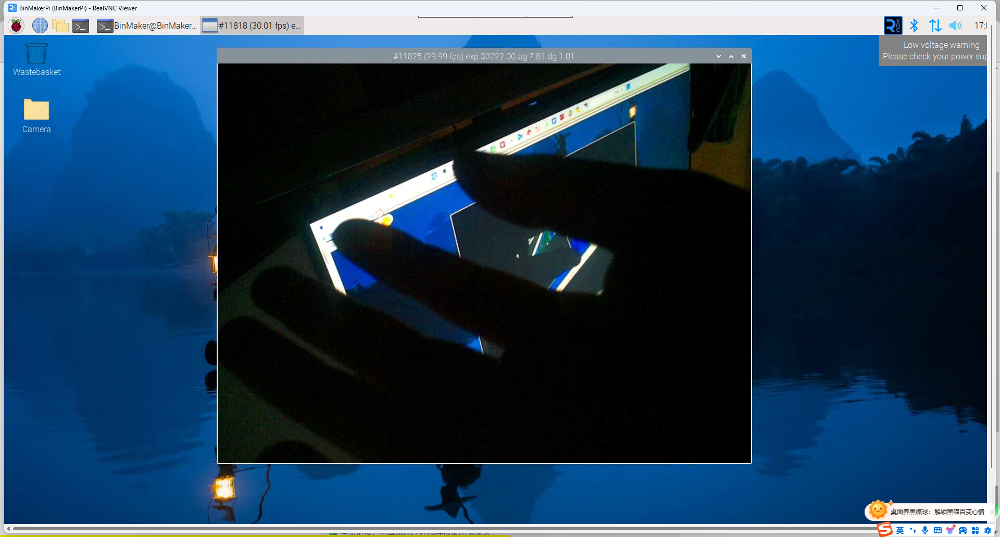

我现在安装的是**Bookworm**的新版本操作系统，默认是开启摄像头的，不需要像老版本在**Raspberry Pi Configuration**中再去开启。
关闭电源后接上摄像头，注意接线正反面，别接错了，之后运行：
```bash
rpicam-hello -t 0
```
就可以在VNC中看到摄像头预览了

::: tip
可能需要网线来连接树莓派，用wifi卡的很，也有可能是我这个树莓派是很久之前的3B，可能有点问题，经常要开关电源好几次才能开机。
:::

## 参考资料

https://www.raspberrypi.com/documentation/computers/camera_software.html#rpicam-apps