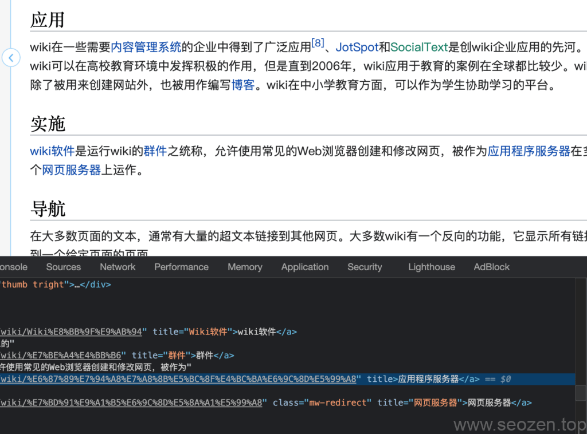

在进行WordPress建站的时候，会遇到`<a>`标签加不加`title`属性的问题，首先我们来聊聊这个属性的目的是什么？如果**A标签**添加了**title**属性，在可视化设备中，比如说浏览器，鼠标移过这个标签就会显示一个类似**tooltip**的提示框，显示的就是`title`中的属性，如下：

a标签鼠标Hover的效果

如果在非可视化设备中，比如说文本阅读器，那个a标签就会转换成title属性里的**文字提示**，标识这个资源到底是什么，至于到底要不要加？我们在学习**SEO优化**的时候，不懂得东西，我们就去找行业里面做的好的榜样去参考，就比如说**wiki百科**，我们看看它是怎么做的a标签：

wiki百科a标签title属性

从源码可以看到，a标签是有加**titile属性**的，所以至于要不要加，这里就各位自己判断了。
