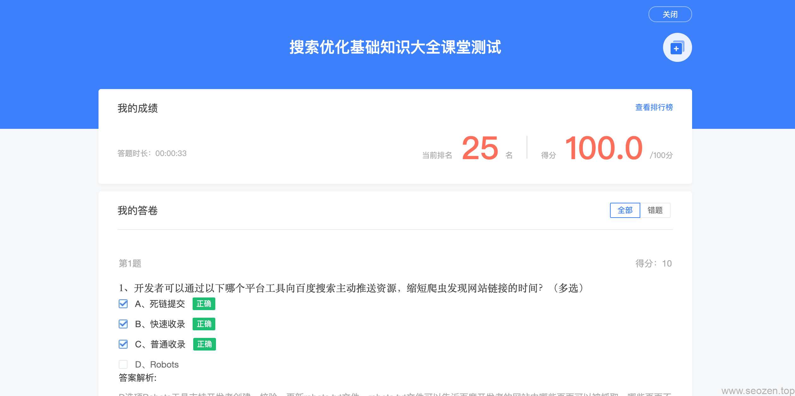

最近有个活动，参加《百度搜索优化基础知识大全》学习，学习完所有基础SEO内容之后，可以参加一个测试，如果100%通过，那就可以获得一次抽奖机会，免费获得百度送的一些小礼品，地址[在这里](https://zy.baidu.com/act/seo?isResponsible=1)。下面是我答的题，拿去不谢，为什么时间那么短？因为刷了三次！

第1题得分：10

1、开发者可以通过以下哪个平台工具向百度搜索主动推送资源，缩短爬虫发现网站链接的时间？（多选）

-  A、死链提交 正确
    
     B、快速收录 正确
    
     C、普通收录 正确
    
     D、Robots
    

- 答案解析:
    
    D选项Robots工具支持开发者创建、校验、更新robots.txt文件，robots.txt文件可以告诉百度开发者的网站中哪些页面可以被抓取，哪些页面不可以被抓取。

第2题得分：10

2、关于站点子链工具的使用说明，以下哪个选项是正确的？（单选）

-  A、百度支持5条子链接的展现样式
    
     B、在“站点子链”工具提交的子链数据生效后，一定会在搜索结果页进行展现
    
     C、站点子链的最终展现顺序就是开发者在平台工具中提交的顺序
    
     D、站点子链展现会根据用户搜索需求的变化不断调整，不保证会全部采纳与展现，最终效果以实际展示为准 正确
    

- 答案解析:
    
    A选项错误，百度只支持2条、4条、6条子链接的展现样式；B选项错误，对于已生效的数据，百度会根据搜索用户当前需求进行展现，不保证会全部展现；C选项错误，开发者可以根据重要程度对子链进行排序，但是百度会根据开发者设定的排序综合评估确定最终的展现顺序。

第3题得分：10

3、以下哪些选项属于聚合页问题，违反了劲风算法的标准？（多选）

-  A、页面内容与站点本身所属领域不符，或站点无专注领域，多为采集拼凑内容。 正确
    
     B、页面内容与标题及页面中标记的标签不符。 正确
    
     C、由网站搜索功能生成的静态搜索结果页。 正确
    
     D、空短、无有效信息、失效的聚合页。 正确
    

- 答案解析:
    
    聚合页，是指页面并无文章主体内容，而是多个页面的索引链接围绕在特定主题下的信息整合页。恶劣聚合页问题主要包括以下四种类型：站点内容领域分散、页面内容与标题不符、静态搜索结果页与无有效信息的聚合页。

第4题得分：10

4、站点被黑后，应该如何应对？（多选）

-  A、立即停止网站服务，避免用户继续受影响，防止继续影响其他站点 正确
    
     B、将被黑页面跳转至首页
    
     C、清理已发现的被黑内容，将被黑页面设置为404死链，并通过百度搜索资源平台死链提交工具进行提交。 正确
    
     D、做好安全工作，排查网站存在的漏洞，防止再次被黑。 正确
    

- 答案解析:
    
    B选项错误，将被黑页面跳转至首页的做法不可取，将会影响站点的整体质量。

第5题得分：10

5、以下哪些行为【违反了】落地页体验规范？（多选）

-  A、在落地页的首屏顶部嵌入超过一屏面积30%的优质广告 正确
    
     B、在文章标题与内容之间设置广告区域，吸引用户注意 正确
    
     C、广告位上有明确的【广告】字样标识，图片清晰视觉体验好
    
     D、设置弹窗广告，确保广告信息有效触达用户 正确
    

- 答案解析:
    
    A选项落地页的首屏顶部不允许嵌入超过一屏面积10%的优质广告；B选项文章内容页或信息详情页，从主体内容标题开始到正文内容结束前，禁止插入任何形式的广告；D选项禁止弹窗弹窗广告。

第6题得分：10

6、以下哪些广告内容或者形式符合搜索标准？（单选）

-  A、某食物广告文案为“上选优质牛肉，给你最高级的口感”
    
     B、在访问某一页面时，出现弹窗广告”发现病毒插件，立即下载清除软件“
    
     C、某化妆品广告未经允许采用了顾客的试用照片作为宣传照
    
     D、某二手书籍网站在文章结束后设置了其他书籍相关推荐，并且与文章内容板块之间有明显间隔距离 正确
    

- 答案解析:
    
    A选项错误，广告内容禁止使用“国家级”、“最高级”、“最佳”等用语。B选项错误，广告内容不能夸大效果、虚假承诺，诱导用户分享，对于带有诱导、欺骗、虚假内容的广告，百度会坚决予以打击。C选项错误， 严禁广告内容侵犯国家尊严利益、泄露国家秘密、侵犯个人隐私。

第7题得分：10

7、内容的丰富度是百度搜索优质内容标准之一，以下哪些选项的做法有利于增加内容的信息量？（多选）

-  A、天气查询页面中，额外增加穿衣搭配建议、出行建议。 正确
    
     B、文章中增加趋势图、动态效果图等，使用户可以直观地获取所需信息。 正确
    
     C、在页面底部增加相关推荐模块，增加广告内容。
    
     D、评论区内中有大量真实用户的反馈，言语中肯有参考价值。 正确
    

- 答案解析:
    
    C答案中增加广告内容无法增加优质内容的有效信息量，反而对用户形成干扰。

第8题得分：10

8、以下哪些选项符合视频内容的优质标准？（多选）

-  A、外语视频中没有配字幕。
    
     B、字幕与视频内容及播放进度保持同步，没有错字、漏字等情况出现。 正确
    
     C、视频画质高清，内容完整连贯易于理解，播放流畅。 正确
    
     D、视频有配文、注释、弹幕、评分、点赞、评论区等多个增益功能或信息，为用户提供参考。 正确
    

- 答案解析:
    
    外语视频中配有字幕有助于辅助用户观看。

第9题得分：10

9、开发者们可以通过以下哪些项目参与百度搜索合作，获取更多权益？

-  A、通过专业问答，将优质权威的内容展示在搜索结果的首位。 正确
    
     B、将优质工具类智能小程序与百度搜索合作，申请OpenCard展现在搜索结果中。 正确
    
     C、我有优质的教育视频资源，通过与百度搜索合作获得更多曝光流量。 正确
    
     D、生产符合百度搜索优质内容指南的视频，根据《搜索视频服务合作资源标准》提交视频数据，获得更多流量。 正确
    

第10题得分：10

10、开发者们想申请专业问答，必须符合以下哪些条件（多选）？

-  A、申请者拥有移动站点，并完成企业类型ICP备案，是经国家主管部门批准的正式运营企业 正确
    
     B、网站移动端体验良好，未命中搜索规则算法，符合《百度移动搜索落地页体验白皮书》的要求 正确
    
     C、在申请领域具备一定的知名度、专业度、权威性 正确
    
     D、有对客观问答内容的规模化生产、技术提交、运营维护能力，愿意紧密配合专业问答项目组统一运营管理 正确
