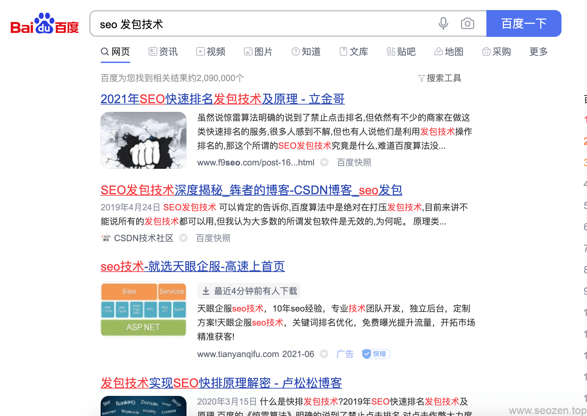
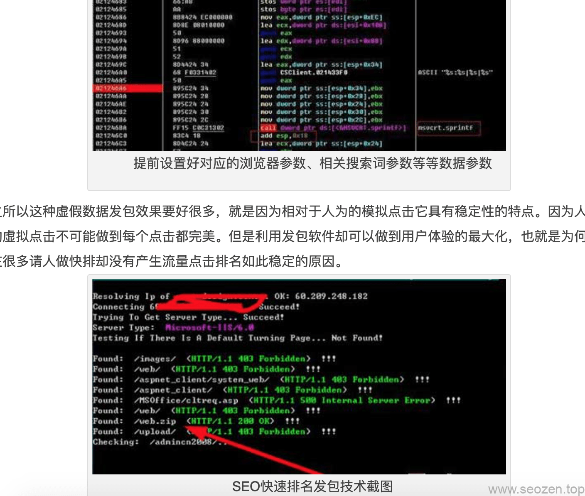
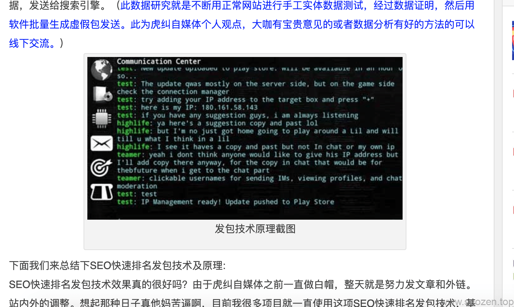
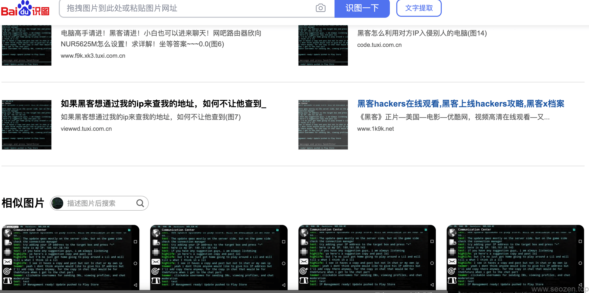
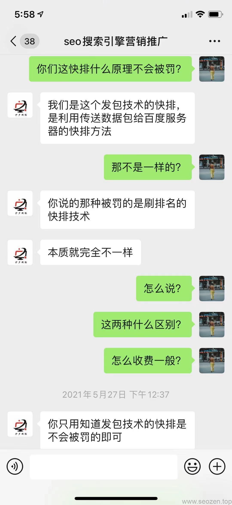
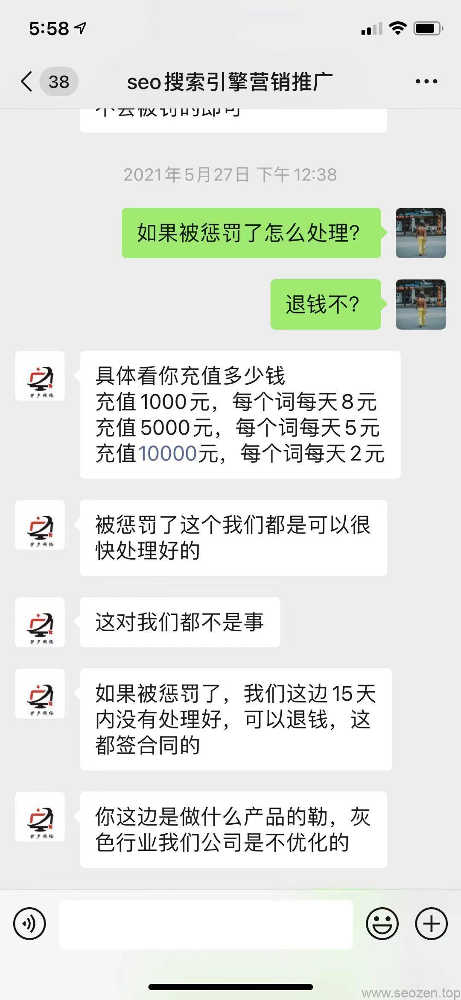

前几年**点击快排**技术相当的流行，因为实现原理非常简单，效果又立杆见影的快，很多站长就选择去使用这种**黑帽SEO技术**，结果肯定是可想而知，[百度惊雷算法](https://www.helloyu.top/seo/baidu-algorithm-2021/)让那些站长真的是一夜回到解放前，我推崇的是纯白帽SEO技术，不存在被搜索引擎处罚的风险，就算出现这种问题，也是很好解决，因为你是用正常的手法，只是有时候搜索引擎误认为你是在作弊，这种情况都会有提示，让你有处理的时间和机会。

前段时间我去谈一个项目，对方要求保证多久能出效果，达到什么的效果，多少关键词可以上首页，回去的时候给这个网站做了一个简单的分析报告，对方可能觉得半年的时间太长，说网上一天几块钱就能保证**关键词7天上首页**，一听这肯定是黑帽快排技术，对方觉得这种效果快，还便宜，我只能说些自己的感受，让客户自己去决定，在做SEO优化的过程中，会遇到很多这样的客户，多半是对SEO技术不了解，急于求成，其实到最后，使用白帽SEO的回报要远大于黑帽。

这两年随着点击快排的退出，慢慢又兴起了一种叫作**发包快排技术**的黑帽SEO手段，我是一名自由程序猿，今天就用程序员的视角去分析下这个技术，首先肯定是先百度下这个技术：

## 所谓SEO发包快排原理“解密”

来看看排在第一位的文章说的内容，看到里面的图片真的是让我笑掉了大牙：

文章内容配的图片初看上去好像像那么回事，好像是快排发包技术的截图，但是你细看第一张只是汇编代码，第二张像那么回事，我还差点真信了，第三张就露出马脚：

下面还写着**发包技术原理截图**，看着英文和IP地址是国内的应该问题不大，但是这图看着就像聊天室的测试截图，用百度识图搜索下果然没错：

可以看到其实文章的图片和内容是不对应的，只是网上找的几张图片而已。

## 我对发包技术分析理解

首先我们要知道为什么会产生快排技术，传统的点击快排原理又是什么，这样才能真正的理解发包快排，还有就是为什么不要选择这项技术去做网站排名。

### 传统点击快排产生的背景

说到为什么会有快排技术，这和搜索引擎排名原理有关系，简单来说，搜索引擎在跟踪收集用户的行为数据，对这些数据进行分析之后，会得到一个权重得分，这个得分越高表示这个网站是越优质的网站，在搜索结果页（SERPs）中就会有越靠前的排名位置，这种行为分析进行排名的方式，就让很多人钻了空子，只要去用软件模拟用户行为，这样就能欺骗搜索引擎，让它误以为这是个高质量的网站，这就是传统点击快排产生的背景。

## 当前所谓的发包快排技术

使用发包快排，看看一个供应商是怎么说的

反正聊下来就是包治百病的承诺，你赶紧上车，从技术方面去分析，发包发包，也就是不用模拟真实用户操作，只要把用户操作的这些数据打包一起发给搜索引擎就行，告诉搜索引擎这就是用户在操作，但是搜索引擎也不是傻子，市面上大部分的发包快排都是无效果的，就算有效果也不是使用真正的所谓发包技术，百度哪里有那么多漏洞可以给你玩，如果真正能用的发包技术，也不会这么便宜提供给大众去使用，一定是给那些有实力的公司私底下偷偷的用，在做搜索引擎优化上，丢掉幻想，脚踏实地的做是最高效的方式。
