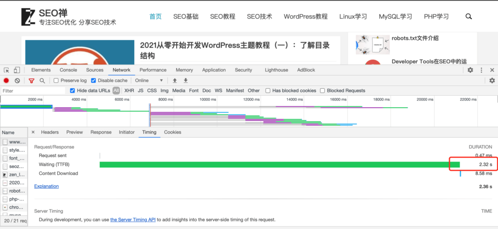

如果还不知道什么是**Dev Tools**的朋友，可以看看我之前写的文章《[Developer Tools在SEO中的运用: Network介绍篇](https://www.helloyu.top/seo/developer-tools-network-seo.html)》，这篇文章是Dev Tools 在SEO优化中的实际应用，当然Developer Tools是非常强大的工具，在**网站优化**的使用肯定无法用一两篇文章来说明，我会尽可能多写几篇文章去举例。

## 缩短TTFB的意义

这篇文章主要介绍的是Dev Tools中的**TTFB概念**，TTFB是Time To First Byte的缩写，意思是浏览器请求到收到服务器响应第一个字节的时间，缩短这个时间对**搜索引擎优化**或者提升用户体验来说都很重要，如果一个用户在浏览器地址栏输入你的网站，等待了两三秒时间界面才刷新出来，那有些急脾气的用户可能就没有耐心去等待，这样可能就错过了一个潜在客户。

下面是我在没有优化的情况下TTFB的时间：

将近2.3S的时间，虽然我显示的时间很快，但是TTFB的时间太长了，这个界面怎么打开？直接点击Dev Tools 中 Network面板信息窗口第一个请求就可以了，如果不懂就去上一篇文章看看介绍。

下面是优化后的TTFB时间：

只有300ms左右，这差不多缩短了10倍的TTFB时间，当然我个人感觉还可以再优化，但是我就做了一个简单的操作就有了10倍的网站优化效果，这不是很划算么？

## 修改localhost

至于我怎么做到的？其实很简单，我只修改了WordPress配置文件`wp-config.php`中数据库地址从localhost改为`127.0.0.1`就可以了，因为php连接mysql数据库使用localhost还需要解析，使用IP地址就不需要解析，这里的时间就直接节省了很多，是的，你只要作这么细小的改动，就起到了网站优化的效果，就问你惊不惊喜，意不意外？
