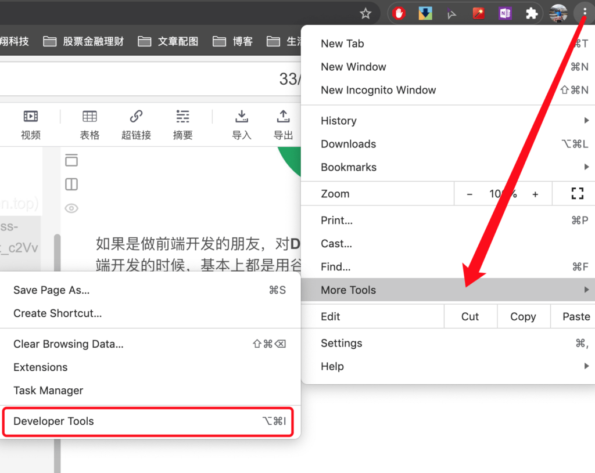
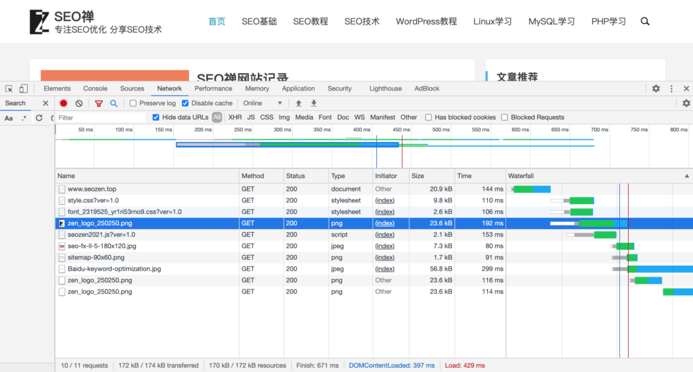
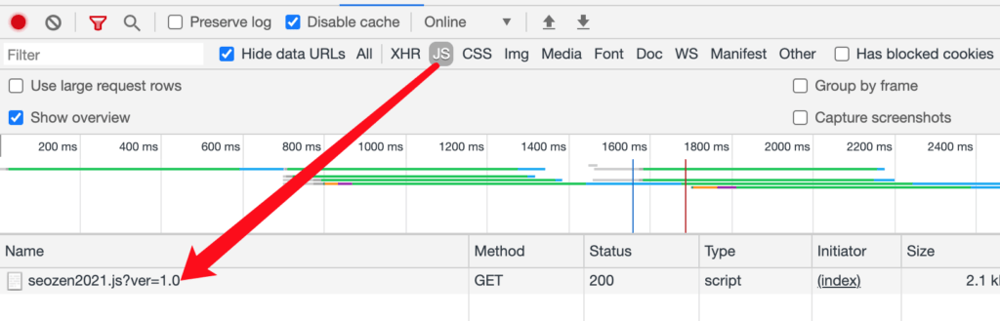
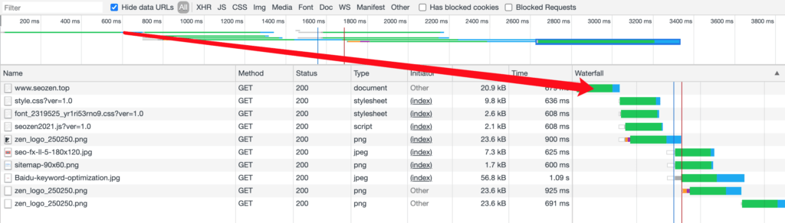
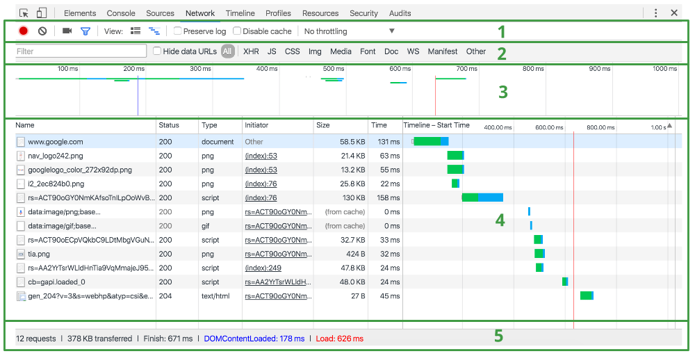

如果是做前端开发的朋友，对**Developer Tools**一定不陌生，在我学习前端开发的时候，基本上都是用谷歌浏览器进行开发调试，因为Google浏览器集成了非常好用的Developer Tools，当然对于SEO优化来说，这个工具集合也是非常强大的，今天我就简单介绍下，我在做**网站优化**过程中，是如何使用Developer Tools进行网站分析优化的，因为这是一个工具集，我就重点挑几个本人自己常用的工具来说，看看在SEO优化过程中如何使用这些工具。

## Network

因为篇幅有限，在这篇文章只覆盖了一些**Chrome Dev Tools**中关于Network工具在网站SEO优化方面的使用技巧，这算是一篇纯**SEO优化技术**的文章。 首先我们来看看怎么打开Developer Tools界面，如果没有下载谷歌浏览器，自行百度下载，我已经尽可能详细的去分享**SEO知识**了，按下图所示打开Dev Tools（开发者工具）界面：

打开之后，再点击`network`按钮，进入network分析面板，你大概会看到下面这图：

可能你刚开始看到这界面绿绿蓝蓝的，还有那么多条条状状就有点头晕，别急，我会解释给你听并不是所有的东西你都需要了解，这个界面上有些东西我做了这么久也没有用过几次，下面我就挑几个在SEO优化方面有比较大作用的内容来说。

## 功能栏

因为谷歌浏览器的版本不同，功能有少许区别，但是大部分应该是像上图所示，第三个图标是`filter`功能的开头，这个功能是非常常用的，你点击后下方就会展开一个过滤栏，它右边是一个搜索功能切换按钮，这功能如果不是开发并不常用。 靠右边有两个功能在进行网站优化的时候比较常用，一个是`Disable cache`和网络模拟，就是上图中的`Fast 3G`这个功能可以模拟当前是宽带网络还是手机网络，可以切换试试看自己的网站在不同网络的表现，默认是`online`的状态，我这里切换到了手机网络的状态。

## 过滤栏

过滤栏最头部是一个可输入的规则过滤文本框，这里可以输入正则表达式，也可以输入简单的文件后缀或者文件名进行过滤，右侧就是依据请求文件类型进行过滤，正常来说我在进行网站SEO的时候，如果加载的文件比较多就会用这些功能来进行过滤查看加载状态，因为我这个网站功能比较简单，加载的内容很少，而且是按需加载的，不同界面会加载不同的`JS脚本`和CSS文件，

## 预览功能

预览功能上方是时间条，中间是条状图，表示当前动作持续了多少时间，和下方的瀑布图是一一对应的关系：

## 请求信息记录窗口

在整个**network**界面，占比最大的就是信息记录窗口，这里显示了网站加载内容的整体信息，这里显示的内容和上面的功能菜单都是联动的，数据是会随着你所选择的功能而发生变化的。

上图第5是总摘要窗口，可以看到界面加载完毕只花了**671ms**的时间，这个参数可以用来大致判断网站的表现，如果这个时间超过3s的话，基本在SEO就算不太合格了，后面的`DOMContentLoaded`和`load`参数表示的是HTML加载完毕的时间和`onload`事件开始的时间，第一个说明网页的HTML文档已经加载完成，后一个参数表示现在JS代码可以开始运行，可能分别通过这两个参数分析网站结构是否设计合理，首页会不会太多内容影响加载速度等。

## 总结

本来我想在一篇文章里面写完network在SEO分析方面的应用，但是写着写着发现内容越来越长，这样会感觉学习效果不好，所以还是决定把剩下的内容单独开篇来说，这篇就是简单的network介绍，下一篇会是具体的使用network进行SEO分析应用。
