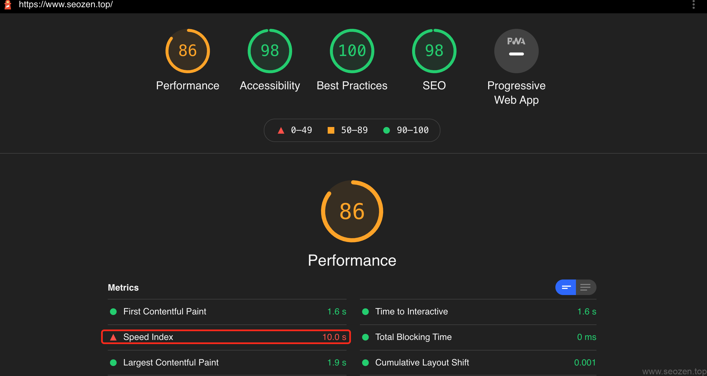
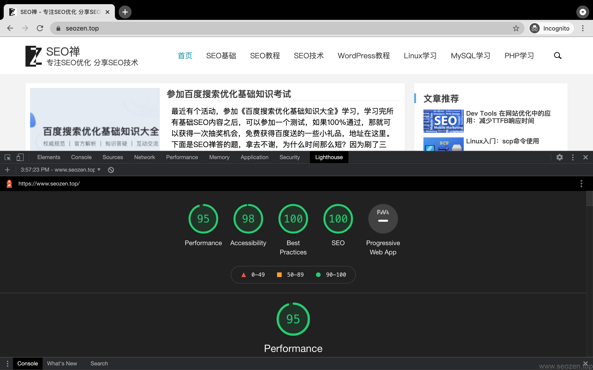
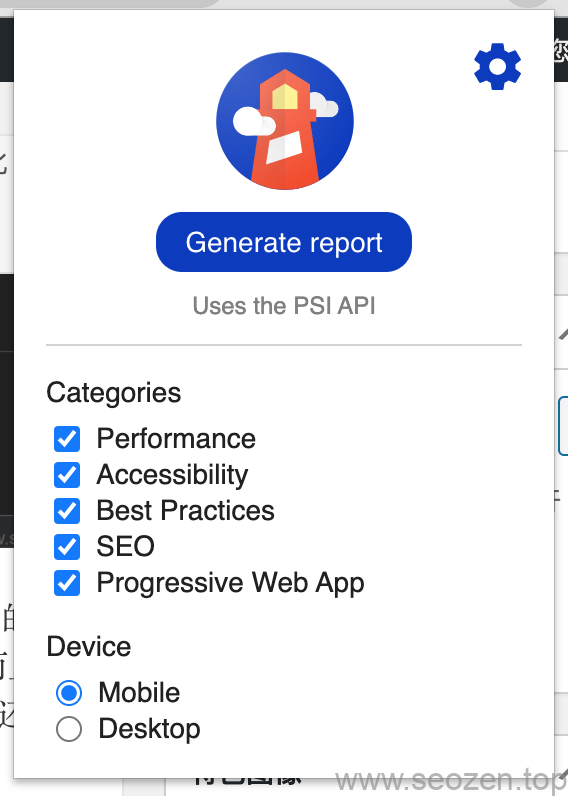
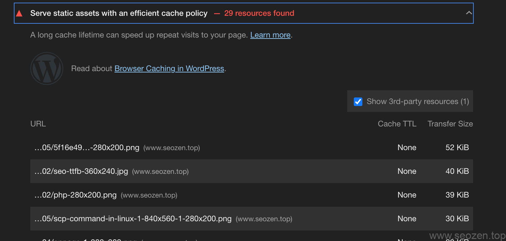
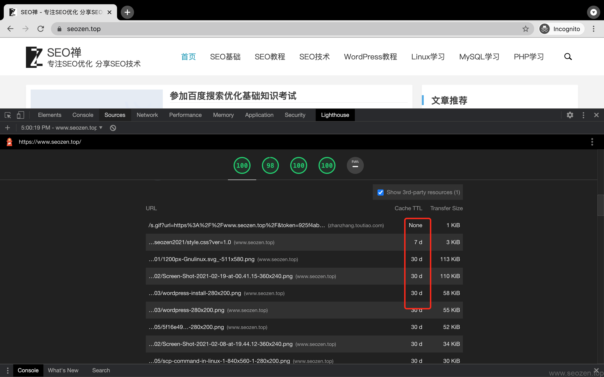

今天我要给大家分享的是谷歌的开源SEO工具：[Lighthouse](https://developers.google.com/web/tools/lighthouse)，说是SEO工具也不是很准确，它其实是一款前端性能分析工具，有两种使用方式，一种是Chrome插件形式，另一种是命令行形式，本文主要是建立在插件形式上来介绍的，如果想要体验命令行的朋友，就自己到官网看看介绍吧。

先上一张[我](https://www.helloyu.top/seo)的审计报表截图（国外网络测试）：



可以看到表现分才86，在一个月前没记错的话应该是93，有一个不达标项`Speed Index`达到了10秒，这个问题主要是使用Lighthouse测试的网络在国外，`www.helloyu.top/seo`服务器在国内，而且服务器带宽比较低导致，我用国内网络和国外网络做了速度测试，下面是本地测试的结果：



开始觉得是`Apache`服务器没有优化好，其实不是，这个问题也很好解决，要么换好的服务器，更大的带宽，要么加CDN，加CDN是一种更好的解决办法，但是现在暂时没有必要，因为访问量不是很大，而且谷歌收录基本就是当天，百度最近没有管他，因为不是我网站的问题导致收录不理想，所以这时候还是“敌不动，我不动”为好，下面就用Lighthouse来优化下我网站。

## 安装Lighthouse

访问 [Lighthouse Chrome 扩展界面](https://chrome.google.com/webstore/detail/lighthouse/blipmdconlkpinefehnmjammfjpmpbjk)，安装Chrome插件，安装完成后能看到右上角有一个小灯塔的图标，转到你想要审查的网页，点击图标，之后点击右上角的**设置**图标，根据自己需要勾选设置：



## 四大指标

作为SEOer，使用Lighthouse进行**网站性能分析**，主要查看的就是前四个指标：Performance，Accessibility，Best Practice，SEO，后面还有一个在国内基本用不到，其中Performance主要讲的是网站的性能表现，比如说打开速度，可交互时间点，JS代码阻塞时长等。

## SEO优化示例

往下拉查看报表，可以看到有一项提示红色：



意思是说没有合适的缓存策略，这里我就添加一个Http`Cache-control`的缓存策略，将下面的代码插入网站根目录的`.htaccess`文件内：
```
\# 开始Cache-Control Headers
<ifModule mod\_headers.c>
<filesMatch "\\.(ico|jpe?g|png|gif|swf)$">
Header set Cache-Control "max-age=2592000, public"
</filesMatch>
<filesMatch "\\.(css)$">
Header set Cache-Control "max-age=604800, public"
</filesMatch>
<filesMatch "\\.(js)$">
Header set Cache-Control "max-age=604800, private"
</filesMatch>
<filesMatch "\\.(x?html?|php)$">
Header set Cache-Control "max-age=600, private, must-revalidate"
</filesMatch>
</ifModule>
# 结束Cache-Control Headers
```
重新启动下`apache`服务器，再重新审查一次看看：
```

```
Lighthouse这篇先介绍到这里，具体的使用可以自己先研究，我也会继续写文章介绍，工具是用来发现问题的，解决问题还是需要自己动手。
