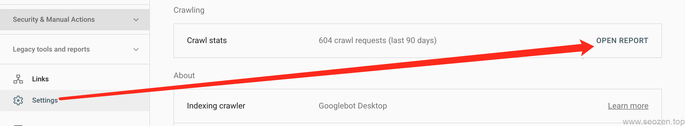
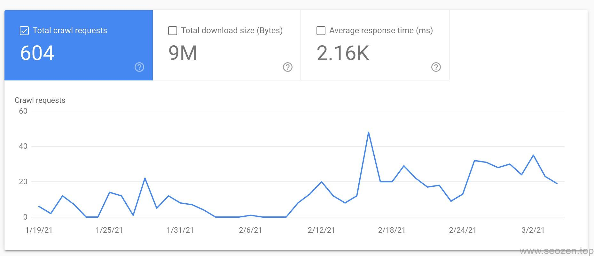
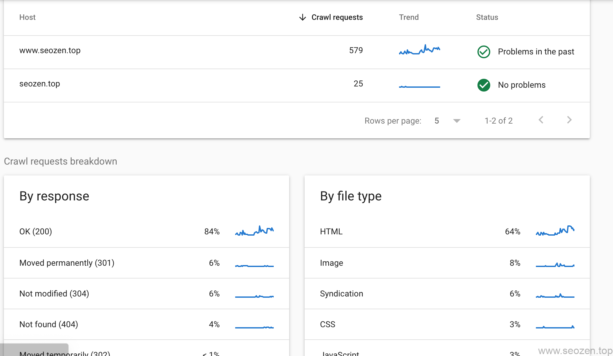
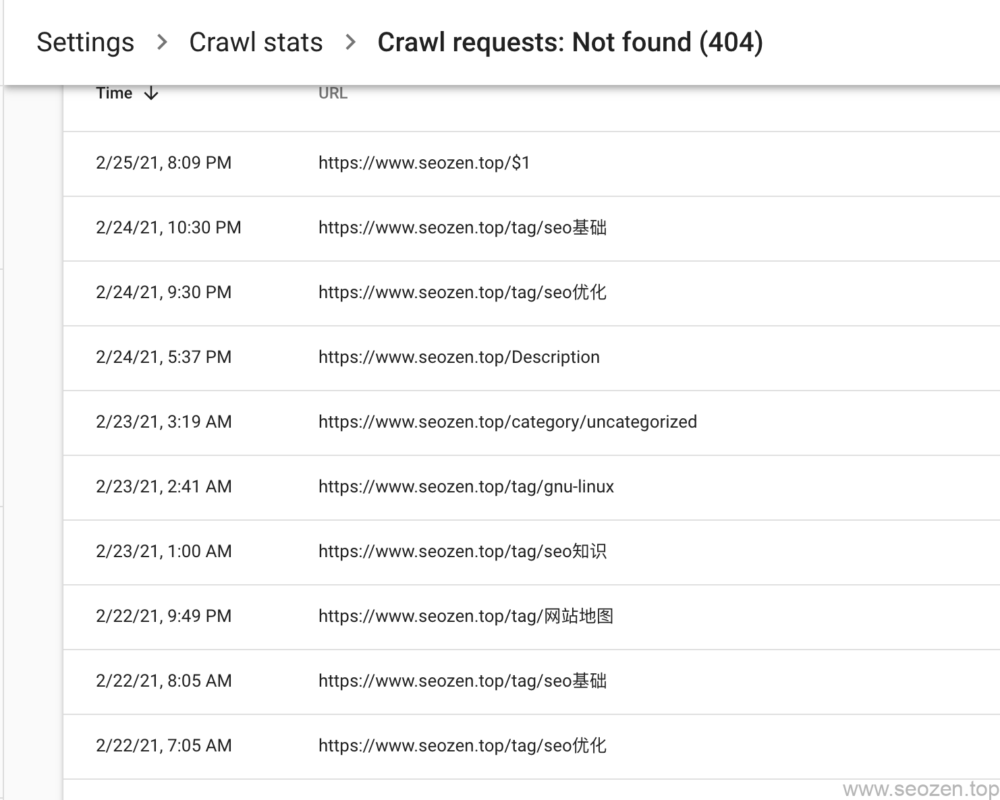
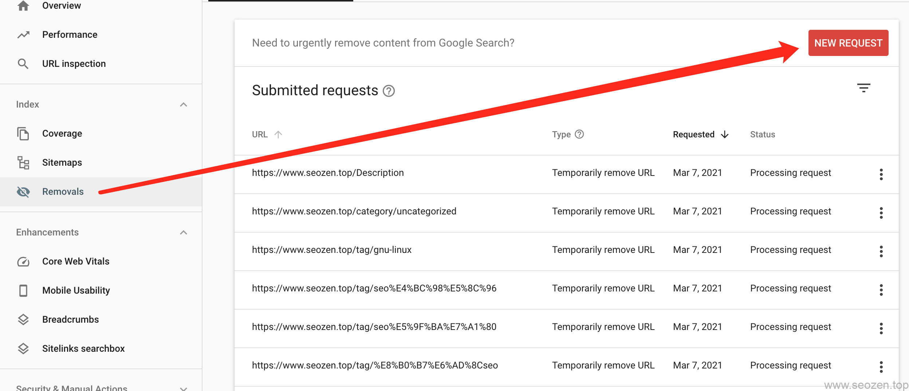

谷歌Google Search Console对于做谷歌SEO优化的人来说应该是再熟悉不过，自从新版上线之后，增加了一个非常有用的功能**Crawl Stats**中文解释为“爬虫统计”，今天我就跟大家分享一下这个牛逼到不行的功能在网站排名优化上有什么用处。

## Crawl stats位置

说实在的，我不知道谷歌大神们怎么想的，把这么好的功能放到一个很不起眼的地方，一般没有去特别看你不会注意到有这个功能，Crawl stats的位置在Settings里面，点开如下图的位置：

点击“OPEN REPORT"进入之后，看到的第一个数据就是爬虫抓取次数的图表：

可以看到我这两个月**谷歌Googlebot**大概来了604次，从2月15号以后频次上涨，这其实正好对应了我做网站内链和外链优化的时间。

往下可以看到各`HOST`的请求次数，因为我做了全站301跳转到`www.helloyu.top/seo`域名下，所以这个数据也是符合预期的，如果做了301跳转和这里的结果不一样的，要好好看看是不是[全站301重定向规则](https://www.helloyu.top/seo/301-https-seo/)写错了。

## SEO优化应用

下面还有按返回类型和文件类型区分，正常来说返回200代码的页面要占80%以上，我这里是84%还算正常，但是我有4%的404界面，这就不合理了，我们点击进入看看是什么链接导致404返回码：

这就一目了然，原来大部分是tag标签的链接，我这里只是作一个演示，这个404死链也是符合我的预期的，因为我前段时间做了`TAG标签`的优化，那我们就需要把这些死链进行提交，让谷歌不要再爬取这些链接，从而达到网站SEO优化的效果，下面是谷歌的提交界面：

这篇文章先简单介绍一下**Google Search Console的Crawl Stats**，使用这个功能查看死链并进行移除，这功能还有很多SEO方面的应用，我会放在其它的文章来说，这篇就先写到这，希望对你有所帮助，或者各位自己可以先点点研究研究。
