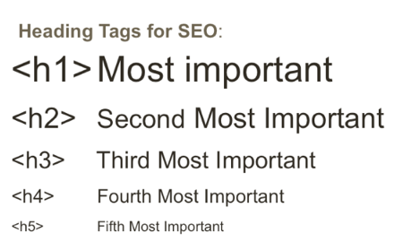
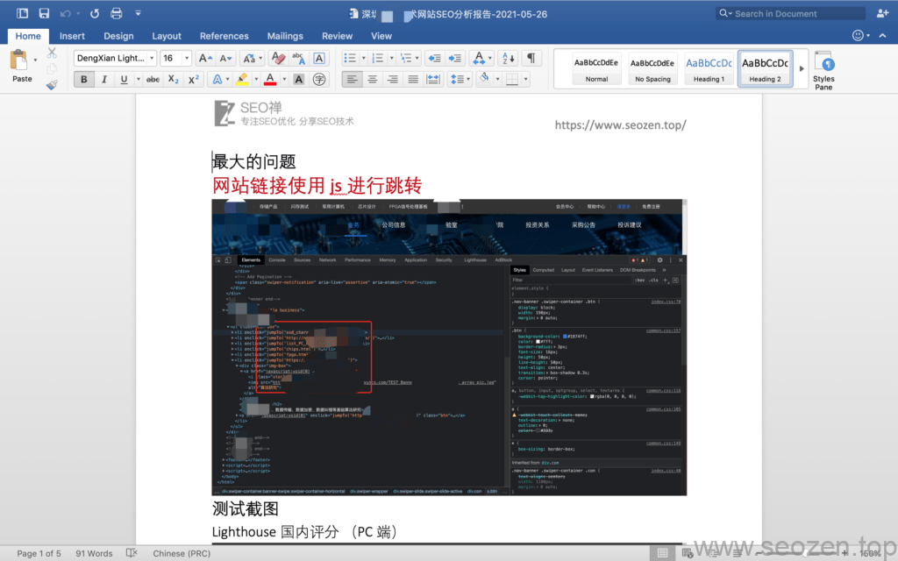

在写这篇文章的时候，SEO禅先挖掘了下什么[网站关键词](https://www.seozen.top/seo-search-keywords-google-2021.html)适合当标题，这篇文章分享**如何做谷歌SEO优化**，内容是谷歌**推荐的SEO方法**，本来想用**SEO优化方案**作为标题关键词，考虑了下这么零散的知识点不太适合，还是用**SEO优化方法**这个关键词吧，虽然这篇文章是说**谷歌SEO优化方法**，但是对于**百度搜索引擎优化**也是通用的，可以参考借鉴，要是**SEO新手**的话，建议先看看[SEO优化入门](https://www.seozen.top/seo-course-first-step.html)这篇文章，然后再回头读**谷歌入门优化**这系列的文章。

首先在做**谷歌网站排名优化**之前，我们先来看看自己网站在谷歌是否有排名，使用`site:seozen.top`命令，看看自己网站在[谷歌的收录和排名情况](https://www.seozen.top/seozen-google-ranking-july.html)，如果网站刚上线，找不到自己网站的记录，那很正常不用太担心，如果网站上线很久了，还是没有收录，可以看看[新站百度不收录](https://www.seozen.top/baidu-index-seo-bad.html)这篇文章。

## 帮助谷歌找到你

首先第一点也是最重要的一点，就是**如何让谷歌收录**，发现你的网站，首先肯定是发一些高质量的外链，除了外链，我们更应该修炼内功，做好网站内链，配合[sitemap网站地图](https://www.seozen.top/what-sitemap-is.html)，让谷歌尽快爬取收录你的新站，当然网站链接内容那么多，我们有时候需要屏蔽一些不重要的页面，比如关于企业，联系方式，员工风采等不是很重要的页面，为什么要让谷歌蜘蛛不去爬取这些页面？谷歌蜘蛛每次抓取的时间是有限的，如果把时间浪费在这些页面，那需要排名的页面可能就没有抓取到，或者抓取的频率比较低，这个也不利于收录和排名，这时候我们就可以[使用robots.txt文件规则](https://www.seozen.top/robots-seo.html)，来告诉搜索引擎哪些页面不要抓取。

## 帮助谷歌理解你

当谷歌的蜘蛛能正常抓取网页内容之后，我们就要把最好的内容提供给它，让他回去向主子交差的时候说点好话，加快收录和排名，怎么做呢？从下面三点入手：

### 网站文章标题优化

每个页面都需要唯一的标题，一般都是文章标题+网站名称，而且标题需要言简意赅，能够准确的表达文章中心思想，不要用无意义的标题，或者不符合内容主题的标题，这样会导致网站排名受影响，这里记住，标题一定要控制关键词的数量，不要堆砌关键词，正常出现2-3个关键词是可以接受的，再多的话很容易被处罚，这是SEO禅的经验教训。

### 网站Description标签优化

首先我们每个页面最好都要用`description` meta标签，这个标签就像文章大纲，会比文章标题要长，但是也不能太长，一样是需要做到言简意赅，描述标签最终会显示在搜索引擎结果页上，写的好就能起到引流的作用，不一定每一篇都要手工去写，就像SEO禅网站，大多数还是通过软件自动生成的，只要特定关键词的文章，是人工书写的。

### 网站H标签优化

把Description写好，我们接下来就要看看文章内容部分，我们都知道Word文档编辑软件里有标题H标签，代表的不同的标题，网页也是一样有H标签，我们在写作的时候要合理利用这些标签，把文章结构梳理正确，不管是让用户还是搜索引擎都能更好理解这篇文章的内容

H标签的重要性

## 让谷歌更快收录你

做好**网站内容优化**后，我们要让网站的内容尽快被谷歌收录，这样才能有排名，怎么让谷歌尽快收录我们的网站呢？从下面三点入手：

### 网站结构优化

首先我们要观察分析网站结构，在SEO禅的经验中，合理的网站深度在3-4层级之内，过深的目录结构不利于搜索引擎收录，当然我们经常看到有些网站目录深度可能达到7层8层，这些网站一般都是大型站点，本身权重就很高，其实他们一开始的目录深度也没有那么多层，只是慢慢扩展，就像SEO禅这个网站，一般最多就2层目录深度，如果以后栏目内容多了，再加深才是合理的，不要一上来就把内容分的太细，我们可以使用标签去归类，但是不要用目录一定是大类，不需要分的太细刚开始。

这里要重点说明下，**[面包屑导航](https://developers.google.com/search/docs/beginner/seo-starter-guide#usebreadcrumbs)**在SEO优化中的作用是很大的，[谷歌Search Console](https://www.seozen.top/google-search-console-seo.html)后台还有专门统计面包屑导航的功能，说明谷歌对面包屑导航还是很重视的，这也体现网站在用户体验上的考虑。

### 网站导航优化

整个网站最重要的关键词一定是布局在首页目录导航栏位置，这个导航一定要使用文字锚文本的形式，千万千万不要使用JS代码跳转，前段时间SEO禅有个客户，5年的老站用的JS跳转，导致全站个位数收录，网站是做的很漂亮：

SEO禅客户使用JS导航

### URL链接优化

大家可以去观察下，那些排名好的网站，都有一个特点，就是URL链接基本都是有意义的单词或者拼音，这里不包括新闻源类的网站，新闻类的网站内容太过庞大，使用**语义化的URL**不太现实，现在很多SEOer有个误区，就是使用数量来打长尾关键词，这个方法在以前可能行得通，但是放在**人工智能大数据**当道的现在来说，这个方法已经不是很推荐，SEO做的就是细节，把尽可能多的细节做好，做到位，搜索引擎排名自然不会低，就拿SEO禅作例子，到现在文章不过百篇，但是多数文章已经在谷歌排名前20以内，有的还排名在第一位，都是有搜索量的关键词，自然流量在随着关键词库不断扩大增长，可以看看[SEO禅站点谷歌排名情况分析](https://www.seozen.top/seozen-google-ranking-july.html)这篇文章，这是SEO禅前一点时间统计的**谷歌SEO关键词排名**情况，各位可以自己用那些关键词搜索下，看看SEO禅排名在什么位置，这是一个讲诚信的社会，SEO禅不会像一些人，使用黑帽手段去谋取利益，不管客户未来会怎么样，扯远了！

URL链接优化也是一项很重要的**SEO优化方法**，在URL语义化的过程中，我们要合理的把关键词放在url中，减少一些无意义的语气词，比如说to，is，of，URL也尽量简短。

URL的唯一性也很重要，不要一个页面有一个以上的URL链接地址，如果是商城网站，URL后缀可能有产品参数，一定要使用[canonical标签](https://www.seozen.top/seo-canonical.html)来告诉搜索引擎，哪个地址才是主要的地址。

## 让谷歌给你更好的排名

做好上面提到得几点之后，收录应该是问题不大，那**如何提高排名**呢？可以从下面三点入手：

### 提供优质内容

还是那句老话，在**SEO行业内容为王**，是永恒不变的真理，就算有在多SEO技巧，SEO知识，没有优质的内容去做支撑，都是空中楼阁，昙花一现，SEO禅看过很多网站，使用一些手段把排名做上去，但是没有看到一个网站能持久靠这种方法稳定排名的，做**[白帽SEO](https://baike.baidu.com/item/白帽SEO/723196)**最重要的就是『以不变应万变』，根本不需要担心搜索引擎算法改变后会受到处罚，专心做好网站推广，不需要担惊受怕，每个人心中都有一杆秤，搜索引擎虽然不是人，但是现在通过人工智能和大数据技术，语义识别的能力已经大大提高，一篇文章，是不是伪原创，是不是采集，多数情况下都是能够判断出来的，就像你现在读的这篇SEO文章，都是SEO禅一个字一个字写出来的，人工写作的语气和语义，谷歌搜索引擎还是有能力识别出来的，而且SEO禅在这篇文章也应该提供了些有价值的信息，这个大家应该能感受到，要是觉得SEO禅写的文章对你有帮助，可以时常回来看看，可以加入浏览器的收藏夹，但是别吃灰哦。

一不小心废话又说了几句，除了在提供优质内容的同时，持续更新也是很关键的一点，你不需要每天都更新，也不需要一天更新好几篇，你只要做到持续更新就行，什么意思呢？就比如SEO禅在刚开始的时候，每2天更新一篇，到现在有时候3天一篇，有时候2天一篇，但是基本在这范围，具体更新数量频率，需要根据自身所处行业和竞争强度来定，**SEO行业**竞争挺大，那么多黑帽还有伪原创，为什么SEO禅就写了几十篇文章，还不是天天更新，排名这么靠前？还是那句老话，SEO做好细节，内容为王！SEO禅平时比较忙，也没空去怎么发外链，其实就是把发外链的时间用来写文章吧，希望产出的每篇文章，都能解答特定的一些问题，给别人提供借鉴，也给自己作为备忘记录。

### 锚文本优化

SEO新手在做特定关键词页面优化的时候，一定很迷茫，我要怎么做这个关键词，怎么推特定的页面文章排名，这里很重要的一个方法就是锚文本，锚文本不管是在[外链优化](https://www.seozen.top/website-external-links.html)还是[内链优化](https://www.seozen.top/internal-link-build-seo.html)都被经常用到，比如说SEO禅要做**[SEO优化](https://www.seozen.top)**这个关键词，那在做内链的时候，就会用这个关键词指向指定的页面，被指定的页面一定是和这个关键词相关的，因为SEO禅要把这个关键词做在首页，那指向的就是首页链接，但是首页的关键词数量有限，搜索引擎为了第一时间能给用户准确的结果，一般会把特定关键词的内容页呈现给用户，一个网站首页能排进**搜索引擎结果页**前十，那就说明整个网站和这个关键词的相关度很高，和这个关键词相关的关键词或者长尾关键词，排名一定不会差。

### 图片Alt标签优化

[图片Alt标签优化](https://www.seozen.top/seo-image-alt.html)在排名优化中也是很重要的一点，很多时候会被新手SEO忽略，有过多年经验的老SEOer有时候也容易忽视这个优化方法，SEO禅是很重视图片Alt标签的优化的，所有的搜索引擎，一般第二个选项卡都是图片，做好Alt标签优化，不亚于**网站标题关键词优化**，按照优化关键词的方法去优化alt标签就可以，言简意赅，直击主题。

## 手机端优化

写在最好，不代表不重要，手机端优化是SEO优化中的压轴内容，现在大部分的流量慢慢转到手机端，昨天还看了百度关键词流量来源统计报告，除了IT领域，其他领域基本上手机流量占了7成，IT行业比较特殊，程序员一般都是用电脑看资料，查资料，手机还是屏幕太小，所以SEO禅为什么不做自媒体，坚持文章写作记录，这也是原因之一，在做**手机端适配优化**方法大致分为以下三种：

- 网页自适应，这种方法也是谷歌推荐的方式
- 动态渲染，如果是手机端，服务器渲染手机端页面
- 子域名，专门为手机端做一个版本的网站，通过子域名链接

具体选择哪一种好，需要因情况而议，一般情况下，如果是企业网站，谷歌推荐的是使用自适应进行适配，现在网站基本也做到了响应式，使用响应式代码也有利于维护，都是同一套代码，只是通过CSS代码做响应式布局就可以，用户体验也很好，SEO禅的网站虽然简单，但是也是响应式布局。具体的优化方法和细节还有很多，这篇文章SEO禅就分享到这，有什么疑问和见解可以留言评论。

如果对谷歌SEO优化感兴趣的朋友，可以再看看《[2021谷歌SEO优化入门：Google搜索引擎是怎么工作的？](https://www.seozen.top/Google SEO优化-tutorial-search-engine-2021.html)》这篇文章。
