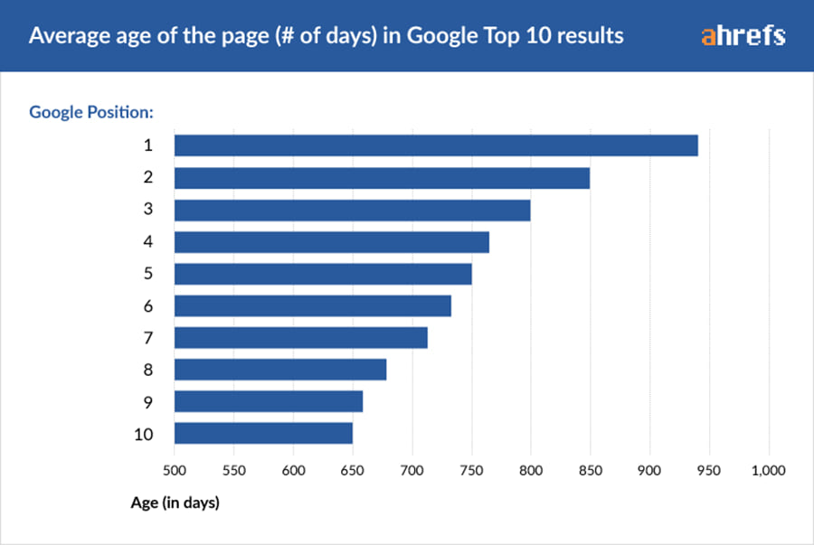
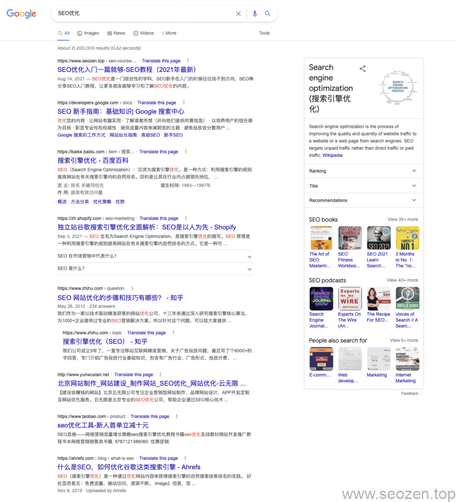
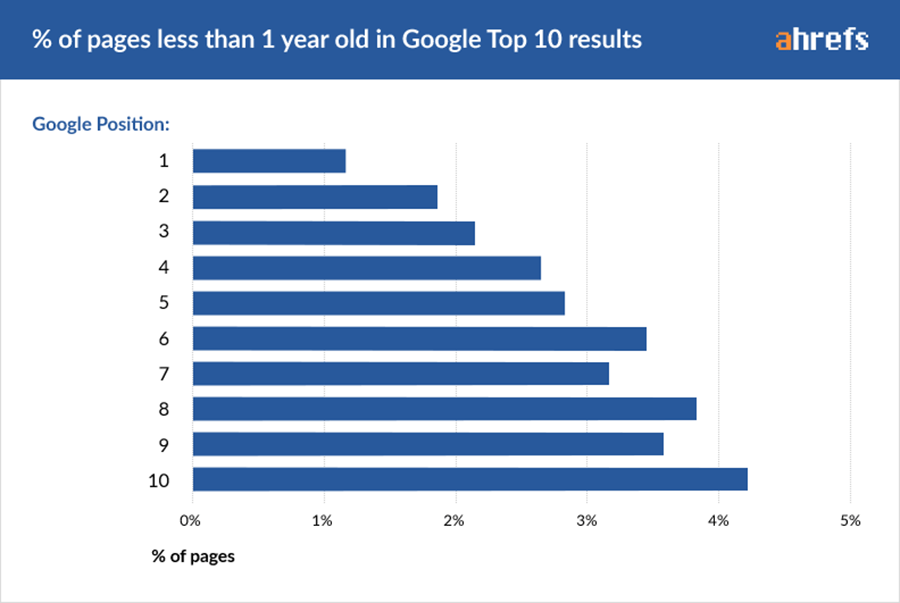
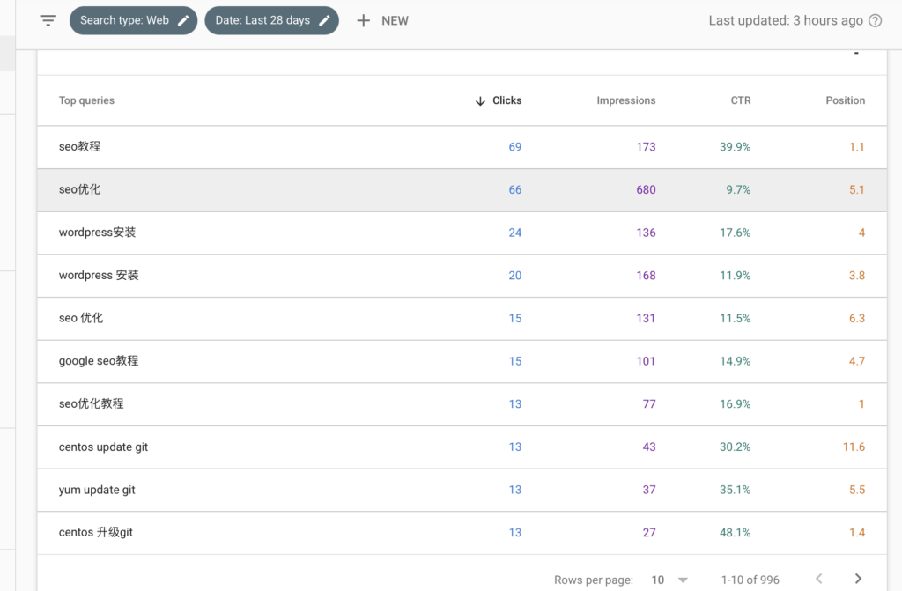
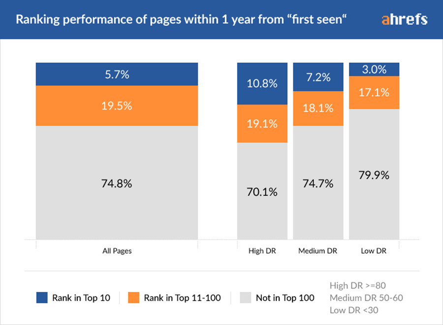

我最经常被问的一句话就是：『多久能有网站排名？多久会有优化效果？』，这种问题是对SEO不了解的客户中最经常被问到得，也是最难回答的，如果你回答『不能保证』，多半会问出这种问题的客户都不会找你做[SEO优化](https://www.helloyu.top/seo/seo-course-first-step.html)，如果你给了一个『保证』，用户以为吃了一颗定心丸，那之后的服务，你自己肯定提心吊胆，而且很有可能是以扯皮结束合作关系，对于[网站优化](https://www.helloyu.top/seo/seo-website-tips.html)来说，因为影响的因素太多，做了SEO排名优化，多久能出效果这是无法保证，但是根据ahrefs曾经发布的一篇《[在谷歌多久能获得排名](https://ahrefs.com/blog/how-long-does-it-take-to-rank/)》的研究报告，和我的自身经验总结，一般情况下老站进行全站优化后，**6-9个月**就能提升大多数关键词排名和整站排名，如果是新站的话，这个时间并不好估计，还需要考虑网站自身因素，和行业因素，下面先介绍下ahrefs行业大佬的这篇文章的几个要点，并结合我的博客情况作个分析。

## 排名在首页的网站年限

无论是做[谷歌SEO优化](https://www.helloyu.top/seo/Google SEO优化-tutorial-starter-guide-2021.html)，还是做百度SEO排名优化，只有排到首页才有意义，基本在第二页就没有什么流量了，ahref抽取了2百万个随机关键词作了统计，基本排名前10的网站，平均域名年龄至少在两年以上：

200W随机关键词谷歌排名域名年限

这个结果我觉得还是比较准确的，就拿SEO优化这个关键词举例，基本在谷歌第一页的域名年限都至少在两年以上：

SEO优化关键词谷歌排名

我的网站已经排名到第一位了，可能在你们那边有变动，但是只要在中国大陆搜索的，基本都是前10的排名，一般是再第3-5位，可以看到其他网站域名年限都是要超过2年，只有我是不到一年的域名年限，做这个词从没有排名，到排名进首页大概花了2个月的时间，可以参看[我谷歌排名优化情况分析](https://www.helloyu.top/seo/seozen-google-ranking-july.html)这篇文章，底部有记录SEO优化这个词的排名变动情况。

当然新站也是能够排进首页的，只是大概只有1/5的概率，也就是说对于SEO优化这个词，想排在第一位，那概率更低，大概只有1%：

谷歌排名前10站点少于1年百分比

我的网站到现在，已经有多个有流量的关键词排名在Top 1的位置：

我关键词谷歌排名TOP情况

前面简单分析了排在首页的网站大概的域名年限情况，下面来看看一个页面多久能够有排名？

## 页面多久能有谷歌排名

ahref随机统计了两百万个页面的收录情况，从第一次收录，到排名进前10，有多少一年以内的页面的情况：

200万随机1年以内页面排名情况

可以看到平均只有5.7%的页面能在一年内排名到前十，作为大多数普通站长，你们的DR（域名权重）都大概在30之内，这个概率更低，只有3.0%，在做排名优化软文推广的时候，如果没有排到前10，不用太在意，因为并不是那么容易，大家的情况都一样。

上面只是对于随机的关键词，如果对于搜索流量高的关键词，新网站能排进前10的概率就更低了，我在这里就不贴图片说明了，其实这篇文章我想表达的是，SEO优化是一门知识面很广，又很细的领域，无论哪一个SEOer都不可能全面的把SEO优化的方方面面说清楚，而且有时候调整的点是很细微的一个方面，然后去观察变化，有时候这种调整在这个网站，这个领域有效果，换一个专业领域就没有效果了。

SEO入门很简单，但是想要做的好并不容易，我创建这个网站，就是为了进行SEO实验，网上很多拿其他案例分享的，那一看就不是他们自己做的，现在我大部分举例，截图都是自己的这个网站，如果图片和文字可以造假，那谷歌搜索引擎的排名反馈肯定是没办法造假，国内做SEO优化的服务商多如牛毛，为什么在首页SEO优化这个词能排名稳定的就没几个？这个大家都可以思考下，大多数他们都是用[黑帽发包快排](https://www.helloyu.top/seo/black-seo-quick-ranking-tech-2021.html)的方式，这种方式对客户来说严重点就是谋财害命。

这篇文章是参看了Zac的《[做SEO多久才能看到效果](https://www.seozac.com/topic/how-long-to-rank/)》后写的，因为和Zac有同感，所以也写一下自己的理解和体会，根据我自身经验，总结下做SEO优化效果平均反馈情况：

- 大概只有1/10的页面在第一年会获得排名
- 大概只有5.7%的新页面，能获得排名并进入Top 10的位置
- 大概只有0.1%的新页面，能获得高搜索流量关键词Top 1的位置
- 大概需要2-6个月左右，关键词从没有排名到前10位置

如果你的排名不好，不要太难过，因为大家都差不多，看看是不是哪个地方没有做好，去调整，去追踪排名变化情况，持续的优化，如果觉得我的文章对你有帮助，可以留言评论让我知道你在看，
