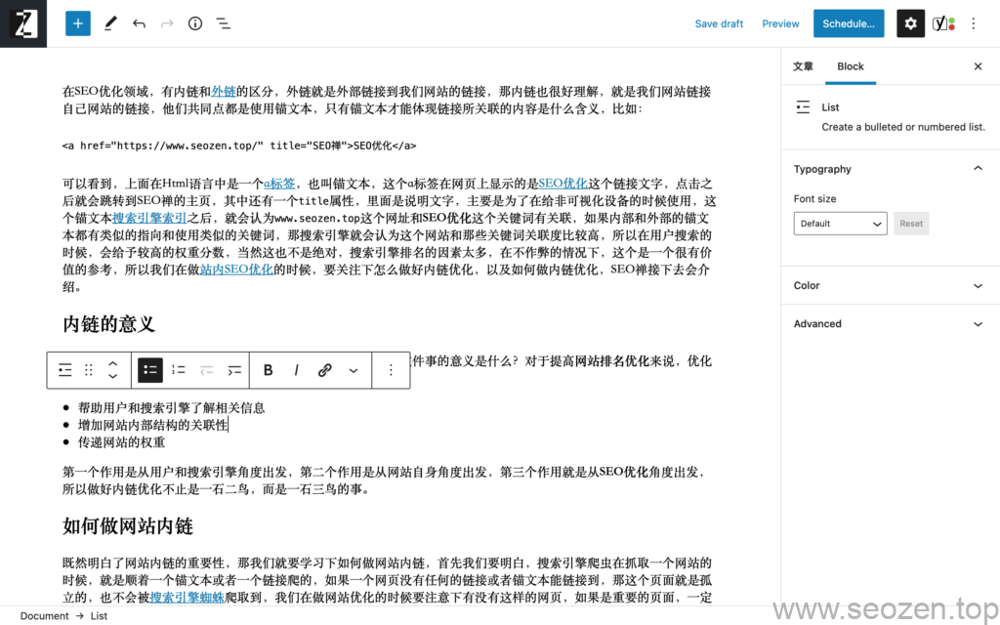

在SEO优化领域，有内链和[外链](https://www.helloyu.top/seo/website-external-links/)的区分，外链就是外部链接到我们网站的链接，那内链也很好理解，就是我们网站链接自己网站的链接，他们共同点都是使用锚文本，只有锚文本才能体现链接所关联的内容是什么含义，比如：

<a href="https://www.helloyu.top/seo/" title="我">SEO优化</a>

可以看到，上面在Html语言中是一个[a标签](https://www.helloyu.top/seo/anchor-tag-title-seo/)，也叫锚文本，这个a标签在网页上显示的是[SEO优化](https://www.helloyu.top/seo)这个链接文字，点击之后就会跳转到我的主页，其中还有一个`title`属性，里面是说明文字，主要是为了在给非可视化设备的时候使用，这个锚文本[搜索引擎索引](https://www.helloyu.top/seo/seo-tutorial-moz-serial-2021-search-engine-first/)之后，就会认为`www.helloyu.top/seo`这个网址和**SEO优化**这个关键词有关联，如果内部和外部的锚文本都有类似的指向和使用类似的关键词，那搜索引擎就会认为这个网站和那些关键词关联度比较高，所以在用户搜索的时候，会给予较高的权重分数，当然这也不是绝对，搜索引擎排名的因素太多，在不作弊的情况下，这个是一个很有价值的参考，所以我们在做[站内SEO优化](https://www.helloyu.top/seo/seo-tutorial-moz-serial-2021-on-page/)的时候，要关注下怎么做好内链优化，以及如何做内链优化，我接下去会介绍。

## 内链的意义

我们需要做一件事的时候，最好要知道为什么做这件事，还有这件事的意义是什么？对于提高**网站排名优化**来说，优化好做好内链建设是非常关键的环节，它主要有如下三个作用：

- 帮助用户和搜索引擎了解相关信息
- 增加网站内部结构的关联性
- 传递网站的权重

第一个作用是从用户和搜索引擎角度出发，第二个作用是从网站自身角度出发，第三个作用就是从**SEO优化**角度出发，所以做好内链优化不止是一石二鸟，而是一石三鸟的事。

## 如何做网站内链

既然明白了网站内链的重要性，那我们就要学习下如何做网站内链，首先我们要明白，搜索引擎爬虫在抓取一个网站的时候，就是顺着一个锚文本或者一个链接爬的，如果一个网页没有任何的链接或者锚文本能链接到，那这个页面就是孤立的，也不会被[搜索引擎蜘蛛](https://www.helloyu.top/seo/search-engine/)爬取到，我们在做网站优化的时候要注意下有没有这样的网页，如果是重要的页面，一定需要建立一个链接指向。

其实要做好网站内链，最关键的一点就是关注上面的三个作用，其中第一个作用是最重要的，就是**链接相关信息的网页**，通过锚文本的形式，就比如这篇文章，我也做了一些内链锚文本：

我文章内链建设

当然这些内链不是随便乱做的，都是相关的文章，这些文章和锚文本都是有一定的关联度的，在做**SEO网站内链**的的时候当然也要注意下，不然容易被搜索引擎处罚，首先这个一篇文章锚文本的数量不能太多，正常**10个左右**都是可以的，根据文章长度，如果文章内容较长，最好不要超过**30个**，还有这个锚文本的选择也是需要和链接的网页内容要相关，锚文本和锚文本的间距不能太短，意思就是不能排列的做锚文本，这样容易出问题。

上面使用锚文本做网站内链是最常用，也是最有效的一种，方法还有很多，比如说专题就是另一个很好的形式，有些SEOer喜欢在网站底部做内链，如果在不影响整体体验的情况下，这种方法还是有一定的作用，如果是为了做内链而做内链就没有太大的必要，其他方法我会继续在其他文章分享，希望这篇文章对你有帮助，如果觉得有什么疑问可以评论留言。
