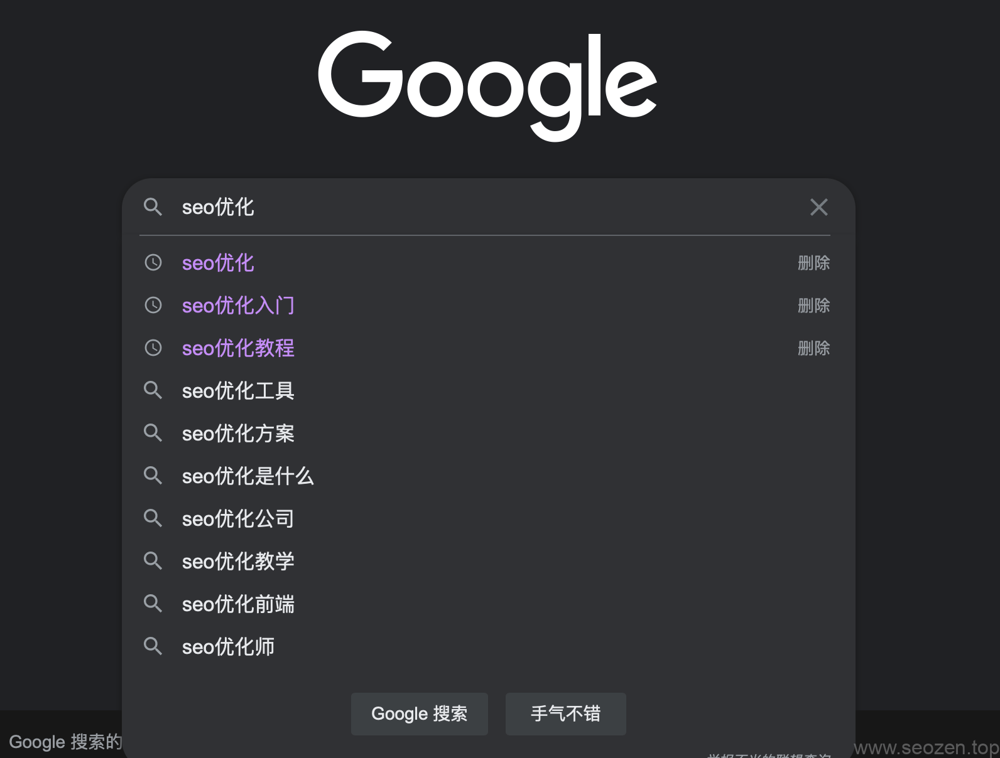

首先给大家说说**什么是长尾关键词**，我们SEO的关键字一般由“短词”和“长词”组成，比如说“租车”，这个租车就是“短词”，包含的意思就很多了，在搜索引擎的收录量上也会有很多，如果你不是特别牛B或者很有钱，就不要去想做这个关键词了，那竞争肯定很大，而且其实实际转化并不一定好，这时候要根据你的客户实际情况去做长尾关键词，比如说我的客户是广州的，那他们一般会搜索“广州租车”这样的“长词”，这种关键词相对于“租车”就是**长尾关键词，**比如这篇文章的标题，**如何挖掘长尾关键词**，也是长尾关键词。

## 长尾关键词的作用

前面说了什么是长尾关键词，那更重要的问题是，为什么要用长尾关键词，其实道理很简单，就是“宁做鸡头，不做凤尾”的道理，长尾关键词在搜索引擎中的收录量会相对少点，也比较好做上排名，而且由这个长尾关键词引来的流量都是比较精准的客户，转化率也会比较高。

## 如何挖掘长尾关键词

这里分享下我一般是如何挖掘长尾关键词的，长尾关键词也是分很多种类，最多被使用的一类就是提问类FAQ长尾关键词，比如文章的标题，什么是长尾关键词？这类关键词对引流能起到比较好的效果，但是对客单转化率帮助并不是很大，转化率较高的长尾词是**目的性长尾关键词**，比如，哪家**SEO服务**做的比较好？一般搜索这种词的用户多数是想找有提供SEO服务的公司或者个人，用户的意图就比较明显，这样的长尾词转化率肯定是要比FAQ类型的长尾词要高，下面介绍几中常用挖掘长尾关键词的手段。

### 分析竞争对手

\[caption id="attachment\_1069" align="alignnone" width="1200"\] 长尾关键词\[/caption\]

通常接到一个项目，需要根据项目所处的行业，去用“短词”关键词搜索行业排名前几的网站，分析他们是如何选择长尾关键词，如果这个行业的竞争力度不高，那大多数同行可能会使用精准的短词，如果使用一点搜索量都没有的长尾关键词，等于没有做一样，只有选择了那些有一定流量，又竞争比较低的词，才能发挥长尾关键词的作用。

### 通过站长平台工具

通过**站长平台**去挖掘相关长尾关键词，各大站长平台都有相关的工具可以使用，也可以使用免费的第三方工具，比如说[SEO站长工具](https://seo.chinaz.com)，如果你的网站权限不高，我建议选择关键词指数（可以理解为每天被搜索的次数）低的**长尾关键词**去做，这里说的低也不是几个的意思，我一般会选择100左右的指数去做，这个范围内的关键词不算很难，一般一两个月就能做出成绩。

### 客户交流

这个方法比较直观，也就是询问你的客户，获得行业第一手资料，但是有时候客户自己也不清楚，所以这个方法必须结合前面两种方法来综合判断，有时候把自己假设成客户，看看自己会如何搜索，分析目标客户的搜索行为。

### 搜索引擎下拉搜索框

\[caption id="attachment\_1070" align="alignnone" width="1592"\] 谷歌搜索下拉框长尾关键词\[/caption\]

通常我们在搜索引擎输入框，输入关键词都会跳出下拉框，这里显示的关键词都是和你现在输入的关键词有关联的，而且是有搜索量的，比如说这个[SEO优化](https://www.helloyu.top/seo/seo-course-first-step.html)关键词，下拉框中**SEO优化入门**就是长尾词，如果想把SEO优化这个词做上去，我们可以先把SEO优化入门，SEO优化教程这几个词先做到首页排名，这样SEO优化这个词的排名就会比较好做。

看完这篇文章，应该会明白长尾关键词是什么了吧，当然挖掘长尾关键词的方法还有很多，长尾关键词相对“短词”关键词来说，能带来更精准的客户流量，所以要做好SEO，长尾关键词是非常重要的一个环节。

这篇文章只是简单的介绍长尾关键词和挖掘长尾关键词，长尾关键词值得研究的地方还有很多，如何部署长尾关键词也是需要注意的，我会在其他文章分享，这篇文章介绍到这，有什么不懂得可以评论留言。
