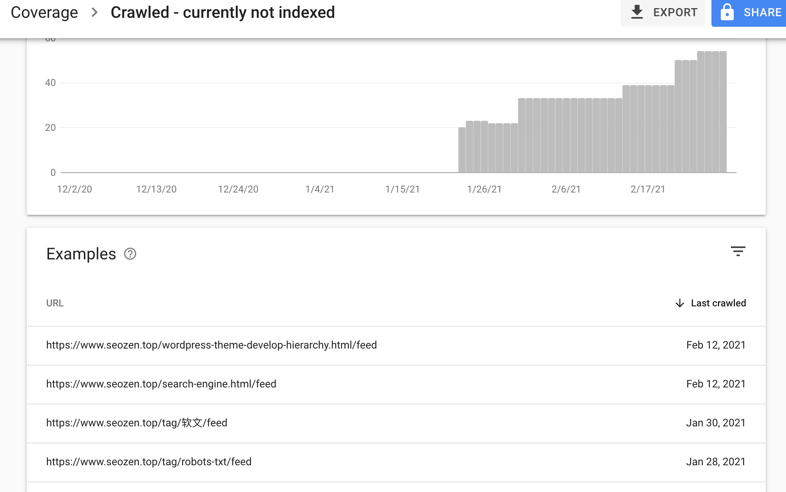
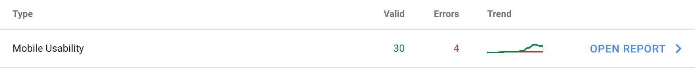
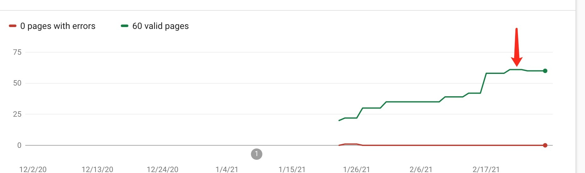

对于一个新站来说，搜索引擎爬虫来抓你的网站，他们就跟大爷一样，要好吃好喝的供着，你不能让别人自己端茶倒水，把别人累个半死，你说这样他回去会跟他主子（搜索引擎）说什么好话么？

那怎么让他们吃好喝好呢？其实也简单，就是让他们少做点，我们多做点，对于一个网站，那就是把目录结构尽量扁平话，但是要掌握好一个度，凡事过了就物极必反，蜘蛛来你网站，你肯定要想办法第一时间把最好的文章，最想排名的关键词让它带走，对于站长来说唯一能和蜘蛛交流的办法，就是`robots.txt`文件了，不知道这个东西？那可以看看这篇文章先《[robots.txt文件介绍](https://www.seozen.top/robots-seo.html)》

## 搜索引擎无用的网页

因为SEO禅这个站是使用WordPress搭建的，WordPress默认使用的是一个虚拟的robots.txt文件，内容比较简单，没有屏蔽`feed页面`，这个页面对搜索引擎来说没什么作用，谷歌也基本不收录



所以把这些文件排除，让搜索引擎蜘蛛只抓取那些对于他们有用的文件，因为蜘蛛来抓取一个网站是有时间限制的，如果把宝贵的时间花在这些没用的内容上，对网站优化来说就太浪费了。

## 错误的robots.txt规则

因为图省事，我就去网上找了一段robots.txt适用于WordPress的规则，当时也没多想，只直接写入到文件里面，但是没过两天，Google Search Console既然有错误提示？



说我移动设备兼容有问题？不可能啊，我前一段时间刚花了一天时间做了响应式布局的？难道我老了不中用了？响应式写错了？带着这么多疑问，我看了错误提示：

> Googlebot blocked by robots.txt

原来我上次的骚操作，把`wp-content`内部的资源文件屏蔽了，下面是我修改以后完整的robots.txt文件内容，可以作为参考：
```
User-agent: \*
Disallow: /wp-admin/
Disallow: /wp-content/
Disallow: /wp-includes/
Disallow: /\*/comment-page-\*
Disallow: /\*?replytocom=\*
Disallow: /category/\*/page/
Disallow: /tag/\*/page/
Disallow: /\*/trackback
Disallow: /feed
Disallow: /\*/feed
Disallow: /comments/feed
Disallow: /?s=\*
Disallow: /\*/?s=\*\\
Disallow: /attachment/
Allow:/wp-content/uploads/
Allow:/wp-content/themes/seozen2021/
Allow:/wp-content/plugins/
Sitemap:https://www.seozen.top/sitemap.xml
```
上面这些规则简单的介绍下：

1、Disallow: /wp-admin/、Disallow: /wp-content/和Disallow: /wp-includes/

用于告诉搜索引擎不要抓取后台程序文件页面。

2、Disallow: /\*/comment-page-\*和Disallow: /\*?replytocom=\*

禁止搜索引擎抓取评论分页等相关链接。

3、Disallow: /category/\*/page/和Disallow: /tag/\*/page/

禁止搜索引擎抓取收录分类和标签的分页。

4、Disallow: /\*/trackback

禁止搜索引擎抓取收录trackback等垃圾信息

5、Disallow: /feed、Disallow: /\*/feed和Disallow: /comments/feed

禁止搜索引擎抓取收录feed链接，feed只用于订阅本站，与搜索引擎无关。

6、Disallow: /?s=\*和Disallow: /\*/?s=\*\\

禁止搜索引擎抓取站内搜索结果

7、Disallow: /attachment/

禁止搜索引擎抓取附件页面，比如毫无意义的图片附件页面。

8、Allow: /wp-content/uploads/

允许搜索引擎抓取资源文件，这个很重要，可以用来判断移动设备兼容性



因为这个操作，导致谷歌对SEO禅的收录不升还降了一点，我重新配置了robots.txt文件，观察一下过几天的情况再看看。
