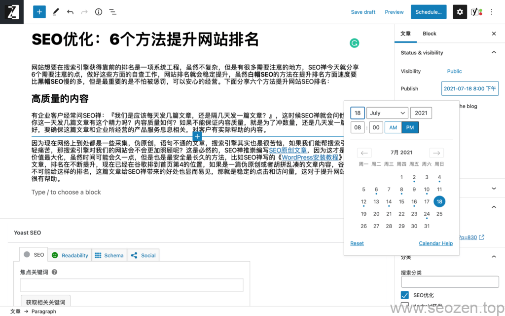
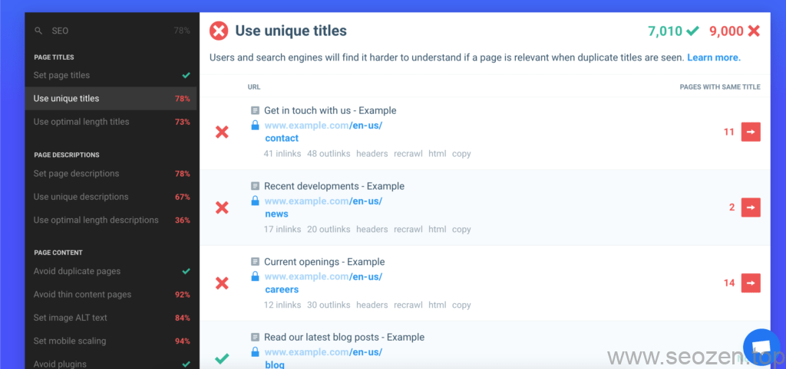

网站想要在搜索引擎获得靠前的排名是一项系统工程，虽然不复杂，但是有很多需要注意的地方，SEO禅今天就分享6个需要注意的点，做好这些方面的自查工作，网站排名就会稳定提升，虽然**白帽SEO**的方法在提升排名方面速度要比**黑帽SEO**慢的多，但是最重要的是不怕被惩罚，可以安心的经营。下面分享六个方法提升网站SEO排名：

## 高质量的内容

有企业客户经常问SEO禅：『我们是应该每天发几篇文章，还是隔几天发一篇文章？』，这时候SEO禅就会问他们，你这一天发几篇文章有这个精力吗？内容质量如何？如果不能保证内容质量，就是为了冲数量，还是几天发一篇比较好，要确保这篇文章和企业所经营的产品服务息息相关，对客户有实际帮助的内容。

因为现在网络上到处都是一些采集，伪原创，语句不通的文章，搜索引擎其实也是很苦恼，如果我们能帮搜索引擎减轻痛苦，那搜索引擎对我们的网站会不会更加照顾呢？这是必然的，SEO禅推崇编写[SEO原创文章](https://www.seozen.top/writing-seo-article.html)，因为这才是真正价值最大化，虽然时间可能会久一点，但是也是最安全最长久的方法，比如SEO禅写的《[WordPress安装教程](https://www.seozen.top/wordpress-install-2021.html)》这篇文章，排名在不断提升，现在已经在谷歌排到首页第4的位置，如果是一篇伪原创或者胡拼乱凑的文章内容，谷歌是不可能给这样的排名，这篇文章给SEO禅带来的好处也显而易见，那就是稳定的点击和访问量，这对于提升网站权重很有帮助。

## 有规律的更新

前面说到第一个方法就是更新高质量的内容，有高质量的内容还是不够，要持续的输出高质量文章内容才能获得搜索引擎的信任，正常一般的企业站点，2天更新一篇是比较合理的时间间隔，而且更新的时间点最好一直，就像SEO禅更新文章内容都是固定晚上8点，每两天更新一篇，一篇文章大概500-1000字左右，文章不是很长，但是每天文章都有要说的内容和知识点。

有规律的更新网站内容

## 用好网站TDK

做SEO优化的对TDK应该不陌生，但是SEO禅现在只使用了TD，已经不再使用**Keyword**的这个标签在网站头部，因为谷歌已经明确[不使用Keyword作为网站排名因素](https://developers.google.com/search/blog/2009/09/google-does-not-use-keywords-meta-tag)，因为这个标签已经被各位站长给用烂了，所以已经不再具备什么参考价值，这里我们需要注意T和D标签，T标签就是Title，D标签是Description，这里最重要的就是T标签，每个网页都需要有它独立的标题，要区别网站上所有其他网页，这里推荐一个工具，SEO禅经常用Chrome上的一款SEO插件[Checkbot](https://www.checkbot.io/?utm_source=checkbot-extension&utm_medium=extension&utm_content=home-logo)来审查网站的TD标签是否符合要求。

Checkbot-seo网站审查工具

## 用好锚文本

SEO禅经常看到有些站长的网站和博客做的内链使用无意义的锚文本，比如说：『在这里』，『参考这里』，『点击这里』，这些都是没有意义的锚文本，对于搜索引擎来说，这些锚文本提供不了任何信息，我们在做[网站内链优化](https://www.seozen.top/internal-link-build-seo.html)的时候，要选择有意义的锚文本关键词，明确告诉读者和搜索引擎，这个链接所指向的网页的主题，最核心的内容是什么，用简单的一段话描述，切忌锚文本不可太长，不然适得其反，还要加上合适的[a标签title属性](https://www.seozen.top/anchor-tag-title-seo.html)。

## 自动生成网站地图

想要提升网站排名，[sitemap网站地图](https://www.seozen.top/what-sitemap-is.html)是不能缺少的，而且需要自动生成，把需要排名的网站链接都要放进去，sitemap的生成有特定格式，如果是**WordPress搭建**的网站，安装下插件就好，如果是自己开发或者使用第三方服务商搭建的网站，一定要有自动生成sitemap的功能，各大搜索引擎管理后台都有sitemap提交入口，所以sitemap对于网站收录排名很重要。

## 用好robots.txt文件

搜索引擎访问网站的第一件事就是访问网站目录下的robots.txt文件，各大搜索引擎都会根据[robots.txt文件规则](https://www.seozen.top/robots-seo.html)，去抓取网站内容，当然robots文件是君子协定，不适合其他种类的爬虫，很多不重要的内容，就可以屏蔽搜索引擎蜘蛛抓取，因为爬虫每次来抓取都是有资源限制的，每次抓取的时间都不会太久，在短时间内如何让爬虫效率最大化，让爬虫不需要抓取不重要的内容，这就是robots.txt文件需要规定的事，当然在写规则的时候要注意，如果规则写错了，有[网站收录下降](https://www.seozen.top/robots-mislead-seo.html)的风险，当然这个很容易观察出来，及时调整就好。

上面是SEO禅分享的6点提升网站排名的方法，可以看看自己网站有没有做好这6方面的内容，以后SEO禅还会分享更多提升排名，优化排名的技巧，今天就分享到这，有什么问题可以评论留言。
