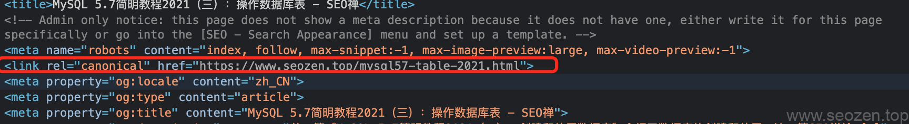

canonical标签的出现主要是为了解决一个问题，那就是**内容重复**，比如一些电商类的网站，一个产品有很多可选参数，但是都是同一个页面，只是URL不同，这样就会导致搜索引擎重复收录，影响**SEO效果**，所以需要一个方法来指明哪一个URL希望作为主要内容被搜索引擎收录。

### 认识canonical

我们来看看canonical在实际中是长什么样子，看看我的文章代码就知道，如下：

这里的`rel="canonical"`就是告诉搜索引擎，这个页面是对应这个URL地址的。如果有很多类似的界面，就像上面说的只是参数不同，就可以用canonical标签指向同一个URL地址，为什么要这么做？这对于SEO优化来说是必须的，因为太多重复内容，会影响**网站排名权重**，很可能会被搜索引擎认为垃圾网站。

## canonical解决URL重复

前面说canonical标签是为了保证URL的唯一性，我们来看下例子，比如有下面这些网址：

http://www.example.com
https://www.example.com
http://example.com
http://example.com/index.php
http://example.com/index.php?r...

他们其实都是同一个网页，内容肯定也是大部份是重复和相似的，这就是为什么一般写[robots.txt文件规则](https://www.helloyu.top/seo/robots-mislead-seo/)要把一些搜索参数排除，让搜索引擎不要重复收录，但是比如说像带www的地址和不带www的地址，可以使用服务器的301跳转，也可以使用canonical告诉搜索引擎跳转，使用canonical作301跳转，用户还是会在原来的URL地址，而搜索引擎会转向新的URL。

## canonical标签相关

canonical标签是可以自引用的，也就是说如果像上面图片中我的博文，这个标签就是指向这篇文章自身的。canonical标签还有一个很重要的应用就是跨域传递权重的功能，如果在一个权重较高的网站，发表了一篇文章，使用canonical标签指向了你的网站，那搜索引擎就会分配更多的权重给指向的这个网站地址，当网站有使用301重定向，又使用canonical标签的时候要特别注意，不要形成回路，那会把搜索引擎搞晕，比如`page A -> page B`使用了canonical，而服务器重写规则又设置了`page B -> page A`的301重定向。
